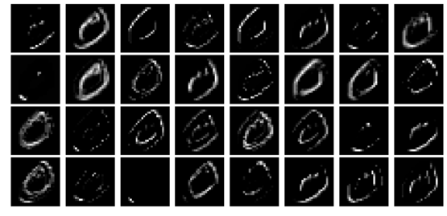

**Author: Sandipan Dey**

In this chapter, we shall discuss recent advances in image processing with deep learning. We'll start by differentiating between classical and deep learning techniques, followed by a conceptual section on convolutional neural networks (CNN), the deep neural net architectures particularly useful for image processing. Then we'll continue our discussion on the image classification problem with a couple of image datasets and how to implement it with TensorFlow and Keras, two very popular deep learning libraries. Also, we'll see how to train deep CNN architectures and use them for predictions. 

The topics to be covered in this chapter are as follows:

- Deep learning in image processing
- CNNs
- Image classification with TensorFlow or Keras with the handwritten digits images dataset
- Some popular deep CNNs (VGG-16/19, InceptionNet, ResNet) with an application in classifying the cats versus dogs images with the VGG-16 network

### Deep learning in image processing                                                   

The main goal of **Machine Learning (ML)** is **generalization**; that is, we train an algorithm on a training dataset and we want the algorithm to work with high performance (accuracy) on an unseen dataset. In order to solve a complex image processing task (such as image classification), the more training data we have, we may expect better generalization—ability of the ML model learned, provided we have taken care of overfitting (for example, with regularization). But with traditional ML techniques, not only does it become computationally very expensive with huge training data, but also, the learning (improvement in generalization) often stops at a certain point. Also, the traditional ML algorithms often need lots of domain expertise and human intervention and they are only capable of what they are designed for—nothing more and nothing less. This is where deep learning models are very promising

### What is deep learning?                                                  

Some of the well-known and widely accepted definitions of deep learning are as follows:
- It is a subset of ML.
- It uses a cascade of multiple layers of (non-linear) processing units, called an artificial neural network (ANN), and algorithms inspired by the structure and function of the brain (neurons). Each successive layer uses the output from the previous layer as input.
- It uses ANN for feature extraction and transformation, to process data, find patterns, and develop abstractions.It can be supervised (for example, classification) or unsupervised (for example, pattern analysis).
- It uses gradient-descent algorithms to learn multiple levels of representations that correspond to different levels of abstraction and the levels form a hierarchy of concepts.
- It achieves great power and flexibility by learning to represent the world as a nested hierarchy of concepts, with each concept defined in relation to simpler concepts, and more abstract representations computed in terms of less abstract ones.


For example, for an image classification problem, a deep learning model learns the image classes in an incremental manner using its hidden layer architecture. 


First, it automatically extracts low-level features such as identifying light or dark regions, and then it extracts high-level features such as edges. Later, it extracts the highest-level features, such as shapes, so that they can be classified. 


Every node or neuron represents a small aspect of the whole image. When put together, they depict the whole image. They are capable of representing the image fully. Moreover, every node and every neuron in the network is assigned weights. These weights represent the actual weight of the neuron with respect to the strength of its relationship with the output. These weights can be adjusted while the models are developed

### Classical versus deep learning                                                        
- Handcrafted versus automated feature extraction: In order to solve image processing problems with traditional ML techniques, the most important preprocessing step is the handcrafted feature (for example, HOG and SIFT) extraction in order to reduce the complexity of an image and make patterns more visible for learning algorithms to work. The biggest advantage of deep learning algorithms is that they try to learn low-level and high-level features from training images in an incremental manner. This eliminates the need for handcrafted feature in extraction or engineering.
- By parts versus end-to-end solution: Traditional ML techniques solve the problem statement by breaking down the problem, solving different parts first, and then aggregating the results finally to give output, whereas deep learning techniques solve the problem using an end-to-end approach. For example, in an object detection problem, classical ML algorithms such as SVM require a bounding box object detection algorithm that will first identify all of the possible objects that will need to have HOG as input to the ML algorithm in order to recognize correct objects. But a deep learning method, such as the YOLO network, takes the image as input and provides the location and name of the object as output. Clearly end-to-end, isn't it?
- Training time and advanced hardware: Unlike traditional ML algorithms, deep learning algorithms take a long time to get trained because of the huge number of parameters and relatively huge datasets. Hence, we should always train a deep learning model on high-end hardware such as GPUs and remember to train for a reasonable time, as time is a very important aspect in training the models effectively.
- Adaptable and transferable: Classical ML techniques are quite restrictive, whereas deep learning techniques can be applied to a wide range of applications and various domains. A big share of it goes to the transfer learning that allows us to use pre-trained deep networks for different applications within the same domains. For example, here, in image processing, pre-trained image classification networks are generally used as a feature extraction frontend to detect objects and segmentation networks

Let's now see the differences between a ML and a deep learning model when used in image classification diagrammatically (cat versus dog images).

Traditional ML will have feature extraction and a classifier to give a solution to any problem

With deep learning, you can see the hidden layers that we talked about and the decision making in action


### Why deep learning?                                                        
As discussed earlier, if you have more data, the best choice would be deep networks that perform much better with ample data. Many a time, the more data used, the more accurate the result. The classical ML method needs a complex set of ML algorithms and more data is only going to hamper its accuracy. Complex methods then need to be applied to make up for the less accuracy. Moreover, even learning is affected—it is almost stopped at some point in time when more training data is added to train the model.
This is how this can be depicted graphically


### CNNs                                                        
CNNs are deep neural networks for which the primarily used input is images. CNNs learn the filters (features) that are hand-engineered in traditional algorithms. This independence from prior knowledge and human effort in feature design is a major advantage. They also reduce the number of parameters to be learned with their shared-weights architecture and possess translation invariance characteristics. In the next subsection, we'll discuss the general architecture of a CNN and how it works

### Conv or pooling or FC layers – CNN architecture and how it works                                                        
The next screenshot shows the typical architecture of a CNN. It consists of one or more convolutional layer, followed by a nonlinear ReLU activation layer, a pooling layer, and, finally, one (or more) fully connected (FC) layer, followed by an FC softmax layer, for example, in the case of a CNN designed to solve an image classification problem.There can be multiple convolution ReLU pooling sequences of layers in the network, making the neural network deeper and useful for solving complex image processing tasks, as seen in the following diagram

The next few sections describe each of the layers and how they work.

### Convolutional layer                                                        

The main building block of CNN is the convolutional layer. The convolutional layer consists of a bunch of convolution filters (kernels), which we already discussed in detail in Chapter 2, Sampling, Fourier Transform, and Convolution. The convolution is applied on the input image using a convolution filter to produce a feature map. On the left side is the input to the convolutional layer; for example, the input image. On the right is the convolution filter, also called the kernel. As usual, the convolution operation is performed by sliding this filter over the input. At every location, the sum of element-wise matrix multiplication goes into the feature map. A convolutional layer is represented by its width, height (the size of a filter is width x height), and depth (number of filters). Stride specifies how much the convolution filter will be moved at each step (the default value is 1). Padding refers to the layers of zeros to surround the input (generally used to keep the input and output image size the same, also known as same padding). The following screenshot shows how 3 x 3 x 3 convolution filters are applied on an RGB image, the first with valid padding and the second with the computation with two such filters with the size of the stride=padding=1


### Pooling layer                                                        
After a convolution operation, a pooling operation is generally performed to reduce dimensionality and the number of parameters to be learned, which shortens the training time, requires less data to train, and combats overfitting. Pooling layers downsample each feature map independently, reducing the height and width, but keeping the depth intact. The most common type of pooling is max pooling, which just takes the maximum value in the pooling window. Contrary to the convolution operation, pooling has no parameters. It slides a window over its input and simply takes the max value in the window. Similar to a convolution, the window size and stride for pooling can be specified.

### Non-linearity – ReLU layer                                                        
For any kind of neural network to be powerful, it needs to contain non-linearity. The result of the convolution operation is hence passed through the non-linear activation function. ReLU activation is used in general to achieve non-linearity (and to combat the vanishing gradient problem with sigmoid activation). So, the values in the final feature maps are not actually the sums, but the relu function applied to them

### FC layer                                                        
After the convolutional and pooling layers, generally a couple of FC layers are added to wrap up the CNN architecture. The output of both convolutional and pooling layers are 3D volumes, but an FC layer expects a 1D vector of numbers. So, the output of the final pooling layer needs to be flattened to a vector, and that becomes the input to the FC layer. Flattening is simply arranging the 3D volume of numbers into a 1D vector

### Dropout                                                        
Dropout is the most popular regularization technique for deep neural networks. Dropout is used to prevent overfitting, and it is typically used to increase the performance (accuracy) of the deep learning task on the unseen dataset. During training time, at each iteration, a neuron is temporarily dropped or disabled with some probability, p. This means all the input and output to this neuron will be disabled at the current iteration. This hyperparameter p is called the dropout rate, and it's typically a number around 0.5, corresponding to 50% of the neurons being dropped out

### Image classification with TensorFlow or Keras                                                        
In this section, we shall revisit the problem of handwritten digits classification (with the MNIST dataset), but this time with deep neural networks. We are going to solve the problem using two very popular deep learning libraries, namely TensorFlow and Keras. TensorFlow (TF) is the most famous library used in production for deep learning models. It has a very large and awesome community. However, TensorFlow is not that easy to use. On the other hand, Keras is a high level API built on TensorFlow. It is more user-friendly and easy to use compared to TF, although it provides less control over low-level structures. Low-level libraries provide more flexibility. Hence TF can be tweaked much more as compared to Keras

### Classification of MNIST using FC network with TF
First, we shall start with a very simple deep neural network, one containing only a single FC hidden layer (with ReLU activation) and a softmax FC layer, with no convolutional layer. The next screenshot shows the network upside down. The input is a flattened image containing 28 x 28 nodes and 1,024 nodes in the hidden layer and 10 output nodes, corresponding to each of the digits to be classified

Now let's implement the deep learning image classification with TF. First, we need to load the mnist dataset and divide the training images into two parts, the first one being the larger (we use 50k images) for training, and the second one (10k images) to be used for validation. Let's reformat the labels to represent the image classes with one-hot encoded binary vectors. Then the tensorflow graph needs to be initialized along with the variable, constant, and placeholder tensors. A mini-batch stochastic gradient descent (SGD) optimizer is to be used as the learning algorithm with a batch size of 256, to minimize the softmax cross-entropy logit loss function with L2 regularizers on the couple of weights layers (with hyperparameter values of λ1=λ2=1). Finally, the TensorFlow session object will be run for 6k steps (mini-batches) and the forward/backpropagation will be run to update the model (weights) learned, with subsequent evaluation of the model on the validation dataset. As can be seen, the accuracy obtained after the final batch completes is 96.5%


```python
%matplotlib inline
import numpy as np
# import data
from keras.datasets import mnist
import tensorflow as tf

# load data
(X_train, y_train), (X_test, y_test) = mnist.load_data()

np.random.seed(0)
train_indices = np.random.choice(60000, 50000, replace=False)
valid_indices = [i for i in range(60000) if i not in train_indices]
X_valid, y_valid = X_train[valid_indices,:,:], y_train[valid_indices]
X_train, y_train = X_train[train_indices,:,:], y_train[train_indices]

print(X_train.shape, X_valid.shape, X_test.shape)
```

    Using TensorFlow backend.


    Downloading data from https://s3.amazonaws.com/img-datasets/mnist.npz
    11493376/11490434 [==============================] - 6s 1us/step
    (50000, 28, 28) (10000, 28, 28) (10000, 28, 28)


```python
image_size = 28
num_labels = 10

def reformat(dataset, labels):
  dataset = dataset.reshape((-1, image_size * image_size)).astype(np.float32)
  # Map 1 to [0.0, 1.0, 0.0 ...], 2 to [0.0, 0.0, 1.0 ...]
  labels = (np.arange(num_labels) == labels[:,None]).astype(np.float32)
  return dataset, labels
X_train, y_train = reformat(X_train, y_train)
X_valid, y_valid = reformat(X_valid, y_valid)
X_test, y_test = reformat(X_test, y_test)
print('Training set', X_train.shape, X_train.shape)
print('Validation set', X_valid.shape, X_valid.shape)
print('Test set', X_test.shape, X_test.shape)
```

    Training set (50000, 784) (50000, 784)
    Validation set (10000, 784) (10000, 784)
    Test set (10000, 784) (10000, 784)


```python
def accuracy(predictions, labels):
  return (100.0 * np.sum(np.argmax(predictions, 1) == np.argmax(labels, 1))
          / predictions.shape[0])
```


```python
batch_size = 256 #128
num_hidden_units = 1024
lambda1 = 0.05 #0.005 #0.01
lambda2 = 0.05 #0.005 #0.01
    
graph = tf.Graph()
with graph.as_default():

  # Input data. For the training data, we use a placeholder that will be fed
  # at run time with a training minibatch.
  tf_train_dataset = tf.placeholder(tf.float32,
                                    shape=(batch_size, image_size * image_size))
  tf_train_labels = tf.placeholder(tf.float32, shape=(batch_size, num_labels))
  tf_valid_dataset = tf.constant(X_valid)
  tf_test_dataset = tf.constant(X_test)
  
  # Variables.
  weights1 = tf.Variable(tf.truncated_normal([image_size * image_size, num_hidden_units]))
  biases1 = tf.Variable(tf.zeros([num_hidden_units]))

  # connect inputs to every hidden unit. Add bias
  layer_1_outputs = tf.nn.relu(tf.matmul(tf_train_dataset, weights1) + biases1)

  weights2 = tf.Variable(tf.truncated_normal([num_hidden_units, num_labels]))
  biases2 = tf.Variable(tf.zeros([num_labels]))  

  # Training computation.
  logits = tf.matmul(layer_1_outputs, weights2) + biases2
  loss = tf.reduce_mean(tf.nn.softmax_cross_entropy_with_logits(labels=tf_train_labels, logits=logits) + \
                        lambda1*tf.nn.l2_loss(weights1) + lambda2*tf.nn.l2_loss(weights2))  
    
  # Optimizer.
  optimizer = tf.train.GradientDescentOptimizer(0.003).minimize(loss)
  
  # Predictions for the training, validation, and test data.
  train_prediction = tf.nn.softmax(logits)
  layer_1_outputs = tf.nn.relu(tf.matmul(tf_valid_dataset, weights1) + biases1)
  valid_prediction = tf.nn.softmax(tf.matmul(layer_1_outputs, weights2) + biases2)
  layer_1_outputs = tf.nn.relu(tf.matmul(tf_test_dataset, weights1) + biases1)
  test_prediction = tf.nn.softmax(tf.matmul(layer_1_outputs, weights2) + biases2)  
```

    WARNING:tensorflow:From <ipython-input-4-c8eef06908bd>:30: softmax_cross_entropy_with_logits (from tensorflow.python.ops.nn_ops) is deprecated and will be removed in a future version.
    Instructions for updating:
    
    Future major versions of TensorFlow will allow gradients to flow
    into the labels input on backprop by default.
    
    See `tf.nn.softmax_cross_entropy_with_logits_v2`.


​    


```python
num_steps = 6001

ll = []
atr = []
av = []

import matplotlib.pylab as plt

with tf.Session(graph=graph) as session:
  #tf.global_variables_initializer().run()
  session.run(tf.initialize_all_variables())
  print("Initialized")
  for step in range(num_steps):
    # Pick an offset within the training data, which has been randomized.
    # Note: we could use better randomization across epochs.
    offset = (step * batch_size) % (y_train.shape[0] - batch_size)
    # Generate a minibatch.
    batch_data = X_train[offset:(offset + batch_size), :]
    batch_labels = y_train[offset:(offset + batch_size), :]
    # Prepare a dictionary telling the session where to feed the minibatch.
    # The key of the dictionary is the placeholder node of the graph to be fed,
    # and the value is the numpy array to feed to it.
    feed_dict = {tf_train_dataset : batch_data, tf_train_labels : batch_labels}
    _, l, predictions = session.run(
      [optimizer, loss, train_prediction], feed_dict=feed_dict)
    if (step % 500 == 0):
      ll.append(l)
      a = accuracy(predictions, batch_labels)
      atr.append(a)
      print("Minibatch loss at step %d: %f" % (step, l))
      print("Minibatch accuracy: %.1f%%" % a)
      a = accuracy(valid_prediction.eval(), y_valid)
      av.append(a)
      print("Validation accuracy: %.1f%%" % a)
      #images = weights1.eval()
      images = weights1.eval() @ weights2.eval()
      plt.figure(figsize=(8,10))
      #indices = np.random.choice(num_hidden_units, 225)
      for j in range(10):
        #plt.subplot(15,15,j+1);plt.imshow(np.reshape(images[:,indices[j]], (image_size,image_size)), cmap='gray');
        plt.subplot(4,3,j+1);plt.imshow(np.reshape(images[:,j], (image_size,image_size)), cmap='gray');
        plt.xticks([],[]);plt.yticks([],[])
      plt.suptitle('SGD after Step ' + str(step) + ' with lambda1=lambda2=' + str(lambda1), size=20)
      #plt.tight_layout()
      plt.show()
  print("Test accuracy: %.1f%%" % accuracy(test_prediction.eval(), y_test))

```

    WARNING:tensorflow:From C:\Users\anto\Anaconda3\envs\gpuenv\lib\site-packages\tensorflow\python\util\tf_should_use.py:193: initialize_all_variables (from tensorflow.python.ops.variables) is deprecated and will be removed after 2017-03-02.
    Instructions for updating:
    Use `tf.global_variables_initializer` instead.
    Initialized
    Minibatch loss at step 0: 70188.093750
    Minibatch accuracy: 11.3%
    Validation accuracy: 40.2%


    Minibatch loss at step 500: 13979.980469
    Minibatch accuracy: 91.0%
    Validation accuracy: 91.0%


    Minibatch loss at step 1000: 11922.359375
    Minibatch accuracy: 94.9%
    Validation accuracy: 91.2%


    Minibatch loss at step 1500: 10250.417969
    Minibatch accuracy: 98.0%
    Validation accuracy: 91.8%


    Minibatch loss at step 2000: 8818.380859
    Minibatch accuracy: 98.0%
    Validation accuracy: 91.7%


    Minibatch loss at step 2500: 7589.846680
    Minibatch accuracy: 98.8%
    Validation accuracy: 91.9%


    Minibatch loss at step 3000: 6532.196289
    Minibatch accuracy: 98.0%
    Validation accuracy: 91.7%


    Minibatch loss at step 3500: 5623.300293
    Minibatch accuracy: 99.6%
    Validation accuracy: 91.7%


    Minibatch loss at step 4000: 4838.726074
    Minibatch accuracy: 98.8%
    Validation accuracy: 91.8%


    Minibatch loss at step 4500: 4164.259277
    Minibatch accuracy: 98.8%
    Validation accuracy: 91.9%


    Minibatch loss at step 5000: 3584.074951
    Minibatch accuracy: 99.2%
    Validation accuracy: 92.0%


    Minibatch loss at step 5500: 3085.011230
    Minibatch accuracy: 99.6%
    Validation accuracy: 91.9%


    Minibatch loss at step 6000: 2655.112793
    Minibatch accuracy: 99.6%
    Validation accuracy: 91.7%


    Test accuracy: 92.0%


```python
images = weights1.eval()
pylab.figure(figsize=(18,18))
indices = np.random.choice(num_hidden_units, 225)
for j in range(225):
   pylab.subplot(15,15,j+1)
   pylab.imshow(np.reshape(images[:,indices[j]], (image_size,image_size)), cmap='gray')
   pylab.xticks([],[]), pylab.yticks([],[])
   pylab.subtitle('SGD after Step ' + str(step) + ' with lambda1=lambda2=' + str(lambda1))
pylab.show()
```

The preceding visualizes the weights learned for 225 (randomly chosen) hidden nodes in the FC layer 1 of the network after 4,000 steps. Observe that the weights are already learned some features from the input images the model was trained on


```python
plt.figure(figsize=(8,12))
plt.subplot(211) 
plt.plot(range(0,6001,500), atr, '.-', label='training accuracy')
plt.plot(range(0,6001,500), av, '.-', label='validation accuracy')
plt.xlabel('GD steps')
plt.ylabel('Accuracy')
plt.legend(loc='lower right')
plt.subplot(212) 
plt.plot(range(0,6001,500), ll, '.-')
plt.xlabel('GD steps')
plt.ylabel('Softmax Loss')
plt.show()
```


### Classification of MNIST using Convolutional neural network with Keras

Let's implement the handwritten digits classification with Keras, again using dense FC layers only. This time we shall use one more hidden layer, along with a dropout layer. The next code block shows how to implement the classifier with a few lines of code using the keras.models Sequential() function. We can simply add the layers sequentially to the model. There are a couple of hidden layers introduced, with each of them having 200 nodes along with a dropout in between, with 15% dropout rate. This time, let's use the Adam optimizer (which uses momentum to accelerate SGD). Let's fit the model on the training dataset with 10 epochs (one pass over the entire input dataset). As can be seen, with this simple change in the architecture, an accuracy of 98.04% is obtained on the test images of MNIST


```python
import keras
from keras.models import Sequential
from keras.layers import Dense, Flatten, Dropout
from keras.layers.convolutional import Conv2D, MaxPooling2D
from keras.utils import to_categorical

# import data
from keras.datasets import mnist

# load data
(X_train, y_train), (X_test, y_test) = mnist.load_data()
print(X_train.shape, X_test.shape)

# reshape to be [samples][pixels][width][height]
X_train = X_train.reshape(X_train.shape[0], 28, 28, 1).astype('float32')
X_test = X_test.reshape(X_test.shape[0], 28, 28, 1).astype('float32')

y_train = to_categorical(y_train)
y_test = to_categorical(y_test)

num_classes = y_test.shape[1] # number of categories

def convolutional_model():
    
    # create model
    model = Sequential()
    model.add(Conv2D(32, kernel_size=(3, 3),
                 activation='relu',
                 input_shape=(28,28,1)))
    model.add(Conv2D(64, (3, 3), activation='relu'))
    model.add(MaxPooling2D(pool_size=(2, 2)))
    model.add(Dropout(0.25))
    model.add(Flatten())
    model.add(Dense(128, activation='relu'))
    model.add(Dropout(0.5))
    model.add(Dense(num_classes, activation='softmax'))
    
    # compile model
    model.compile(optimizer='adam', loss='categorical_crossentropy',  metrics=['accuracy'])
    return model

# build the model
model = convolutional_model()
model.summary()

# fit the model
model.fit(X_train, y_train, validation_data=(X_test, y_test), epochs=10, batch_size=200, verbose=2)

# evaluate the model
scores = model.evaluate(X_test, y_test, verbose=0)
print("Accuracy: {} \n Error: {}".format(scores[1], 100-scores[1]*100))
```

    (60000, 28, 28) (10000, 28, 28)
    WARNING:tensorflow:From c:\users\anto\anaconda3\envs\25112019\lib\site-packages\tensorflow\python\framework\op_def_library.py:263: colocate_with (from tensorflow.python.framework.ops) is deprecated and will be removed in a future version.
    Instructions for updating:
    Colocations handled automatically by placer.
    WARNING:tensorflow:From c:\users\anto\anaconda3\envs\25112019\lib\site-packages\keras\backend\tensorflow_backend.py:3445: calling dropout (from tensorflow.python.ops.nn_ops) with keep_prob is deprecated and will be removed in a future version.
    Instructions for updating:
    Please use `rate` instead of `keep_prob`. Rate should be set to `rate = 1 - keep_prob`.
    _________________________________________________________________
    Layer (type)                 Output Shape              Param #   
    =================================================================
    conv2d_1 (Conv2D)            (None, 26, 26, 32)        320       
    _________________________________________________________________
    conv2d_2 (Conv2D)            (None, 24, 24, 64)        18496     
    _________________________________________________________________
    max_pooling2d_1 (MaxPooling2 (None, 12, 12, 64)        0         
    _________________________________________________________________
    dropout_1 (Dropout)          (None, 12, 12, 64)        0         
    _________________________________________________________________
    flatten_1 (Flatten)          (None, 9216)              0         
    _________________________________________________________________
    dense_1 (Dense)              (None, 128)               1179776   
    _________________________________________________________________
    dropout_2 (Dropout)          (None, 128)               0         
    _________________________________________________________________
    dense_2 (Dense)              (None, 10)                1290      
    =================================================================
    Total params: 1,199,882
    Trainable params: 1,199,882
    Non-trainable params: 0
    _________________________________________________________________
    WARNING:tensorflow:From c:\users\anto\anaconda3\envs\25112019\lib\site-packages\tensorflow\python\ops\math_ops.py:3066: to_int32 (from tensorflow.python.ops.math_ops) is deprecated and will be removed in a future version.
    Instructions for updating:
    Use tf.cast instead.
    Train on 60000 samples, validate on 10000 samples
    Epoch 1/10
     - 8s - loss: 1.5270 - acc: 0.8420 - val_loss: 0.0757 - val_acc: 0.9778
    Epoch 2/10
     - 3s - loss: 0.1268 - acc: 0.9627 - val_loss: 0.0462 - val_acc: 0.9860
    Epoch 3/10
     - 3s - loss: 0.0935 - acc: 0.9722 - val_loss: 0.0423 - val_acc: 0.9867
    Epoch 4/10
     - 3s - loss: 0.0760 - acc: 0.9767 - val_loss: 0.0407 - val_acc: 0.9864
    Epoch 5/10
     - 3s - loss: 0.0646 - acc: 0.9812 - val_loss: 0.0434 - val_acc: 0.9875
    Epoch 6/10
     - 3s - loss: 0.0597 - acc: 0.9821 - val_loss: 0.0417 - val_acc: 0.9882
    Epoch 7/10
     - 3s - loss: 0.0489 - acc: 0.9846 - val_loss: 0.0378 - val_acc: 0.9897
    Epoch 8/10
     - 3s - loss: 0.0488 - acc: 0.9847 - val_loss: 0.0382 - val_acc: 0.9899
    Epoch 9/10
     - 4s - loss: 0.0440 - acc: 0.9865 - val_loss: 0.0372 - val_acc: 0.9881
    Epoch 10/10
     - 3s - loss: 0.0399 - acc: 0.9873 - val_loss: 0.0375 - val_acc: 0.9906
    Accuracy: 0.9906 
     Error: 0.9399999999999977


###### Visualizing the network
Let's visualize the architecture of the neural network we designed with Keras. The following code snippet will allow us to save the model (network) architecture in an image


```python
# pip install pydot_ng ## install pydot_ng if not already installed
import pydot as pydot
from keras.utils import plot_model
plot_model(model, to_file='../images/model.png')
```

    Using TensorFlow backend.

```python
from keras.models import Model
import matplotlib.pylab as plt
import numpy as np

intermediate_layer_model = Model(inputs=model.input, outputs=model.get_layer('conv2d_1').output)
intermediate_output = intermediate_layer_model.predict(X_train)
print(model.input.shape, intermediate_output.shape)
fig = plt.figure(figsize=(15,7))
fig.subplots_adjust(left=0, right=1, bottom=0, top=1, hspace=0.05, wspace=0.05) 
plt.gray()
i = 1 
for c in range(32):
    plt.subplot(4, 8, c+1), plt.imshow(intermediate_output[i,:,:,c]), plt.axis('off')
plt.show()
```


    <matplotlib.figure.Figure at 0x18b0e633438>





```python
intermediate_layer_model = Model(inputs=model.input, outputs=model.get_layer('conv2d_2').output)
intermediate_output = intermediate_layer_model.predict(X_train)
print(model.input.shape, intermediate_output.shape)
```

    (?, 28, 28, 1) (60000, 24, 24, 64)


```python
fig = plt.figure(figsize=(15,15))
fig.subplots_adjust(left=0, right=1, bottom=0, top=1, hspace=0.05, wspace=0.05) 
plt.gray()
i = 1 
for c in range(64):
    plt.subplot(8, 8, c+1), plt.imshow(intermediate_output[i,:,:,c]), plt.axis('off')
plt.show()
```


### Classification of MNIST using Convolutional network with Keras


```python
import keras
from keras.models import Sequential
from keras.layers import Dense
from keras.utils import to_categorical
from keras.layers.convolutional import Conv2D # to add convolutional layers
from keras.layers.convolutional import MaxPooling2D # to add pooling layers
from keras.layers import Flatten # to flatten data for fully connected layers

# import data
from keras.datasets import mnist
# load data
(X_train, y_train), (X_test, y_test) = mnist.load_data()
print(X_train.shape, X_test.shape)
# (60000, 28, 28) (10000, 28, 28)
# reshape to be [samples][pixels][width][height]
X_train = X_train.reshape(X_train.shape[0], 28, 28, 1).astype('float32')
X_test = X_test.reshape(X_test.shape[0], 28, 28, 1).astype('float32')
X_train = X_train / 255 # normalize training data
X_test = X_test / 255 # normalize test data
y_train = to_categorical(y_train)
y_test = to_categorical(y_test)
num_classes = y_test.shape[1] # number of categories

def convolutional_model():    

    # create model
    model = Sequential()
    model.add(Conv2D(64, (5, 5), strides=(1, 1), activation='relu', input_shape=(28, 28, 1)))
    model.add(MaxPooling2D(pool_size=(2, 2), strides=(2, 2)))
    model.add(Flatten())
    model.add(Dense(100, activation='relu'))
    model.add(Dense(num_classes, activation='softmax'))  
    # compile model
    model.compile(optimizer='adam', loss='categorical_crossentropy', metrics=['accuracy'])
    return model

# build the model
model = convolutional_model()
model.summary()
# fit the model
model.fit(X_train, y_train, validation_data=(X_test, y_test), epochs=10, batch_size=200, verbose=2)
# evaluate the model
scores = model.evaluate(X_test, y_test, verbose=0)
print("Accuracy: {} \n Error: {}".format(scores[1], 100-scores[1]*100))
```

    C:\Users\Sandipan.Dey\Anaconda\envs\ana41py35\lib\site-packages\h5py\__init__.py:34: FutureWarning: Conversion of the second argument of issubdtype from `float` to `np.floating` is deprecated. In future, it will be treated as `np.float64 == np.dtype(float).type`.
      from ._conv import register_converters as _register_converters
    Using TensorFlow backend.


    (60000, 28, 28) (10000, 28, 28)
    _________________________________________________________________
    Layer (type)                 Output Shape              Param #   
    =================================================================
    conv2d_1 (Conv2D)            (None, 24, 24, 64)        1664      
    _________________________________________________________________
    max_pooling2d_1 (MaxPooling2 (None, 12, 12, 64)        0         
    _________________________________________________________________
    flatten_1 (Flatten)          (None, 9216)              0         
    _________________________________________________________________
    dense_1 (Dense)              (None, 100)               921700    
    _________________________________________________________________
    dense_2 (Dense)              (None, 10)                1010      
    =================================================================
    Total params: 924,374
    Trainable params: 924,374
    Non-trainable params: 0
    _________________________________________________________________
    Train on 60000 samples, validate on 10000 samples
    Epoch 1/10
     - 49s - loss: 0.2398 - acc: 0.9289 - val_loss: 0.0721 - val_acc: 0.9781
    Epoch 2/10
     - 50s - loss: 0.0671 - acc: 0.9799 - val_loss: 0.0504 - val_acc: 0.9832
    Epoch 3/10
     - 47s - loss: 0.0453 - acc: 0.9866 - val_loss: 0.0391 - val_acc: 0.9876
    Epoch 4/10
     - 48s - loss: 0.0330 - acc: 0.9897 - val_loss: 0.0358 - val_acc: 0.9888
    Epoch 5/10
     - 46s - loss: 0.0281 - acc: 0.9913 - val_loss: 0.0411 - val_acc: 0.9867
    Epoch 6/10
     - 47s - loss: 0.0212 - acc: 0.9936 - val_loss: 0.0343 - val_acc: 0.9889
    Epoch 7/10
     - 47s - loss: 0.0183 - acc: 0.9943 - val_loss: 0.0375 - val_acc: 0.9878
    Epoch 8/10
     - 51s - loss: 0.0131 - acc: 0.9961 - val_loss: 0.0378 - val_acc: 0.9879
    Epoch 9/10
     - 46s - loss: 0.0110 - acc: 0.9965 - val_loss: 0.0346 - val_acc: 0.9892
    Epoch 10/10
     - 46s - loss: 0.0081 - acc: 0.9978 - val_loss: 0.0371 - val_acc: 0.9890
    Accuracy: 0.989 
     Error: 1.0999999999999943


```python
from keras.models import Model
import matplotlib.pylab as plt
import numpy as np
intermediate_layer_model = Model(inputs=model.input, outputs=model.get_layer('conv2d_1').output)
intermediate_output = intermediate_layer_model.predict(X_train)
print(model.input.shape, intermediate_output.shape)
fig = plt.figure(figsize=(15,15))
fig.subplots_adjust(left=0, right=1, bottom=0, top=1, hspace=0.05, wspace=0.05) 
plt.gray()
i = 2 
for c in range(64):
    plt.subplot(8, 8, c+1), plt.imshow(intermediate_output[i,:,:,c]), plt.axis('off')
plt.show()
```

    (?, 28, 28, 1) (60000, 24, 24, 64)


### Classification of MNIST using FC network with Keras

Let's implement the handwritten digits classification with Keras, again using dense FC layers only. This time we shall use one more hidden layer, along with a dropout layer. The next code block shows how to implement the classifier with a few lines of code using the keras.models Sequential() function. We can simply add the layers sequentially to the model. There are a couple of hidden layers introduced, with each of them having 200 nodes along with a dropout in between, with 15% dropout rate. This time, let's use the Adam optimizer (which uses momentum to accelerate SGD). Let's fit the model on the training dataset with 10 epochs (one pass over the entire input dataset). As can be seen, with this simple change in the architecture, an accuracy of 98.04% is obtained on the test images of MNIST


```python
import keras
from keras.models import Sequential
from keras.layers import Dense, Flatten, Dropout
from keras.utils import to_categorical

# import data
from keras.datasets import mnist
# load data
(X_train, y_train), (X_test, y_test) = mnist.load_data()
print(X_train.shape, X_test.shape)
# (60000, 28, 28) (10000, 28, 28)
# reshape to be [samples][pixels][width][height]
X_train = X_train.reshape(X_train.shape[0], 28, 28, 1).astype('float32')
X_test = X_test.reshape(X_test.shape[0], 28, 28, 1).astype('float32')
X_train = X_train / 255 # normalize training data
X_test = X_test / 255 # normalize test data
y_train = to_categorical(y_train)
y_test = to_categorical(y_test)
num_classes = y_test.shape[1] # number of categories

def FC_model():    

    # create model
    model = Sequential()
    model.add(Flatten(input_shape=(28, 28, 1)))
    model.add(Dense(200, activation='relu'))
    model.add(Dropout(0.15))
    model.add(Dense(200, activation='relu'))
    model.add(Dense(num_classes, activation='softmax'))  
    # compile model
    model.compile(optimizer='adam', loss='categorical_crossentropy', metrics=['accuracy'])
    return model

# build the model
model = FC_model()
model.summary()
# fit the model
model.fit(X_train, y_train, validation_data=(X_test, y_test), epochs=10, batch_size=200, verbose=2)
# evaluate the model
scores = model.evaluate(X_test, y_test, verbose=0)
print("Accuracy: {} \n Error: {}".format(scores[1], 100-scores[1]*100))
```

    (60000, 28, 28) (10000, 28, 28)
    WARNING:tensorflow:From C:\Users\anto\Anaconda3\envs\gpuenv\lib\site-packages\keras\backend\tensorflow_backend.py:74: The name tf.get_default_graph is deprecated. Please use tf.compat.v1.get_default_graph instead.
    
    WARNING:tensorflow:From C:\Users\anto\Anaconda3\envs\gpuenv\lib\site-packages\keras\backend\tensorflow_backend.py:517: The name tf.placeholder is deprecated. Please use tf.compat.v1.placeholder instead.
    
    WARNING:tensorflow:From C:\Users\anto\Anaconda3\envs\gpuenv\lib\site-packages\keras\backend\tensorflow_backend.py:4138: The name tf.random_uniform is deprecated. Please use tf.random.uniform instead.
    
    WARNING:tensorflow:From C:\Users\anto\Anaconda3\envs\gpuenv\lib\site-packages\keras\backend\tensorflow_backend.py:133: The name tf.placeholder_with_default is deprecated. Please use tf.compat.v1.placeholder_with_default instead.
    
    WARNING:tensorflow:From C:\Users\anto\Anaconda3\envs\gpuenv\lib\site-packages\keras\backend\tensorflow_backend.py:3445: calling dropout (from tensorflow.python.ops.nn_ops) with keep_prob is deprecated and will be removed in a future version.
    Instructions for updating:
    Please use `rate` instead of `keep_prob`. Rate should be set to `rate = 1 - keep_prob`.
    WARNING:tensorflow:From C:\Users\anto\Anaconda3\envs\gpuenv\lib\site-packages\keras\optimizers.py:790: The name tf.train.Optimizer is deprecated. Please use tf.compat.v1.train.Optimizer instead.
    
    WARNING:tensorflow:From C:\Users\anto\Anaconda3\envs\gpuenv\lib\site-packages\keras\backend\tensorflow_backend.py:3295: The name tf.log is deprecated. Please use tf.math.log instead.
    
    _________________________________________________________________
    Layer (type)                 Output Shape              Param #   
    =================================================================
    flatten_1 (Flatten)          (None, 784)               0         
    _________________________________________________________________
    dense_1 (Dense)              (None, 200)               157000    
    _________________________________________________________________
    dropout_1 (Dropout)          (None, 200)               0         
    _________________________________________________________________
    dense_2 (Dense)              (None, 200)               40200     
    _________________________________________________________________
    dense_3 (Dense)              (None, 10)                2010      
    =================================================================
    Total params: 199,210
    Trainable params: 199,210
    Non-trainable params: 0
    _________________________________________________________________
    WARNING:tensorflow:From C:\Users\anto\Anaconda3\envs\gpuenv\lib\site-packages\tensorflow\python\ops\math_grad.py:1250: add_dispatch_support.<locals>.wrapper (from tensorflow.python.ops.array_ops) is deprecated and will be removed in a future version.
    Instructions for updating:
    Use tf.where in 2.0, which has the same broadcast rule as np.where
    Train on 60000 samples, validate on 10000 samples
    Epoch 1/10
     - 1s - loss: 0.3531 - acc: 0.8963 - val_loss: 0.1500 - val_acc: 0.9558
    Epoch 2/10
     - 1s - loss: 0.1405 - acc: 0.9576 - val_loss: 0.1022 - val_acc: 0.9676
    Epoch 3/10
     - 1s - loss: 0.0953 - acc: 0.9714 - val_loss: 0.0840 - val_acc: 0.9743
    Epoch 4/10
     - 1s - loss: 0.0757 - acc: 0.9770 - val_loss: 0.0762 - val_acc: 0.9759
    Epoch 5/10
     - 1s - loss: 0.0618 - acc: 0.9805 - val_loss: 0.0692 - val_acc: 0.9783
    Epoch 6/10
     - 1s - loss: 0.0522 - acc: 0.9835 - val_loss: 0.0625 - val_acc: 0.9796
    Epoch 7/10
     - 1s - loss: 0.0444 - acc: 0.9857 - val_loss: 0.0674 - val_acc: 0.9789
    Epoch 8/10
     - 1s - loss: 0.0364 - acc: 0.9886 - val_loss: 0.0617 - val_acc: 0.9817
    Epoch 9/10
     - 1s - loss: 0.0336 - acc: 0.9888 - val_loss: 0.0665 - val_acc: 0.9797
    Epoch 10/10
     - 1s - loss: 0.0304 - acc: 0.9901 - val_loss: 0.0604 - val_acc: 0.9826
    Accuracy: 0.9826 
     Error: 1.7399999999999949


Let's visualize the architecture of the neural network we designed with Keras. The following code snippet will allow us to save the model (network) architecture in an image


```python
import pydot_ng as pydot
from keras.utils import plot_model
plot_model(model, to_file='model.png')
```

The following screenshot shows the output of the previous code block, the neural network architecture


**Visualizing the weights in the intermediate layers**                                                         
Now, let's visualize the weights learned in the intermediate layers. The following Python code visualizes the weights learned for the first 200 hidden units at the first dense layer


```python
from keras.models import Model
import matplotlib.pylab as plt
import numpy as np
W1 = model.get_layer('dense_7').get_weights()
W2 = model.get_layer('dense_8').get_weights()
W3 = model.get_layer('dense_9').get_weights()
print(W1[0].shape, W2[0].shape)
W = W1[0] @ W2[0] @ W3[0]
print(W.shape)
fig = plt.figure(figsize=(5,8))
fig.subplots_adjust(left=0, right=1, bottom=0, top=0.95, hspace=0.05, wspace=0.05) 
plt.gray()
for i in range(10):
    plt.subplot(4, 3, i+1), plt.imshow(np.reshape(W[:, i], (28,28))), plt.axis('off')
plt.suptitle('What NN sees', size=20)
plt.show()
```


```python
#! pip install pydot
#! pip install pydot_ng graphviz
import pydot_ng as pydot
from keras.utils import plot_model
plot_model(model, to_file='../images/keras_model.png')
```

### Some popular deep CNNs
In this section, let's discuss popular deep CNNs (for example, VGG-18/19, ResNet, and InceptionNet) used for image classification. The following screenshot shows single-crop accuracies (top-1 accuracy: how many times the correct label has the highest probability predicted by the CNN) of the most relevant entries submitted to the ImageNet challenge, from AlexNet (Krizhevsky et al., 2012), on the far left, to the best performing, Inception-v4 (Szegedy et al., 2016)


### VGG-16/19 
The following screenshot shows the architecture of a popular CNN called VGG-16/19. The remarkable thing about the VGG-16 net is that, instead of having so many hyper-parameters, it lets you use a much simpler network where you focus on just having convolutional layers that are just 3 x 3 filters with a stride of 1 and that always use the same padding and make all the max pooling layers 2 x 2 with a stride of 2. It is a really deep network.This network has a total of about 138 million parameters, as seen in the following diagram


### Classifying Cat/Dog images using VGG-16 in Keras

* First download the compressed cats/dogs images train and test datasets from here: https://www.kaggle.com/c/dogs-vs-cats/data.
* Then unzip the train.zip file under the **train** folder (should contain all the 25k train images) and test.zip file under the **test** folder (should contain all the test images).

###### Training phase
The following code block shows how to fit the model on the training dataset. Let's use 20k images from the training dataset to train the VGG-16 model and 5k images as validation dataset to evaluate the model while training. The weights=None parameter value must be passed to the VGG16() function to ensure that the network is trained from scratch. Note, this will take a long time if not run on a GPU, so a GPU is recommended. 

    For installing TensorFlow with a GPU, refer to this article: https://medium.com/@raza.shahzad/setting-up-tensorflow-gpu-keras-in-conda-on-windows-10-75d4fd498198.

With 20 epochs, the accuracy achieved on the validation dataset is 78.38%. We can tune the hyperparameters to increase the accuracy of the model further, which is left as an exercise to the reader


```python
import os                 
import numpy as np        
import cv2                
from random import shuffle 
from tqdm import tqdm # percentage bar for tasks. 

# download the cats/dogs images compressed train and test datasets from here: https://www.kaggle.com/c/dogs-vs-cats/data
# unzip the train.zip images under the train folder and test.zip images under the test folder
train = './train'      
test = './test'
lr = 1e-6     # learning rate
image_size = 50 # all the images will be resized to squaure images with this dimension

model_name = 'cats_dogs-{}-{}.model'.format(lr, 'conv2') 
```


```python
def label_image(image):
    word_label = image.split('.')[-3]
    if word_label == 'cat': return 0
    elif word_label == 'dog': return 1
```


```python
def create_training_data():
    training_data = []
    for image in tqdm(os.listdir(train)):
        path = os.path.join(train, image)
        label = label_image(image)
        image = cv2.imread(path)
        image = cv2.resize(image, (image_size, image_size))
        training_data.append([np.array(image),np.array(label)])
    shuffle(training_data)
    np.save('train_data.npy', training_data)
    return training_data
```


```python
def create_test_data():
    testing_data = []
    for image in tqdm(os.listdir(test)):
        path = os.path.join(test, image)
        image = cv2.imread(path)
        image = cv2.resize(image, (image_size, image_size))
        testing_data.append(np.array(image))        
    shuffle(testing_data)
    np.save('test_data.npy', testing_data)
    return testing_data
```


```python
train_data = create_training_data()
```

    100%|██████████████████████████████████████████████████████████████████| 25000/25000 [03:38<00:00, 114.62it/s]


```python
len(train_data)
#train_data[0]
```


    25000


```python
from keras.applications.vgg16 import VGG16
from keras.optimizers import Adam
from keras.utils import to_categorical

train = train_data[:-5000] # 20k images for training
valid = train_data[-5000:] # 5k images for validation
X_train = np.array([i[0] for i in train]).reshape(-1,image_size,image_size,3)
y_train = [i[1] for i in train]
y_train = to_categorical(y_train)
print(X_train.shape, y_train.shape)

X_valid = np.array([i[0] for i in valid]).reshape(-1,image_size,image_size,3)
y_valid = [i[1] for i in valid]
y_valid = to_categorical(y_valid) # to one-hot encoding

num_classes = y_valid.shape[1] # number of categories

model = VGG16(weights=None, input_shape=(image_size,image_size,3), classes=num_classes) # train VGG16 model from scratch
model.compile(Adam(lr=lr), "categorical_crossentropy", metrics=["accuracy"]) # "adam"
model.summary()

# fit the model, it's going take a long time if not run on GPU
model.fit(X_train, y_train, validation_data=(X_valid, y_valid), epochs=20, batch_size=256, verbose=2)
# evaluate the model
scores = model.evaluate(X_valid, y_valid, verbose=0)
print("Accuracy: {} \n Error: {}".format(scores[1], 100-scores[1]*100))
```

    (20000, 50, 50, 3) (20000, 2)
    _________________________________________________________________
    Layer (type)                 Output Shape              Param #   
    =================================================================
    input_6 (InputLayer)         (None, 50, 50, 3)         0         
    _________________________________________________________________
    block1_conv1 (Conv2D)        (None, 50, 50, 64)        1792      
    _________________________________________________________________
    block1_conv2 (Conv2D)        (None, 50, 50, 64)        36928     
    _________________________________________________________________
    block1_pool (MaxPooling2D)   (None, 25, 25, 64)        0         
    _________________________________________________________________
    block2_conv1 (Conv2D)        (None, 25, 25, 128)       73856     
    _________________________________________________________________
    block2_conv2 (Conv2D)        (None, 25, 25, 128)       147584    
    _________________________________________________________________
    block2_pool (MaxPooling2D)   (None, 12, 12, 128)       0         
    _________________________________________________________________
    block3_conv1 (Conv2D)        (None, 12, 12, 256)       295168    
    _________________________________________________________________
    block3_conv2 (Conv2D)        (None, 12, 12, 256)       590080    
    _________________________________________________________________
    block3_conv3 (Conv2D)        (None, 12, 12, 256)       590080    
    _________________________________________________________________
    block3_pool (MaxPooling2D)   (None, 6, 6, 256)         0         
    _________________________________________________________________
    block4_conv1 (Conv2D)        (None, 6, 6, 512)         1180160   
    _________________________________________________________________
    block4_conv2 (Conv2D)        (None, 6, 6, 512)         2359808   
    _________________________________________________________________
    block4_conv3 (Conv2D)        (None, 6, 6, 512)         2359808   
    _________________________________________________________________
    block4_pool (MaxPooling2D)   (None, 3, 3, 512)         0         
    _________________________________________________________________
    block5_conv1 (Conv2D)        (None, 3, 3, 512)         2359808   
    _________________________________________________________________
    block5_conv2 (Conv2D)        (None, 3, 3, 512)         2359808   
    _________________________________________________________________
    block5_conv3 (Conv2D)        (None, 3, 3, 512)         2359808   
    _________________________________________________________________
    block5_pool (MaxPooling2D)   (None, 1, 1, 512)         0         
    _________________________________________________________________
    flatten (Flatten)            (None, 512)               0         
    _________________________________________________________________
    fc1 (Dense)                  (None, 4096)              2101248   
    _________________________________________________________________
    fc2 (Dense)                  (None, 4096)              16781312  
    _________________________________________________________________
    predictions (Dense)          (None, 2)                 8194      
    =================================================================
    Total params: 33,605,442
    Trainable params: 33,605,442
    Non-trainable params: 0
    _________________________________________________________________
    # Train on 20000 samples, validate on 5000 samples 
    # Epoch 1/10 
    # - 92s - loss: 0.6878 - acc: 0.5472 - val_loss: 0.6744 - val_acc: 0.5750 
    # Epoch 2/20 
    # - 51s - loss: 0.6529 - acc: 0.6291 - val_loss: 0.6324 - val_acc: 0.6534 
    # Epoch 3/20 
    # - 51s - loss: 0.6123 - acc: 0.6649 - val_loss: 0.6249 - val_acc: 0.6472 
    # Epoch 4/20 
    # - 51s - loss: 0.5919 - acc: 0.6842 - val_loss: 0.5902 - val_acc: 0.6828 
    # Epoch 5/20 
    # - 51s - loss: 0.5709 - acc: 0.6992 - val_loss: 0.5687 - val_acc: 0.7054 
    # Epoch 6/20 
    # - 51s - loss: 0.5564 - acc: 0.7159 - val_loss: 0.5620 - val_acc: 0.7142 
    # Epoch 7/20 
    # - 51s - loss: 0.5539 - acc: 0.7137 - val_loss: 0.5698 - val_acc: 0.6976 
    # Epoch 8/20 
    # - 51s - loss: 0.5275 - acc: 0.7371 - val_loss: 0.5402 - val_acc: 0.7298 
    # Epoch 9/20 
    # - 51s - loss: 0.5072 - acc: 0.7536 - val_loss: 0.5240 - val_acc: 0.7444 
    # Epoch 10/20 
    # - 51s - loss: 0.4880 - acc: 0.7647 - val_loss: 0.5127 - val_acc: 0.7544 
    # Epoch 11/20 
    # - 51s - loss: 0.4659 - acc: 0.7814 - val_loss: 0.5594 - val_acc: 0.7164 
    # Epoch 12/20 
    # - 51s - loss: 0.4584 - acc: 0.7813 - val_loss: 0.5689 - val_acc: 0.7124 
    # Epoch 13/20 
    # - 51s - loss: 0.4410 - acc: 0.7952 - val_loss: 0.4863 - val_acc: 0.7704 
    # Epoch 14/20 
    # - 51s - loss: 0.4295 - acc: 0.8022 - val_loss: 0.5073 - val_acc: 0.7596 
    # Epoch 15/20 
    # - 51s - loss: 0.4175 - acc: 0.8084 - val_loss: 0.4854 - val_acc: 0.7688 
    # Epoch 16/20 
    # - 51s - loss: 0.3914 - acc: 0.8259 - val_loss: 0.4743 - val_acc: 0.7794 
    # Epoch 17/20 
    # - 51s - loss: 0.3852 - acc: 0.8286 - val_loss: 0.4721 - val_acc: 0.7810 
    # Epoch 18/20 
    # - 51s - loss: 0.3692 - acc: 0.8364 - val_loss: 0.6765 - val_acc: 0.6826 
    # Epoch 19/20 
    # - 51s - loss: 0.3752 - acc: 0.8332 - val_loss: 0.4805 - val_acc: 0.7760 
    # Epoch 20/20 
    # - 51s - loss: 0.3360 - acc: 0.8586 - val_loss: 0.4711 - val_acc: 0.7838 
    # Accuracy: 0.7838 
    # Error: 21.61999999999999


```python
from keras.models import Model
import matplotlib.pylab as plt
import numpy as np

intermediate_layer_model = Model(inputs=model.input, outputs=model.get_layer('block1_conv2').output)
intermediate_output = intermediate_layer_model.predict(X_train)
print(model.input.shape, intermediate_output.shape)
```

    (?, 50, 50, 3) (20000, 50, 50, 64)


```python
intermediate_layer_model = Model(inputs=model.input, outputs=model.get_layer('block1_conv2').output)
intermediate_output = intermediate_layer_model.predict(X_train)
fig = plt.figure(figsize=(10,10))
fig.subplots_adjust(left=0, right=1, bottom=0, top=1, hspace=0.05, wspace=0.05) 
plt.gray()
i = 3
for c in range(64):
    plt.subplot(8, 8, c+1), plt.imshow(intermediate_output[i,:,:,c]), plt.axis('off')
plt.show()
```


```python
intermediate_layer_model = Model(inputs=model.input, outputs=model.get_layer('block2_conv2').output)
intermediate_output = intermediate_layer_model.predict(X_train)
print(model.input.shape, intermediate_output.shape)
```

    (?, 50, 50, 3) (20000, 25, 25, 128)


```python
fig = plt.figure(figsize=(10,10))
fig.subplots_adjust(left=0, right=1, bottom=0, top=1, hspace=0.05, wspace=0.05) 
plt.gray()
i = 3
for c in range(128):
    plt.subplot(13, 10, c+1), plt.imshow(intermediate_output[i,:,:,c]), plt.axis('off')
plt.show()
```


```python
intermediate_layer_model = Model(inputs=model.input, outputs=model.get_layer('block3_conv3').output)
intermediate_output = intermediate_layer_model.predict(X_train)
print(model.input.shape, intermediate_output.shape)
```

    (?, 50, 50, 3) (20000, 12, 12, 256)


```python
fig = plt.figure(figsize=(7,7))
fig.subplots_adjust(left=0, right=1, bottom=0, top=1, hspace=0.05, wspace=0.05) 
plt.gray()
i = 3
for c in range(256):
    plt.subplot(16, 16, c+1), plt.imshow(intermediate_output[i,:,:,c]), plt.axis('off')
plt.show()
```


###### Testing (prediction) phase 
The next code block show how to use the VGG-16 model learned to predict the probability of whether an image is dog or cat from the test images dataset


```python
test_data = create_test_data()
len(test_data) # only took a subset of the test data
```

    100%|█████████████████████████████████████████████████████████████████████| 1000/1000 [00:24<00:00, 41.20it/s]
    
    1000


```python
X_test = np.array([i for i in test_data]).reshape(-1,image_size,image_size,3)
probs = model.predict(X_test)
```


```python
probs = np.round(probs,2)
plt.figure(figsize=(20,20))
for i in range(100):
    plt.subplot(10,10,i+1), plt.imshow(X_test[i,:,:,::-1]), plt.axis('off')
    plt.title("{}, prob={:0.2f}".format('cat' if probs[i][1] < 0.5 else 'dog', max(probs[i][0],probs[i][1])))
plt.show()
```


### InceptionNet
In the development of CNN classifiers, the inception network is a very important milestone. Before the inception network came into the picture, CNNs used to just stack the convolutional layers to the utmost depths in order to achieve better performance. Inception networks use complex techniques and tricks to meet performance both in terms of speed and accuracy. 

Inception networks are evolving constantly and have led to the birth of several new versions of the network. Some of the popular versions are—Inception-v1, v2, v3, v4, and Inception-ResNet. Since there can be huge variations in salient parts and the location of information in images, choosing the right kernel size for the convolution operation becomes tough. A larger kernel is preferred for information that is distributed more globally, and a smaller kernel is preferred for information that is distributed more locally. Deep neural networks suffer from overfitting and vanishing gradient problems. Naively stacking large convolution operations will incur a lot of expenses.

The inception network solves all of the previous issues by adding filters that have multiple sizes that operate on the same level. This causes the network to become wider rather than deeper. The next screenshot shows an inception module with dimension reduction. It performs convolution on the input with three different sizes of filters (1 x 1, 3 x 3, and 5 x 5) and an additional max pooling. The output is concatenated and sent to the next inception module. To make it cheaper, the number of input channels were limited by adding an extra 1 x 1 convolution before the 3 x 3 and 5 x 5 convolutions. Using the dimension reduced inception module, a neural network architecture was built. This was popularly known as GoogleNet (Inception v1). The architecture is shown in the following—GoogleNet has nine such inception modules stacked linearly. It is 22 layers deep (27, including the pooling layers) and uses global average pooling at the end of the last inception module


Several versions of the inception net have been introduced to the time of writing (V2, 3, and 4) that are extensions over the previous architecture. Keras provides Inception-v3 models that can be trained from scratch or a pre-trained version (with the weights obtained by training on ImageNet) can be used.

### ResNet

Simply stacking the layers won't necessarily increase the network depth. They are difficult to train because of the vanishing gradient problem as well. It is an issue wherein the gradient is backpropagated to previous layers and if this happens repeatedly, the gradient may become infinitely small. Hence, as we get deeper, performance gets heavily affected. 

ResNet stands for Residual Network and it introduces shortcuts in the network, which we know by the name of identity shortcut connections. Shortcut connections abide by their name and do the job of skipping one or more layers, hence preventing the stacked layers from degrading performance. The identity layers that are stacked do nothing other than simply stacking identity mappings on the current network. The other architectures can then perform at their expected levels, meaning the deeper models will not produce a training error rate higher than its shallower counterparts.

Here is an example of a 34-layer plain versus residual network


Keras provides the ResNet50 model that can be trained from scratch or a pre-trained network can be loaded. 

There are a few more architectures, such as AlexNet and MobileNet, that the reader is encouraged to explore (for example, from here: https://medium.com/@sidereal/cnns-architectures-lenet-alexnet-vgg-googlenet-resnet-and-more-666091488df5)

### Summary
In this chapter, the recent advances in image processing with deep learning models were introduced. We started by discussing the basic concepts of deep learning, how it's different from traditional ML, and why we need it. Then CNNs were introduced as deep neural networks designed particularly to solve complex image processing and computer vision tasks. The CNN architecture with convolutional, pooling, and FC layers were discussed. Next, we introduced TensorFlow and Keras, two popular deep learning libraries in Python. We showed how test accuracy on the MNIST dataset for handwritten digits classification can be increased with CNNs, then the same using FC layers only. Finally, we discussed a few popular networks such as VGG-16/19, GoogleNet, and ResNet. Kera's VGG-16 model was trained on Kaggle's Dogs vs. Cats competition images and we showed how it performs on the validation image dataset with decent accuracy.

In the next chapter, we'll discuss how to solve more complex image processing tasks (for example, object detection, segmentation, and style transfer) with deep learning models and how to use transfer learning to save training time3

### Further reading
- https://arxiv.org/pdf/1409.4842v1.pdf
- http://cs231n.github.io/convolutional-networks/ 
- https://arxiv.org/abs/1512.03385.pdf
- https://arxiv.org/pdf/1605.07678.pdf
- https://www.cs.toronto.edu/~frossard/post/vgg16/
- https://pythonprogramming.net/convolutional-neural-network-kats-vs-dogs-machine-learning-tutorial/

