**Author: Sandipan Dey**

In this chapter, we'll continue our discussion on the recent advances in image processing with deep learning. We will be dealing with a few problems in particular, and shall try to solve them using deep learning with deep CNNs. 

We will look at the object detection problem, understanding the basic concepts involved, then examine how to write code to solve the problem with object proposals and a You Only Look On (YOLO) v2 pre-trained deep neural network in Keras. You will be provided with resources that will help you in training the YOLO net.

Get ready to learn about transfer learning and solve deep segmentation problems using the DeepLab library. You will learn to specify which layers to train while training a deep learning model, and demonstrate a custom image classification problem by only learning the weights for the FC layers of a VGG16 network.

You may be surprised to learn how deep learning can be used in art generation, with deep style transfer models, where the content of one image and the style of another image can be used to obtain a final image. 

The topics to be covered in this chapter are the following:
- A fully convolutional model for detecting objects: YOLO (v2)
- Deep segmentation with DeepLab (v3)
- Transfer learning: what is it and when to use it
- Deep style transfer with cv2 using a pretrained torch-based deep learning model

## Introducing YOLO v2 
YOLO, is a very popular and fully conventional algorithm that is used for detecting images. It gives a very high accuracy rate compared to other algorithms, and also runs in real time. As the name suggests, this algorithm looks only once at an image. This means that this algorithm requires only one forward propagation pass to make accurate predictions. 

In this section, we will detect objects in images with a fully convolutional network (FCN) deep learning model. Given an image with some objects (for example, animals, cars, and so on), the goal is to detect objects in those images using a pre-trained YOLO model, with bounding boxes.

Many of the ideas are from the two original YOLO papers, available at https://arxiv.org/abs/1506.02640 and https://arxiv.org/abs/1612.08242. But before diving into the YOLO model, let's first understand some prerequisite fundamental concepts.

## Classifying and localizing images and detecting objects                                                       
Let's first understand the concepts regarding classification, localization, detection, and object detection problems, how they can be transformed into supervised machine learning problems, and subsequently, how they can be solved using a deep convolution neural network.Refer to the following diagram:

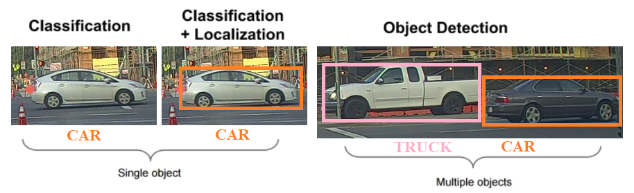


Here's what we can infer:
- In the image classification problem, there is generally a (big) central object in an image and we have to recognize the object by assigning a correct label to the image. 

- Image classification with localization aims to find the location of an object in an image by not only assigning a label (class) the image (for example, a binary classification problem: whether there is a car in an image or not), but also finding a bounding box around the object, if there is one to be found.

- Detection goes a level further by aiming to identify multiple instances of same/different types of objects, by localizing all the objects (all instances) by marking their locations (the localization problem usually tries to find a single object location).

- The localization problem can be converted to a supervised machine learning multi-class classification and a regression problem in the following way: in addition to the class labels of the objects to be identified (with classification), the output vector corresponding to an input training image must also contain the location (bounding box coordinates relative to image size, with regression) of the object.

- A typical output data vector will contain eight entries for a 4-class classification. As shown in the following diagram, the first entry will correspond to whether or not an object of any from the three classes of objects (except the background). If one is present in an image, the next four entries will define the bounding box containing the object, followed by three binary values for the three class labels indicating the class of the object. If none of the objects are present, the first entry will be 0 and the others will be ignored:

  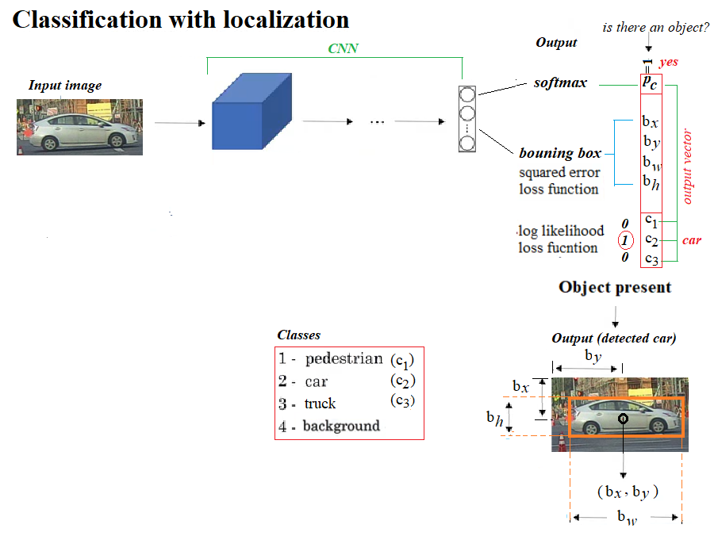

  

## Proposing and detecting objects using CNNs                                                        
Moving from localization to detection, we can proceed in two steps, as shown in the following screenshot: first use small tightly cropped images to train a convolution neural net for image classification, and then use sliding windows of different window sizes (smaller to larger) to classify a test image within that window using the convnet learnt and run the windows sequentially through the entire image, but it’s infeasibly slow computationally.

However, as shown in the next figure, the convolutional implementation of the sliding windows by replacing the fully connected layers with 1 × 1 filters makes it possible to simultaneously classify the image-subset inside all possible sliding windows parallelly, making it much more efficient computationally.

## Using YOLO v2                                                         
The convolutional sliding windows, although computationally much more efficient, still has the problem of detecting bounding boxes accurately, since the boxes don’t align with the sliding windows and the object shapes also tend to be different. The YOLO algorithm overcomes this limitation by dividing a training image into grids and assigning an object to a grid if and only if the center of the object falls inside the grid. This way, each object in a training image can get assigned to exactly one grid and then the corresponding bounding box is represented by the coordinates relative to the grid. 

In the test images, multiple adjacent grids may think that an object actually belongs to them. In order to resolve this, the intersection of union (iou) measure is used to find the maximum overlap and the non-maximum-suppression algorithm is used to discard all the other bounding boxes with low-confidence of containing an object, keeping the one with the highest confidence among the competing ones, and discarding the others. Still, there is the problem of multiple objects falling in the same grid. Multiple anchor boxes (of different shapes) are used to resolve the problem, each anchor box of a particular shape being likely to eventually detect an object of a particular shape.

If we want YOLO to recognize 80 classes that we have, we will represent the class label c as an 80-dimensional vector, which means having 80 numbers out of these 80 numbers, one of the components is 0, whereas others are 1.

To reduce the computational expense in training the YOLO model, we will be using pre-trained weights. For more detail about the model, refer to the links provided at the end of the chapter.

## Using a pre-trained YOLO model for object detection                                                        
The following are the steps that you must follow to be able to use the pre-trained model:
1. Clone this repository: go to https://github.com/allanzelener/YAD2K/, right-click on clone or download, and select the path where you want to download the ZIP. Then unzip the compressed file to YAD2K-master folder.

2. Download the weights and cfg file from https://pjreddie.com/darknet/yolo/ by clicking on the yellow links on the page, marked by red boxes here:
   


    
3. Save the yolov2.cfg and the yolov2.weights files downloaded inside the YAD2K-master folder.

4. Go inside the YAD2K-master folder, open a command prompt (you need to have Python3 installed and in path) and run the following command:

    python yad2k.py yolov2.cfg yolov2.weights yolo/yolo.h5


    If executed successfully, it will create two files inside the YAD2K-master/model_data folder, namely, yolo.h5 and yolo.anchors.

5. Now go to the folder from where you want to run your code. Create a folder named yolo here and copy the four files (coco_classes, pascal_classes, yolo.h5, yolo.anchors) from the YAD2K-master/model_data folder to the yolo folder you created.
6. Copy the yad2k folder from the YAD2K-master folder to the current path. Your current path should have these two folders, yad2k and yolo, now. 
7. Create a new folder named images in the current path and put your input images here.
8. Create another new empty folder named output in the current path. The YOLO model will save the output images (with objects detected) here.
9. Create a .py script in the current path and copy-paste the following code and run (or run in from Jupyter Notebook cell from the current path). 
10. Double-check that the folder structure is exactly as shown in the following screenshot, with the required files present, before running the code:

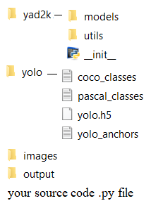

Let's first load all the required libraries, as shown in this code block:


```python
# import the needed modules
import os
import matplotlib.pylab as pylab
import scipy.io
import scipy.misc
import numpy as np
from PIL import Image
from keras import backend as K
from keras.models import load_model
# The following functions from the yad2k library will be used
# Note: it assumed that you have the yad2k folder in your current path,otherwise it will not work!
from yad2k.models.keras_yolo import yolo_head, yolo_eval
import colorsys
import imghdr
import random
from PIL import Image, ImageDraw, ImageFont


def read_classes(classes_path):
    with open(classes_path) as f:
        class_names = f.readlines()
        class_names = [c.strip() for c in class_names]
    return class_names

def read_anchors(anchors_path):
    with open(anchors_path) as f:
        anchors = f.readline()
        anchors = [float(x) for x in anchors.split(',')]
        anchors = np.array(anchors).reshape(-1, 2)
    return anchors

def generate_colors(class_names):
    hsv_tuples = [(x / len(class_names), 1., 1.) for x in
    range(len(class_names))]
    colors = list(map(lambda x: colorsys.hsv_to_rgb(*x), hsv_tuples))
    colors = list(map(lambda x: (int(x[0] * 255), int(x[1] * 255), int(x[2] * 255)), colors))
    random.seed(10101) # Fixed seed for consistent colors across runs.
    random.shuffle(colors) # Shuffle colors to decorrelate adjacent classes.
    random.seed(None) # Reset seed to default.
    return colors

def scale_boxes(boxes, image_shape):
    """ scales the predicted boxes in order to be drawable on the image"""
    height = image_shape[0]
    width = image_shape[1]
    image_dims = K.stack([height, width, height, width])
    image_dims = K.reshape(image_dims, [1, 4])
    boxes = boxes * image_dims
    return boxes

def preprocess_image(img_path, model_image_size):
    image_type = imghdr.what(img_path)
    image = Image.open(img_path)
    resized_image = image.resize(tuple(reversed(model_image_size)), Image.BICUBIC)
    image_data = np.array(resized_image, dtype='float32')
    image_data /= 255.
    image_data = np.expand_dims(image_data, 0) # Add batch dimension.
    return image, image_data

def draw_boxes(image, out_scores, out_boxes, out_classes, class_names, colors):
    font = ImageFont.truetype(font="arial.ttf", size=np.floor(3e-2 * image.size[1] + 0.5).astype('int32'))
    thickness = (image.size[0] + image.size[1]) // 300
    for i, c in reversed(list(enumerate(out_classes))):
        predicted_class = class_names[c]
        box = out_boxes[i]
        score = out_scores[i]
        label = '{} {:.2f}'.format(predicted_class, score)
        draw = ImageDraw.Draw(image)
        label_size = draw.textsize(label, font)
        top, left, bottom, right = box
        top = max(0, np.floor(top + 0.5).astype('int32'))
        left = max(0, np.floor(left + 0.5).astype('int32'))
        bottom = min(image.size[1], np.floor(bottom + 0.5).astype('int32'))
        right = min(image.size[0], np.floor(right + 0.5).astype('int32'))
        print(label, (left, top), (right, bottom))
        if top - label_size[1] >= 0:
            text_origin = np.array([left, top - label_size[1]])
        else:
            text_origin = np.array([left, top + 1])
        # My kingdom for a good redistributable image drawing library.
        for i in range(thickness):
            draw.rectangle([left + i, top + i, right - i, bottom - i], outline=colors[c])
        draw.rectangle([tuple(text_origin), tuple(text_origin + label_size)], fill=colors[c])
        draw.text(text_origin, label, fill=(0, 0, 0), font=font)
        del draw
                              
# provide the name of the image that you saved in the images folder to be fed through the network
input_image_name = "giraffe_zebra.jpg"
input_image = Image.open("images/" + input_image_name)
width, height = input_image.size
width = np.array(width, dtype=float)
height = np.array(height, dtype=float)
image_shape = (height, width)
#Loading the classes and the anchor boxes that are copied to the yolo folder
class_names = read_classes("yolo/coco_classes.txt")    
anchors = read_anchors("yolo/yolo_anchors.txt")
#Load the pretrained model
# Download the weights and cfg file from https://pjreddie.com/darknet/yolo/ and create the yolo.h5 file with
# python yad2k.py yolov2.cfg yolov2.weights yolo/yolo.h5
yolo_model = load_model("yolo/yolo.h5")
#Print the summery of the model
yolo_model.summary()
# convert final layer features to bounding box parameters
yolo_outputs = yolo_head(yolo_model.output, anchors, len(class_names))
#Now yolo_eval function selects the best boxes using filtering and non-max suppression techniques.
# If you want to dive in more to see how this works, refer keras_yolo.py file in yad2k/models
boxes, scores, classes = yolo_eval(yolo_outputs, image_shape)
# Initiate a session
sess = K.get_session()
#Preprocess the input image before feeding into the convolutional network
image, image_data = preprocess_image("images/" + input_image_name, model_image_size = (608, 608))
#Run the session
out_scores, out_boxes, out_classes = sess.run([scores, boxes,
classes],feed_dict={yolo_model.input:image_data,K.learning_phase(): 0})
#Print the results
print('Found {} boxes for {}'.format(len(out_boxes), input_image_name))
#Produce the colors for the bounding boxs
colors = generate_colors(class_names)
#Draw the bounding boxes   
draw_boxes(image, out_scores, out_boxes, out_classes, class_names, colors)
#Apply the predicted bounding boxes to the image and save it
image.save(os.path.join("output", input_image_name), quality=90)
output_image = scipy.misc.imread(os.path.join("output", input_image_name))
pylab.figure(figsize=(20,20))
pylab.imshow(output_image)
pylab.axis('off')
pylab.show()
```

    C:\Users\Sandipan.Dey\Anaconda\envs\ana41py35\lib\site-packages\keras\engine\saving.py:292: UserWarning: No training configuration found in save file: the model was *not* compiled. Compile it manually.
      warnings.warn('No training configuration found in save file: '


    __________________________________________________________________________________________________
    Layer (type)                    Output Shape         Param #     Connected to                     
    ==================================================================================================
    input_1 (InputLayer)            (None, 608, 608, 3)  0                                            
    __________________________________________________________________________________________________
    conv2d_1 (Conv2D)               (None, 608, 608, 32) 864         input_1[0][0]                    
    __________________________________________________________________________________________________
    batch_normalization_1 (BatchNor (None, 608, 608, 32) 128         conv2d_1[0][0]                   
    __________________________________________________________________________________________________
    leaky_re_lu_1 (LeakyReLU)       (None, 608, 608, 32) 0           batch_normalization_1[0][0]      
    __________________________________________________________________________________________________
    max_pooling2d_1 (MaxPooling2D)  (None, 304, 304, 32) 0           leaky_re_lu_1[0][0]              
    __________________________________________________________________________________________________
    conv2d_2 (Conv2D)               (None, 304, 304, 64) 18432       max_pooling2d_1[0][0]            
    __________________________________________________________________________________________________
    batch_normalization_2 (BatchNor (None, 304, 304, 64) 256         conv2d_2[0][0]                   
    __________________________________________________________________________________________________
    leaky_re_lu_2 (LeakyReLU)       (None, 304, 304, 64) 0           batch_normalization_2[0][0]      
    __________________________________________________________________________________________________
    max_pooling2d_2 (MaxPooling2D)  (None, 152, 152, 64) 0           leaky_re_lu_2[0][0]              
    __________________________________________________________________________________________________
    conv2d_3 (Conv2D)               (None, 152, 152, 128 73728       max_pooling2d_2[0][0]            
    __________________________________________________________________________________________________
    batch_normalization_3 (BatchNor (None, 152, 152, 128 512         conv2d_3[0][0]                   
    __________________________________________________________________________________________________
    leaky_re_lu_3 (LeakyReLU)       (None, 152, 152, 128 0           batch_normalization_3[0][0]      
    __________________________________________________________________________________________________
    conv2d_4 (Conv2D)               (None, 152, 152, 64) 8192        leaky_re_lu_3[0][0]              
    __________________________________________________________________________________________________
    batch_normalization_4 (BatchNor (None, 152, 152, 64) 256         conv2d_4[0][0]                   
    __________________________________________________________________________________________________
    leaky_re_lu_4 (LeakyReLU)       (None, 152, 152, 64) 0           batch_normalization_4[0][0]      
    __________________________________________________________________________________________________
    conv2d_5 (Conv2D)               (None, 152, 152, 128 73728       leaky_re_lu_4[0][0]              
    __________________________________________________________________________________________________
    batch_normalization_5 (BatchNor (None, 152, 152, 128 512         conv2d_5[0][0]                   
    __________________________________________________________________________________________________
    leaky_re_lu_5 (LeakyReLU)       (None, 152, 152, 128 0           batch_normalization_5[0][0]      
    __________________________________________________________________________________________________
    max_pooling2d_3 (MaxPooling2D)  (None, 76, 76, 128)  0           leaky_re_lu_5[0][0]              
    __________________________________________________________________________________________________
    conv2d_6 (Conv2D)               (None, 76, 76, 256)  294912      max_pooling2d_3[0][0]            
    __________________________________________________________________________________________________
    batch_normalization_6 (BatchNor (None, 76, 76, 256)  1024        conv2d_6[0][0]                   
    __________________________________________________________________________________________________
    leaky_re_lu_6 (LeakyReLU)       (None, 76, 76, 256)  0           batch_normalization_6[0][0]      
    __________________________________________________________________________________________________
    conv2d_7 (Conv2D)               (None, 76, 76, 128)  32768       leaky_re_lu_6[0][0]              
    __________________________________________________________________________________________________
    batch_normalization_7 (BatchNor (None, 76, 76, 128)  512         conv2d_7[0][0]                   
    __________________________________________________________________________________________________
    leaky_re_lu_7 (LeakyReLU)       (None, 76, 76, 128)  0           batch_normalization_7[0][0]      
    __________________________________________________________________________________________________
    conv2d_8 (Conv2D)               (None, 76, 76, 256)  294912      leaky_re_lu_7[0][0]              
    __________________________________________________________________________________________________
    batch_normalization_8 (BatchNor (None, 76, 76, 256)  1024        conv2d_8[0][0]                   
    __________________________________________________________________________________________________
    leaky_re_lu_8 (LeakyReLU)       (None, 76, 76, 256)  0           batch_normalization_8[0][0]      
    __________________________________________________________________________________________________
    max_pooling2d_4 (MaxPooling2D)  (None, 38, 38, 256)  0           leaky_re_lu_8[0][0]              
    __________________________________________________________________________________________________
    conv2d_9 (Conv2D)               (None, 38, 38, 512)  1179648     max_pooling2d_4[0][0]            
    __________________________________________________________________________________________________
    batch_normalization_9 (BatchNor (None, 38, 38, 512)  2048        conv2d_9[0][0]                   
    __________________________________________________________________________________________________
    leaky_re_lu_9 (LeakyReLU)       (None, 38, 38, 512)  0           batch_normalization_9[0][0]      
    __________________________________________________________________________________________________
    conv2d_10 (Conv2D)              (None, 38, 38, 256)  131072      leaky_re_lu_9[0][0]              
    __________________________________________________________________________________________________
    batch_normalization_10 (BatchNo (None, 38, 38, 256)  1024        conv2d_10[0][0]                  
    __________________________________________________________________________________________________
    leaky_re_lu_10 (LeakyReLU)      (None, 38, 38, 256)  0           batch_normalization_10[0][0]     
    __________________________________________________________________________________________________
    conv2d_11 (Conv2D)              (None, 38, 38, 512)  1179648     leaky_re_lu_10[0][0]             
    __________________________________________________________________________________________________
    batch_normalization_11 (BatchNo (None, 38, 38, 512)  2048        conv2d_11[0][0]                  
    __________________________________________________________________________________________________
    leaky_re_lu_11 (LeakyReLU)      (None, 38, 38, 512)  0           batch_normalization_11[0][0]     
    __________________________________________________________________________________________________
    conv2d_12 (Conv2D)              (None, 38, 38, 256)  131072      leaky_re_lu_11[0][0]             
    __________________________________________________________________________________________________
    batch_normalization_12 (BatchNo (None, 38, 38, 256)  1024        conv2d_12[0][0]                  
    __________________________________________________________________________________________________
    leaky_re_lu_12 (LeakyReLU)      (None, 38, 38, 256)  0           batch_normalization_12[0][0]     
    __________________________________________________________________________________________________
    conv2d_13 (Conv2D)              (None, 38, 38, 512)  1179648     leaky_re_lu_12[0][0]             
    __________________________________________________________________________________________________
    batch_normalization_13 (BatchNo (None, 38, 38, 512)  2048        conv2d_13[0][0]                  
    __________________________________________________________________________________________________
    leaky_re_lu_13 (LeakyReLU)      (None, 38, 38, 512)  0           batch_normalization_13[0][0]     
    __________________________________________________________________________________________________
    max_pooling2d_5 (MaxPooling2D)  (None, 19, 19, 512)  0           leaky_re_lu_13[0][0]             
    __________________________________________________________________________________________________
    conv2d_14 (Conv2D)              (None, 19, 19, 1024) 4718592     max_pooling2d_5[0][0]            
    __________________________________________________________________________________________________
    batch_normalization_14 (BatchNo (None, 19, 19, 1024) 4096        conv2d_14[0][0]                  
    __________________________________________________________________________________________________
    leaky_re_lu_14 (LeakyReLU)      (None, 19, 19, 1024) 0           batch_normalization_14[0][0]     
    __________________________________________________________________________________________________
    conv2d_15 (Conv2D)              (None, 19, 19, 512)  524288      leaky_re_lu_14[0][0]             
    __________________________________________________________________________________________________
    batch_normalization_15 (BatchNo (None, 19, 19, 512)  2048        conv2d_15[0][0]                  
    __________________________________________________________________________________________________
    leaky_re_lu_15 (LeakyReLU)      (None, 19, 19, 512)  0           batch_normalization_15[0][0]     
    __________________________________________________________________________________________________
    conv2d_16 (Conv2D)              (None, 19, 19, 1024) 4718592     leaky_re_lu_15[0][0]             
    __________________________________________________________________________________________________
    batch_normalization_16 (BatchNo (None, 19, 19, 1024) 4096        conv2d_16[0][0]                  
    __________________________________________________________________________________________________
    leaky_re_lu_16 (LeakyReLU)      (None, 19, 19, 1024) 0           batch_normalization_16[0][0]     
    __________________________________________________________________________________________________
    conv2d_17 (Conv2D)              (None, 19, 19, 512)  524288      leaky_re_lu_16[0][0]             
    __________________________________________________________________________________________________
    batch_normalization_17 (BatchNo (None, 19, 19, 512)  2048        conv2d_17[0][0]                  
    __________________________________________________________________________________________________
    leaky_re_lu_17 (LeakyReLU)      (None, 19, 19, 512)  0           batch_normalization_17[0][0]     
    __________________________________________________________________________________________________
    conv2d_18 (Conv2D)              (None, 19, 19, 1024) 4718592     leaky_re_lu_17[0][0]             
    __________________________________________________________________________________________________
    batch_normalization_18 (BatchNo (None, 19, 19, 1024) 4096        conv2d_18[0][0]                  
    __________________________________________________________________________________________________
    leaky_re_lu_18 (LeakyReLU)      (None, 19, 19, 1024) 0           batch_normalization_18[0][0]     
    __________________________________________________________________________________________________
    conv2d_19 (Conv2D)              (None, 19, 19, 1024) 9437184     leaky_re_lu_18[0][0]             
    __________________________________________________________________________________________________
    batch_normalization_19 (BatchNo (None, 19, 19, 1024) 4096        conv2d_19[0][0]                  
    __________________________________________________________________________________________________
    conv2d_21 (Conv2D)              (None, 38, 38, 64)   32768       leaky_re_lu_13[0][0]             
    __________________________________________________________________________________________________
    leaky_re_lu_19 (LeakyReLU)      (None, 19, 19, 1024) 0           batch_normalization_19[0][0]     
    __________________________________________________________________________________________________
    batch_normalization_21 (BatchNo (None, 38, 38, 64)   256         conv2d_21[0][0]                  
    __________________________________________________________________________________________________
    conv2d_20 (Conv2D)              (None, 19, 19, 1024) 9437184     leaky_re_lu_19[0][0]             
    __________________________________________________________________________________________________
    leaky_re_lu_21 (LeakyReLU)      (None, 38, 38, 64)   0           batch_normalization_21[0][0]     
    __________________________________________________________________________________________________
    batch_normalization_20 (BatchNo (None, 19, 19, 1024) 4096        conv2d_20[0][0]                  
    __________________________________________________________________________________________________
    space_to_depth_x2 (Lambda)      (None, 19, 19, 256)  0           leaky_re_lu_21[0][0]             
    __________________________________________________________________________________________________
    leaky_re_lu_20 (LeakyReLU)      (None, 19, 19, 1024) 0           batch_normalization_20[0][0]     
    __________________________________________________________________________________________________
    concatenate_1 (Concatenate)     (None, 19, 19, 1280) 0           space_to_depth_x2[0][0]          
                                                                     leaky_re_lu_20[0][0]             
    __________________________________________________________________________________________________
    conv2d_22 (Conv2D)              (None, 19, 19, 1024) 11796480    concatenate_1[0][0]              
    __________________________________________________________________________________________________
    batch_normalization_22 (BatchNo (None, 19, 19, 1024) 4096        conv2d_22[0][0]                  
    __________________________________________________________________________________________________
    leaky_re_lu_22 (LeakyReLU)      (None, 19, 19, 1024) 0           batch_normalization_22[0][0]     
    __________________________________________________________________________________________________
    conv2d_23 (Conv2D)              (None, 19, 19, 425)  435625      leaky_re_lu_22[0][0]             
    ==================================================================================================
    Total params: 50,983,561
    Trainable params: 50,962,889
    Non-trainable params: 20,672
    __________________________________________________________________________________________________
    Found 5 boxes for giraffe_zebra.jpg
    zebra 0.83 (16, 325) (126, 477)
    giraffe 0.89 (56, 175) (272, 457)
    zebra 0.91 (370, 326) (583, 472)
    giraffe 0.94 (388, 119) (554, 415)
    giraffe 0.95 (205, 111) (388, 463)


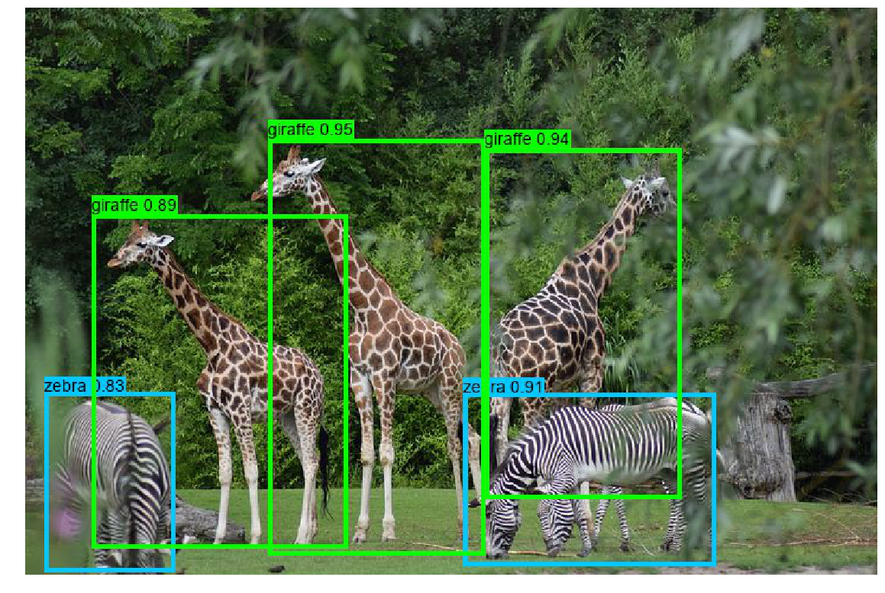


```python
# for jupyter notebook uncomment the following line of code
#% matplotlib inline
import os
import matplotlib.pylab as pylab
import scipy.io
import scipy.misc
import numpy as np
from PIL import Image
from keras import backend as K
from keras.models import load_model
# The following functions from the yad2k library will be used
# Note: it assumed that you have the yad2k folder in your current path, otherwise it will not work
from yad2k.models.keras_yolo import yolo_head, yolo_eval
import colorsys
import imghdr
import random
from PIL import Image, ImageDraw, ImageFont
```

Now implement a few functions to read the classes and anchor files, generate the color of the boxes, and scale the boxes predicted by YOLO:


```python
def read_classes(classes_path):    
    with open(classes_path) as f:        
        class_names = f.readlines()    
    class_names = [c.strip() for c in class_names]    
    return class_names
    
def read_anchors(anchors_path):    
    with open(anchors_path) as f:       
        anchors = f.readline()        
        anchors = [float(x) for x in anchors.split(',')]        
        anchors = np.array(anchors).reshape(-1, 2)    
    return anchors
def generate_colors(class_names):    
    hsv_tuples = [(x / len(class_names), 1., 1.) for x in range(len(class_names))]    
    colors = list(map(lambda x: colorsys.hsv_to_rgb(*x), hsv_tuples))    
    colors = list(map(lambda x: (int(x[0] * 255), int(x[1] * 255), int(x[2] * 255)), colors))   
    random.seed(10101) # Fixed seed for consistent colors across runs.    
    random.shuffle(colors) # Shuffle colors to decorrelate adjacent classes.    
    random.seed(None) # Reset seed to default.    
    return colors
def scale_boxes(boxes, image_shape):    
    """ scales the predicted boxes in order to be drawable on the image"""    
    height = image_shape[0]    
    width = image_shape[1]    
    image_dims = K.stack([height, width, height, width])    
    image_dims = K.reshape(image_dims, [1, 4])    
    boxes = boxes * image_dims   
    return boxes
```

In the following code snippet, we'll implement a couple of functions to preprocess an image and draw the boxes obtained from YOLO to detect the objects present in the image:


```python
def preprocess_image(img_path, model_image_size):    
    image_type = imghdr.what(img_path)    
    image = Image.open(img_path)    
    resized_image = image.resize(tuple(reversed(model_image_size)), Image.BICUBIC)    
    image_data = np.array(resized_image, dtype='float32')    
    image_data /= 255.    
    image_data = np.expand_dims(image_data, 0) # Add batch dimension.    
    return image, image_data

def draw_boxes(image, out_scores, out_boxes, out_classes, class_names, colors):        
    font = ImageFont.truetype(font='font/FiraMono-Medium.otf',size=np.floor(3e-2 * image.size[1] + 0.5).astype('int32'))    
    thickness = (image.size[0] + image.size[1]) // 300    
    for i, c in reversed(list(enumerate(out_classes))):        
        predicted_class = class_names[c]        
        box = out_boxes[i]        
        score = out_scores[i]        
        label = '{} {:.2f}'.format(predicted_class, score)        
        draw = ImageDraw.Draw(image)        
        label_size = draw.textsize(label, font)        
        top, left, bottom, right = box        
        top = max(0, np.floor(top + 0.5).astype('int32'))        
        left = max(0, np.floor(left + 0.5).astype('int32'))        
        bottom = min(image.size[1], np.floor(bottom + 0.5).astype('int32'))        
        right = min(image.size[0], np.floor(right + 0.5).astype('int32'))        
        print(label, (left, top), (right, bottom))        
        if top - label_size[1] >= 0:            
            text_origin = np.array([left, top - label_size[1]])        
        else:            
            text_origin = np.array([left, top + 1])        
            # My kingdom for a good redistributable image drawing library.        
        for i in range(thickness):            
            draw.rectangle([left + i, top + i, right - i, bottom - i], outline=colors[c])        
        draw.rectangle([tuple(text_origin), tuple(text_origin + label_size)], fill=colors[c])        
        draw.text(text_origin, label, fill=(0, 0, 0), font=font)        
        del draw
```

Let's now load the input image, the classes file, and the anchors using our functions, then load the YOLO pretrained model and print the model summary using the next code block:


```python
# provide the name of the image that you saved in the images folder to be fed through the network
input_image_name = "giraffe_zebra.jpg"
input_image = Image.open("images/" + input_image_name)
width, height = input_image.size
width = np.array(width, dtype=float
height = np.array(height, dtype=float)
image_shape = (height, width)
#Loading the classes and the anchor boxes that are copied to the yolo folder
class_names = read_classes("yolo/coco_classes.txt")
anchors = read_anchors("yolo/yolo_anchors.txt")
#Load the pretrained model 
yolo_model = load_model("yolo/yolo.h5")#Print the summery of the model
yolo_model.summary()
```

## Semantic Segmentation 

In this section, we'll discuss how to use a deep learning FCN to perform semantic segmentation of an image. Before diving into further details, let's clear the basic concepts.

Semantic segmentation refers to an understanding of an image at pixel level; that is, when we want to assign each pixel in the image an object class (a semantic label). It is a natural step in the progression from coarse to fine inference. It achieves fine-grained inference by making dense predictions that infer labels for every pixel so that each pixel is labeled with the class of its enclosing object or region.

### with DeepLab V3+

DeepLab presents an architecture for controlling signal decimation and learning multi-scale contextual features. DeepLab uses an ResNet-50 model, pre-trained on the ImageNet dataset, as its main feature extractor network. However, it proposes a new residual block for multi-scale feature learning, as shown in the following diagram. Instead of regular convolutions, the last ResNet block uses atrous convolutions. Also, each convolution (within this new block) uses different dilation rates to capture multi-scale context. Additionally, on top of this new block, it uses Atrous Spatial Pyramid Pooling (ASPP). ASPP uses dilated convolutions with different rates as an attempt of classifying regions of an arbitrary scale. Hence, the DeepLab v3+ architecture contains three main components:
1. The ResNet architecture
2. Atrous convolutions
3. Atrous Spatial Pyramid Pooling

### DeepLab v3 architecture                                                        
The image shows the parallel modules with atrous convolution:


With DeepLab-v3+, the DeepLab-v3 model is extended by adding a simple, yet effective, decoder module to refine the segmentation results, especially along object boundaries. The depth-wise separable convolution is applied to both atrous spatial pyramid pooling and decoder modules, resulting in a faster and stronger encoder-decoder network for semantic segmentation. The architecture is shown in the following diagram:


### Steps you must follow to use DeepLab V3+ model for semantic segmentation
Here are the steps that must be followed to be able to use the model to segment an image:
1. First, clone or download the repository from https://github.com/bonlime/keras-deeplab-v3-plus.
2. Extract the ZIP file downloaded to the keras-deeplab-v3-plus-master folder.
3. Navigate to the keras-deeplab-v3-plus-master folder; the following code needs to be run from inside the directory.

Before running the following code block, create an input folder and an empty output folder. Save your images you want to segment inside the input folder. The following code block shows how to use the Deeplabv3+ in Python to do semantic segmentation:


```python
% matplotlib inline
import os
os.chdir('keras-deeplab-v3-plus-master') # go to keras-deeplab-v3-plusmaster
from matplotlib import pyplot as pylab
import cv2 # used for resize
import numpy as np
from model import Deeplabv3
deeplab_model = Deeplabv3()
pathIn = 'input' # path for the input image
pathOut = 'output' # output path for the segmented image
img = pylab.imread(pathIn + "/cycle.jpg")
w, h, _ = img.shape
ratio = 512. / np.max([w,h])
resized = cv2.resize(img,(int(ratio*h),int(ratio*w)))
resized = resized / 127.5 - 1.
pad_x = int(512 - resized.shape[0])
resized2 = np.pad(resized,((0,pad_x),(0,0),(0,0)),mode='constant')
res = deeplab_model.predict(np.expand_dims(resized2,0))
labels = np.argmax(res.squeeze(),-1)
pylab.figure(figsize=(10,10))
pylab.imshow(labels[:-pad_x], cmap='inferno'), pylab.axis('off'),
pylab.colorbar()
pylab.show()
pylab.savefig(pathOut + "\\segmented.jpg", bbox_inches='tight',
pad_inches=0)
pylab.close()
os.chdir('..')
```


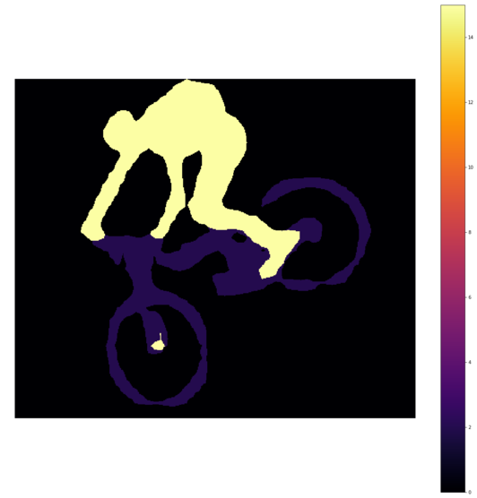

You can obtain the labels of the segments and create an overlay with yet another input image, as shown in the following diagram:

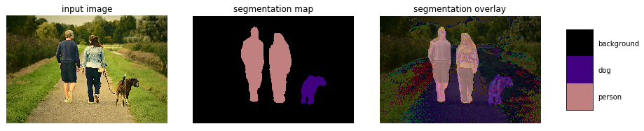


### Transfer Learning what it is, and when to use it 
Transfer learning is a deep learning strategy that reuses knowledge gained from solving one problem by applying it to a different, but related, problem. For example, let's say we have three types of flowers, namely, a rose, a sunflower, and a tulip. We can use the standard pre-trained models, such as VGG16/19, ResNet50, or InceptionV3 models (pre-trained on ImageNet with 1000 output classes, which can be found at https://gist.github.com/yrevar/942d3a0ac09ec9e5eb3a) to classify the flower images, but our model wouldn't be able to correctly identify them because these flower categories were not learned by the models. In other words, they are classes that the model is not aware of.

The following image shows how the flower images are classified wrongly by the pre-trained VGG16 model (the code is left to the reader as an exercise):

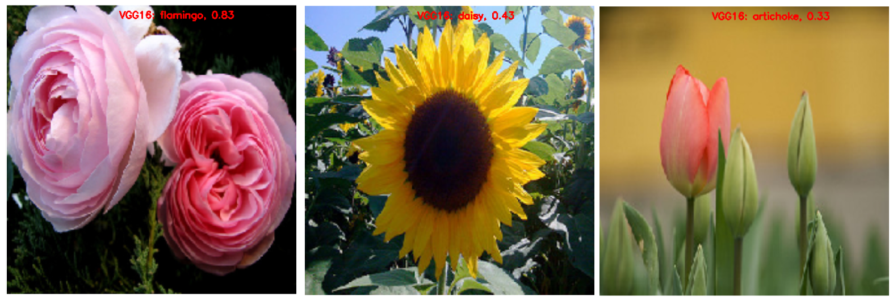

### Transfer learning with Keras                                                        
Training of pre-trained models is done on many comprehensive image classification problems. The convolutional layers act as a feature extractor, and the fully connected (FC) layers act as classifiers, as shown in the following diagram, in the context of cat vs. dog image classification with a conv net:

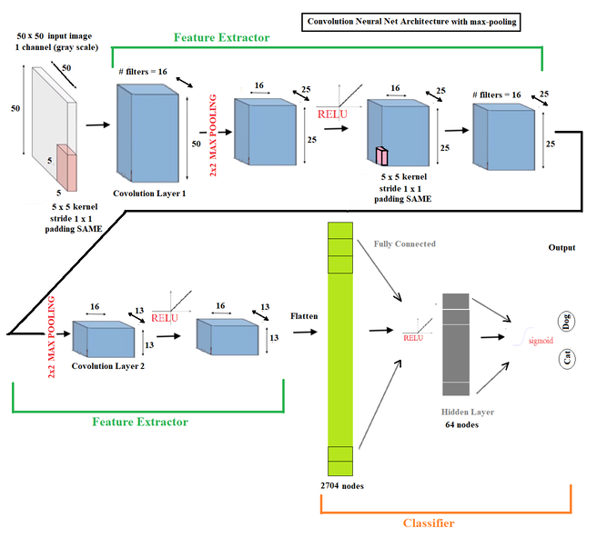

Since the standard models, such as VGG-16/19, are quite large and are trained on many images, they are capable of learning many different features for different classes. We can simply reuse the convolutional layers as a feature extractor that learns low and high level image features, and train only the FC layer weights (parameters). This is what transfer learning is.

We can use transfer learning when we have a training set that is concise, and the problem that we are dealing with is the same as that on which the pre-trained model was trained. We can tweak the convolutional layers if we have ample data, and learn all the model parameters from scratch so that we can train the models to learn more robust features relevant to our problem. 

Now, let's use transfer learning to classify rose, sunflower and tulip flower images. These images are obtained from the TensorFlow sample image dataset, available at http://download.tensorflow.org/example_images/flower_photos.tgz. Let's use 550 images for each of the three classes, making a total of 1,650 images, which is a small number of images and the right place to use transfer learning. We'll use 500 images from each class for training, reserving the remaining 50 images from each class for validation. Also, let's create a folder called flower_photos, with two sub-folders, train and valid, inside it, and save our training and validation images inside those folders, respectively. The folder structure should look such as the following:

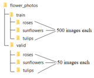


We will first load the weights of the convolution layers only for the pre-trained VGG16 model (with include_top=False, let's not load the last two FC layers), which will act as our classifier. Note that the last layer has a shape of 7 x 7 x 512.

We will use the ImageDataGenerator class to load the images, and the flow_from_directory() function to generate batches of images and labels. We will also use model.predict() function to pass the image through the network, giving us a 7 x 7 x 512 dimensional tensor and subsequently reshape the tensor into a vector. We will find the validation_features in the same way.

That being said, let's implement transfer learning with Keras to train the VGG16 model partially—that is, it will just learn the weights for the FC layers only on the training images we have, and then use it to predict the classes:

* First download the TensorFlow sample image dataset, available at http://download.tensorflow.org/example_images/flower_photos.tgz and unzip.
* Select 500 roses, sunflowers and tulip images each and put them in the **train** folder
* Select 50 roses, sunflowers and tulip images each and put them in the **valid** folder


```python
from keras.applications import VGG16 
from keras.preprocessing.image import ImageDataGenerator
from keras import models, layers, optimizers
from keras.layers.normalization import BatchNormalization
import matplotlib.pylab as plt
from keras.preprocessing.image import load_img

vgg_conv = VGG16(weights='imagenet',
                  include_top=False,
                  input_shape=(224, 224, 3)) # it will download weights for the first time
```

    Using TensorFlow backend.


```python
import numpy as np

train_dir = './flower_photos/train'
validation_dir = './flower_photos/valid'
 
nTrain = 500*3
nVal = 50*3


datagen = ImageDataGenerator(rescale=1./255)
batch_size = 25
 
train_features = np.zeros(shape=(nTrain, 7, 7, 512))
train_labels = np.zeros(shape=(nTrain,3))

train_generator = datagen.flow_from_directory(
    train_dir,
    target_size=(224, 224),
    batch_size=batch_size,
    class_mode='categorical',
    shuffle=True)
```

    Found 1650 images belonging to 3 classes.

```python
i = 0
for inputs_batch, labels_batch in train_generator:
    features_batch = vgg_conv.predict(inputs_batch)
    train_features[i * batch_size : (i + 1) * batch_size] = features_batch
    train_labels[i * batch_size : (i + 1) * batch_size] = labels_batch
    i += 1
    #print(i * batch_size)
    if i * batch_size >= nTrain:
        break
         
train_features = np.reshape(train_features, (nTrain, 7 * 7 * 512))
```


```python
validation_features = np.zeros(shape=(nVal, 7, 7, 512))
validation_labels = np.zeros(shape=(nVal,3))

validation_generator = datagen.flow_from_directory(
    validation_dir,
    target_size=(224, 224),
    batch_size=batch_size,
    class_mode='categorical',
    shuffle=False)
i = 0
for inputs_batch, labels_batch in validation_generator:
    features_batch = vgg_conv.predict(inputs_batch)
    validation_features[i * batch_size : (i + 1) * batch_size] = features_batch
    validation_labels[i * batch_size : (i + 1) * batch_size] = labels_batch
    i += 1
    if i * batch_size >= nVal:
        break
         
validation_features = np.reshape(validation_features, (nVal, 7 * 7 * 512))
```

    Found 150 images belonging to 3 classes.


Next, create your own model with a simple feed-forward network with a softmax output layer that has three classes. Next, we have to train the model. As you have already seen, training a network in Keras is as simple as calling the model.fit() function. In order to check the performance of the model, let's visualize which images are wrongly classified:


```python
model = models.Sequential()
model.add(layers.Dense(512, activation='relu', input_dim=7 * 7 * 512))
model.add(BatchNormalization())
model.add(layers.Dropout(0.5))
#model.add(layers.Dense(256, activation='relu')) # make the neural network deep
#model.add(BatchNormalization())
#model.add(layers.Dropout(0.5))
model.add(layers.Dense(3, activation='softmax'))
```


```python
model.compile(optimizer = optimizers.Adam(lr=1e-4), #optimizers.RMSprop(lr=1e-3),
              loss='categorical_crossentropy',
              metrics=['acc'])
 
history = model.fit(train_features,
                    train_labels,
                    epochs=10,
                    batch_size=batch_size,
                    validation_data=(validation_features,validation_labels))
```

    Train on 1500 samples, validate on 150 samples
    Epoch 1/10
    1500/1500 [==============================] - 13s 9ms/step - loss: 0.7524 - acc: 0.7473 - val_loss: 0.4640 - val_acc: 0.8533
    Epoch 2/10
    1500/1500 [==============================] - 10s 7ms/step - loss: 0.2686 - acc: 0.8973 - val_loss: 0.3131 - val_acc: 0.8933
    Epoch 3/10
    1500/1500 [==============================] - 11s 7ms/step - loss: 0.1422 - acc: 0.9493 - val_loss: 0.3989 - val_acc: 0.8533
    Epoch 4/10
    1500/1500 [==============================] - 11s 8ms/step - loss: 0.0985 - acc: 0.9620 - val_loss: 0.3599 - val_acc: 0.9000
    Epoch 5/10
    1500/1500 [==============================] - 11s 7ms/step - loss: 0.0767 - acc: 0.9733 - val_loss: 0.2908 - val_acc: 0.9200
    Epoch 6/10
    1500/1500 [==============================] - 11s 7ms/step - loss: 0.0552 - acc: 0.9813 - val_loss: 0.3111 - val_acc: 0.8933
    Epoch 7/10
    1500/1500 [==============================] - 11s 7ms/step - loss: 0.0401 - acc: 0.9913 - val_loss: 0.3951 - val_acc: 0.8533
    Epoch 8/10
    1500/1500 [==============================] - 11s 7ms/step - loss: 0.0336 - acc: 0.9907 - val_loss: 0.3547 - val_acc: 0.8733
    Epoch 9/10
    1500/1500 [==============================] - 11s 7ms/step - loss: 0.0243 - acc: 0.9953 - val_loss: 0.4394 - val_acc: 0.8667
    Epoch 10/10
    1500/1500 [==============================] - 11s 7ms/step - loss: 0.0230 - acc: 0.9980 - val_loss: 0.3563 - val_acc: 0.8800

```python
fnames = validation_generator.filenames 
ground_truth = validation_generator.classes 
label2index = validation_generator.class_indices 
# Getting the mapping from class index to class label
idx2label = dict((v,k) for k,v in label2index.items()) 
predictions = model.predict_classes(validation_features)
prob = model.predict(validation_features) 
errors = np.where(predictions != ground_truth)[0]
print("No of errors = {}/{}".format(len(errors),nVal))
```

    No of errors = 18/150

```python
label2index
```


    {'roses': 0, 'sunflowers': 1, 'tulips': 2}


```python
len(train_features), len(validation_features)
```


    (1500, 150)


```python
errors = np.where(predictions != ground_truth)[0]
print("No of errors = {}/{}".format(len(errors),nVal))
```

    No of errors = 18/150

```python
#errors = np.random.choice(errors, 5)
plt.figure(figsize=(20,12))
for i in range(len(errors)):
    pred_class = np.argmax(prob[errors[i]])
    pred_label = idx2label[pred_class]
    original = load_img('{}/{}'.format(validation_dir,fnames[errors[i]]))
    plt.subplot(3,6,i+1), plt.imshow(original), plt.axis('off')
    plt.title('Original label:{}\nPrediction:{}\nconfidence:{:.3f}'.format(
        fnames[errors[i]].split('\\')[0],
        pred_label,
        prob[errors[i]][pred_class]), size=15)
plt.show()
```


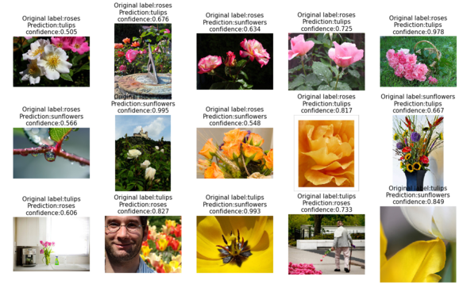


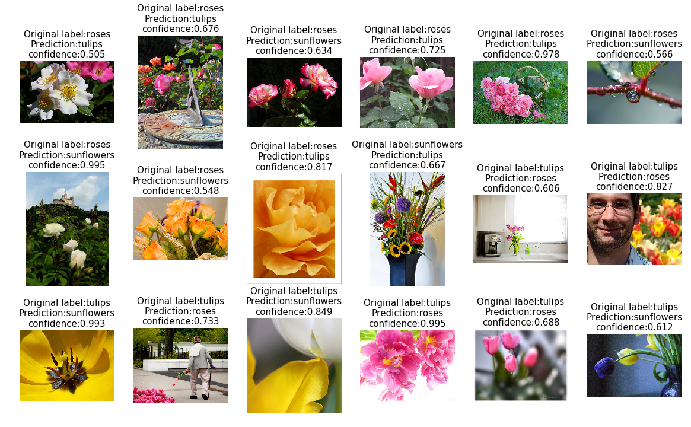


## Neural style transfers with cv2 using a pre-trained torch model                                                        
In this section, we will discuss how to use deep learning to implement a ***neural style transfer (NST)***. You will be surprised at the kind of artistic images we can generate using it. Before diving into further details about the deep learning model, let's discuss some of the basic concepts.
### Understanding the NST algorithm                                                        
The NST algorithm was first revealed in a paper on the subject by Gatys et alia in 2015. This technique involves a lot of fun! I am sure you will love implementing this, and will be amazed at the outputs that you'll create.

It attempts to merge two images based on the following parameters
- A content image (C)
- A style image (S)

The NST algorithm uses these parameters to create a third, generated image (G). The generated image G combines the content of the image C with the style of image S.

Here is an example of what we will actually be doing: 

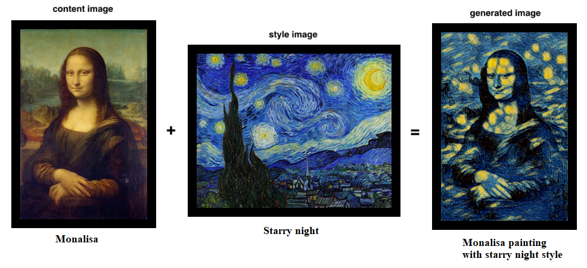

Surprised? I hope you liked the filter applied on the Mona Lisa! Excited to implement this? Let's do it with transfer learning. 

###  Implementation of NST with transfer learning                                                        
Unlike most of the algorithms in deep learning, NST optimizes a cost function to get pixel values. An NST implementation generally uses a pre-trained convolutional network.

It is simply the idea of using a network trained on one task and putting it to use on an entirely new task.

The following are the three component loss functions:
- Content loss
- Style loss
- Total-variation loss

Each component is individually computed and then combined in a single meta-loss function. By minimizing the meta-loss function, we will be, in turn, jointly optimizing the content, style, and total-variation loss as well.

### Ensuring NST with content loss                                                        
We now thoroughly know that top layers of a convolutional network detect lower level features and the deeper layers detect high-level features of an image. But what about the middle layers? They hold content. And as we want the generated image G to have similar contents as the input, our content image C, we would use some activation layers in between to represent content of an image. 

We are going to get more visually pleasing outputs if we choose the middle layers of the network ourselves, meaning that it's neither too shallow, nor too deep.

The content loss or feature reconstruction loss (which we want to minimize) can be represented as the following:

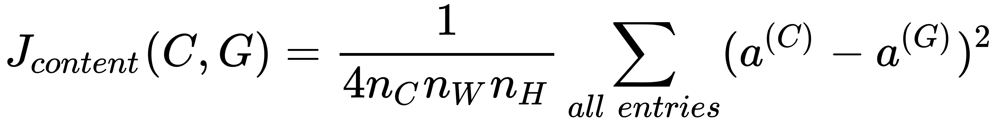

Here, nW, nH, and nC are width, height, and number of channels in the chosen hidden layer, respectively. In practice, the following happens:

- The content cost takes a hidden layer activation of the neural network, and measures how different a(C) and a(G) are.
- When we minimize the content cost later, this will help make sure G has similar content to C.

### Computing the style cost                                                        
We first need to compute the style, or Gram matrix, by computing the matrix of dot products from the unrolled filter matrix.

The style loss for the hidden layer a can be represented as the following:

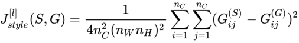

We want to minimize the distance between the Gram matrices for the images S and G. The overall weighted style loss (which we want to minimize) is represented as the following:

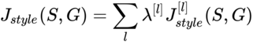

Here, λ represents the weights for different layers. Bear the following in mind:

- The style of an image can be represented using the Gram matrix of a hidden layer’s activations. However, we get even better results combining this representation from multiple different layers. This is in contrast to the content representation, where usually using just a single hidden layer is sufficient.
-Minimizing the style cost will cause the image G to follow the style of the image S.

### Computing the overall loss                                                        
A cost function that minimizes both the style and the content cost is the following:

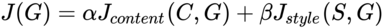

Sometimes, to encourage spatial smoothness in the output image G, a total variation regularizer TV(G) is also added to the RHS convex combination.

In this section, however, we shall not use transfer learning. If you are interested, you can follow the link provided in the further reading and references section. Instead, we are going to use a pre-trained Torch model (Torch is yet another deep learning library) with a particular image style, namely, the Starry Night painting by Van Gogh.

### Neural style transfer with Python and OpenCV                                                        
Let's first download the pre-trained Torch model from https://github.com/DmitryUlyanov/online-neural-doodle/blob/master/pretrained/starry_night.t7 and save it in the current folder (where we are planning to run the following code from). Create a folder named output on the current path to save the generated image by the model.

The next code block demonstrates how to perform an NST (with Starry Night style) to an input content image. First, use the cv2.dnn.readNetFromTorch() function to load the pre-trained model.

Next, create a 4-dimensional blob from the image with the cv2.dnn.blobFromImage() function by subtracting the mean values from the RGB channels. Finally, perform a forward pass to obtain an output image (that is, the result of the NST algorithm):


```python
import cv2
import matplotlib.pyplot as pylab
import imutils
import time
model = 'neural-style-transfer/models/starry_night.t7' # assumes the pre-trained torch file is in this path, 
# download it from here: https://github.com/DmitryUlyanov/online-neural-doodle/blob/master/pretrained/starry_night.t7
print("loading style transfer model...")
net = cv2.dnn.readNetFromTorch(model)
image = cv2.imread('../images/monalisa.jpg') # the content image path
image = imutils.resize(image, width=600)
(h, w) = image.shape[:2]
b, g, r = np.mean(image[...,0]), np.mean(image[...,1]), np.mean(image[...,2])
# construct a blob from the image, set the input, and then perform a
# forward pass of the network
blob = cv2.dnn.blobFromImage(image, 1.0, (w, h), (b, g, r), swapRB=False, crop=False)
net.setInput(blob)
start = time.time()
output = net.forward()
end = time.time()
# reshape the output tensor, add back in the mean subtraction, and
# then swap the channel ordering
output = output.reshape((3, output.shape[2], output.shape[3]))
output[0] += b
output[1] += g
output[2] += r
#output /= 255.0
output = output.transpose(1, 2, 0)
# show information on how long inference took
print("neural style transfer took {:.4f} seconds".format(end - start))
# show the images
print(output.shape)
cv2.imwrite('output/styled.jpg', output)
```

    loading style transfer model...
    neural style transfer took 0.9367 seconds
    (896, 600, 3)
    
    True

### Summary                                                      
In this chapter, we discussed a few advanced deep learning applications to solve a few complex image processing problems. We started with basic concepts in image classification with localization and object detection. Then we demonstrated how a popular YOLO v2 FCN pre-trained model can be used to detect objects in images and draw boxes around them. Next, we discussed the basic concepts in semantic segmentation and then demonstrated how to use DeepLab v3+ (along with a summary on its architecture) to perform semantic segmentation of an image. Then we defined transfer learning and explained how and when it is useful in deep learning, along with a demonstration on transfer learning in Keras to classify flowers with a pre-trained VGG16 model. Finally, we discussed how to generate novel artistic images with deep neural style transfer, and demonstrated this with Python and OpenCV and a pre-trained Torch model. You should be familiar with how to use pre-trained deep learning models to solve complex image processing problems. You should be able to load pre-trained models with Keras, Python, and OpenCV, and use the models to predict outputs for different image processing tasks. You should also be able to use transfer learning and implement it with Keras.

In the next chapter, we'll discuss a few more advanced image processing problems.

### Further reading
- http://www.deeplearning.ai
- http://www.learnopencv.com
- http://pyimagesearch.com
- https://arxiv.org/abs/1506.02640
- https://arxiv.org/abs/1612.08242
- https://pjreddie.com/darknet/yolo/
- https://arxiv.org/pdf/1506.02640.pdf
- https://sandipanweb.wordpress.com/2018/03/11/autonomous-driving-car-detection-with-yolo-in-python/
- https://arxiv.org/abs/1706.05587
- https://arxiv.org/pdf/1802.02611.pdf
- https://arxiv.org/pdf/1508.06576.pdf
- https://cs.stanford.edu/people/jcjohns/papers/eccv16/JohnsonECCV16.pdf
- https://sandipanweb.wordpress.com/2018/01/02/deep-learning-art-neural-style-transfer-an-implementation-with-tensorflow-in-python/
