**Author: Sandipan Dey**

**Table of content**

- [Additional Problems in Image Processing](#Additional Problems in Image Processing)

- [Seam carving](#Seam carving)
  - [Content-aware image resizing with seam carving](#Content-aware image resizing with seam carving)
  - [Object removal with seam carving](#Object removal with seam carving  )

- [Seamless cloning and Poisson image editing](#Seamless cloning and Poisson image editing)

- [Image inpainting](#Image inpainting)

- [Variational image processing](#Variational image processing)

- [Total Variation Denoising](#Total Variation Denoising)

- [Creating flat-texture cartoonish images with total variation denoising](#Creating flat-texture cartoonish images with total variation denoising)

- [Image quilting](#Image quilting)

- [Texture synthesis](#Texture synthesis)   

- [Texture transfer](#Texture transfer)

- [Face morphing](#Face morphing ) 

- [Summary](#Summary)

- [Further reading](#Further reading)


<a name='Additional Problems in Image Processing'></a>

## Additional Problems in Image Processing                                                        
In this chapter, we will discuss a few more advanced problems in image processing. We'll start with the seam carving problem and demonstrate a couple of applications, the first one being the content-aware image resizing, and the second one being object removal from images. Next, we'll discuss seamless cloning, which can be used to seamlessly copy one object from an image to another image. Then we'll discuss an inpainting algorithm that can be used to restore damaged pixels in an image. After that, we'll look at variational methods in image processing with an application in image denoising. Next, we'll discuss the image quilting algorithm and its applications in texture synthesis and the transfer of images. We shall end our discussion with a sophisticated face morphing algorithm. 

The topics to be covered in this chapter are as follows:
- Seam carving
- Seamless cloning and Poisson image editing
- Image inpainting
- Variational image processing
- Image quilting
- Face morphing

<a name='Seam carving'></a>

### Seam carving
Seam carving is a content-aware image resizing technique where the image is reduced in size by one pixel in height (or width) at a time. A vertical seam in an image is a path of pixels connected from the top to the bottom with one pixel in each row. A horizontal seam is a path of pixels connected from the left to the right with one pixel in each column. Although the underlying algorithm is simple and elegant, it was not discovered until 2007.

Now it is now a core feature in Adobe Photoshop and other computer graphics applications. Unlike standard content-agnostic resizing techniques, such as cropping and scaling, seam carving preserves the most interesting features of the image, such as aspect ratio, set of objects present, and so on. Finding and removing a seam involves three parts:

1. **Energy calculation**: The first step is to calculate the energy of a pixel, which is a measure of its importance—the higher the energy, the less likely that the pixel will be included as part of a seam. For example, the dual-gradient energy function can be used for energy computation.
2. **Seam identification**: The next step is to find a vertical or horizontal seam of minimum total energy. This is similar to the classic shortest path problem in an edge-weighted digraph, with the important difference that the weights are on the vertices instead of the edges. The goal is to find the shortest path from any of the W pixels in the top row to any of the W pixels in the bottom row. The digraph is acyclic, where there is a downward edge from pixel (x, y) to pixels (x − 1, y + 1), (x, y + 1), and (x + 1, y + 1), assuming that the coordinates are in the prescribed ranges. Also, seams cannot wrap around the image. The optimal seam can be found using dynamic programming. The first step is to traverse the image from the second row to the last row and compute the cumulative minimum energy, M, for all possible connected seams for each pixel (i, j), as follows: 
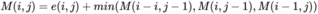
3. **Seam removal**: The final step is to remove from the image all of the pixels along the vertical or horizontal seam.

In the following two subsections, we'll discuss a couple of applications of the seam carving technique, the first one being content-aware image resizing, and the second one being object removal from images. The implementations of these will be done with scikit-image library's transform module's functions.

<a name='Content-aware image resizing with seam carving'></a>

### Content-aware image resizing with seam carving                                                        
The following code demonstrates how the scikit-image library's transform module's seam_curve() function can be used for content-aware image resizing. Let's first import the required packages, load the original input airplane image, and display the image using the following code block:


```python
% matplotlib inline 

from skimage import data, draw
from skimage import transform, util
import numpy as np
from skimage import filters, color
from matplotlib import pyplot as plt
from skimage.io import imread
from skimage.color import rgb2gray


hl_color = np.array([0, 1, 0])

img = imread('../images/aero.jpg')
print(img.shape)
img = util.img_as_float(img)
eimg = filters.sobel(color.rgb2gray(img))

plt.figure(figsize=(20,16))
plt.title('Original Image')
plt.imshow(img)
```

    (821, 616, 3)
    
    <matplotlib.image.AxesImage at 0x1b4fe1fe748>


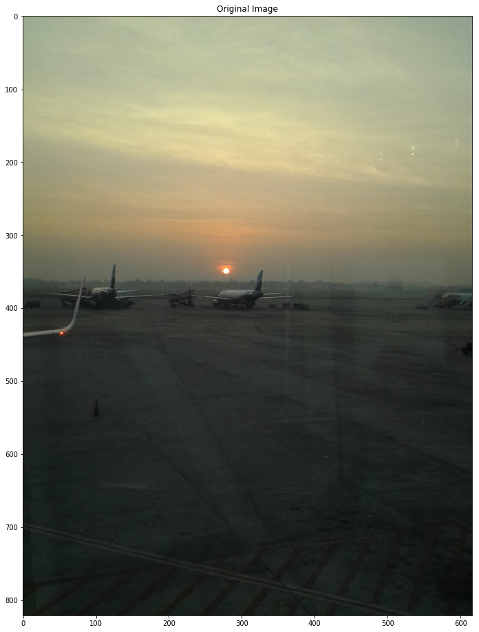


```python
resized = transform.resize(img, (img.shape[0], img.shape[1] - 200), mode='reflect')
print(resized.shape)
plt.figure(figsize=(20,11))
plt.title('Resized Image')
plt.imshow(resized)
```

    C:\Users\Sandipan.Dey\Anaconda\envs\ana41py35\lib\site-packages\skimage\transform\_warps.py:110: UserWarning: Anti-aliasing will be enabled by default in skimage 0.15 to avoid aliasing artifacts when down-sampling images.
      warn("Anti-aliasing will be enabled by default in skimage 0.15 to "


    (821, 416, 3)
    
    <matplotlib.image.AxesImage at 0x1b4fe06bda0>


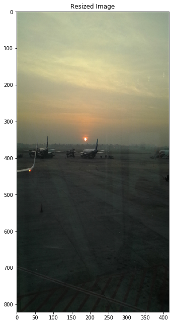


```python
img = util.img_as_float(img)
eimg = filters.sobel(color.rgb2gray(img))
out = transform.seam_carve(img, eimg, 'vertical', 200)
plt.figure(figsize=(20,11))
plt.title('Resized using Seam Carving')
plt.imshow(out)
```


    <matplotlib.image.AxesImage at 0x1b480c19e80>


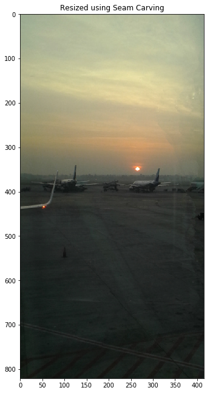

<a name='Object removal with seam carving'></a>

### Object removal with seam carving                                                        

You can use seam carving to remove objects or artifacts from images too. This requires weighting the object region with low values, since the lower weights are preferentially removed in seam carving. The following code block uses a mask image of the same shape as the original input photo that masks the region of the photo containing the dog with a low weight, indicating that it should be removed:


```python
#from skimage import img_as_float
img = imread('../images/man.jpg')
mask_img = rgb2gray(imread('../images/man_mask.jpg'))
print(img.shape)
plt.figure(figsize=(15,10))
plt.subplot(121), plt.imshow(img), plt.title('Original Image')
plt.subplot(122), plt.imshow(mask_img), plt.title('Mask for the object to be removed (the dog)')#, plt.colorbar()
```

    (720, 534, 3)
    
    (<matplotlib.axes._subplots.AxesSubplot at 0x1b4810e85f8>,
     <matplotlib.image.AxesImage at 0x1b4811067f0>,
     <matplotlib.text.Text at 0x1b480db4160>)


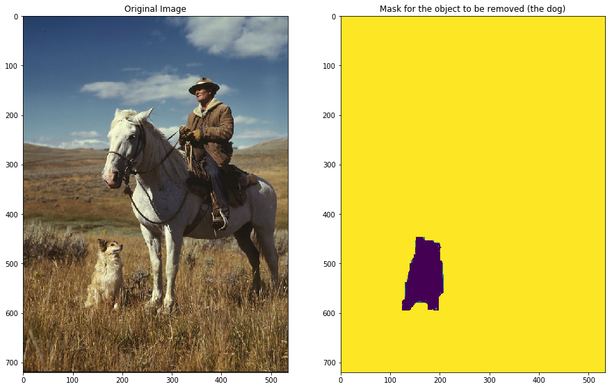


```python
plt.figure(figsize=(10,12))
plt.title('Object (the dog) Removed')
out = transform.seam_carve(img, mask_img, 'vertical', 90)
resized = transform.resize(img, out.shape, mode='reflect')
plt.imshow(out)
plt.show()
```

    C:\Users\Sandipan.Dey\Anaconda\envs\ana41py35\lib\site-packages\skimage\transform\_warps.py:110: UserWarning: Anti-aliasing will be enabled by default in skimage 0.15 to avoid aliasing artifacts when down-sampling images.
      warn("Anti-aliasing will be enabled by default in skimage 0.15 to "


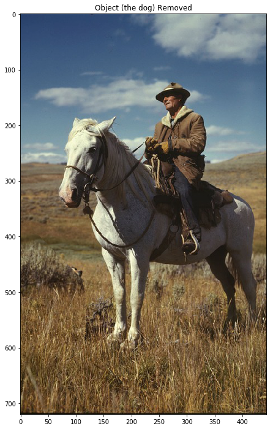

<a name='Seamless cloning and Poisson image editing'></a>

### Seamless cloning and Poisson image editing                                                        

The goal of Poisson image editing is to perform seamless blending (cloning) of an object or a texture from a source image (captured by a mask image) to a target image. We want to create a photomontage by pasting an image region onto a new background using Poisson image editing. This idea is from the SIGGRAPH 2003 paper, Poisson Image Editing, by Perez et alia. The problem is first expressed in the continuous domain as a constrained variational optimization problem (the Euler-Lagrange equation is used to find a solution), and then can be solved using a discrete Poisson solver. The main task of the discrete Poisson solver is to solve a huge linear system. The central insight in the paper is that working with image gradients, instead of image intensities, can produce much more realistic results. After seamless cloning, the gradient of the output image in the masked region is the same as the gradient of the source region in the masked region. Additionally, the intensity of the output image at the boundary of the masked region is the same as the intensity of the destination image.

In this section, we shall demonstrate seamless cloning with Python and OpenCV (with the seamlessClone() function introduced in OpenCV 3.0). Let's use this function to copy the bird from the sky in the source image (with the help of a mask image) to the sky in the destination sea-bird image. These are the photos that we'll be using:


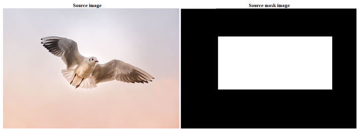


destination image:

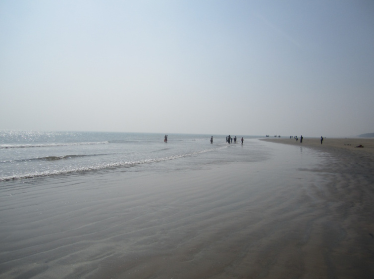


The next code block shows how to implement seamless cloning by invoking the function with the right arguments. In this example, the cloning type flag used is NORMAL_CLONE, where the texture (gradient) of the source image is preserved in the cloned region:


```python
# Standard imports
import cv2
import numpy as np 
 
# Read images
src = cv2.imread("../images/bird.jpg")
dst = cv2.imread("../images/sea.jpg")

# Create a rough mask around the airplane.
src_mask = cv2.imread("../images/bird_mask.jpg") 
print(src.shape, dst.shape, src_mask.shape)


# This is where the CENTER of the airplane will be placed
center = (450,150)
 
# Clone seamlessly.
output = cv2.seamlessClone(src, dst, src_mask, center, cv2.NORMAL_CLONE) #MIXED_CLONE) #NORMAL_CLONE)
 
# Save result
cv2.imwrite("../images/sea_bird.jpg", output);
```

    (501, 1401, 3) (576, 768, 3) (480, 698, 3)

<a name='Image inpainting'></a>

### Image inpainting                                                        

Inpainting is the process of restoring damaged or missing parts of an image. Suppose we have a binary mask, D, that specifies the location of the damaged pixels in the input image, f, as shown here:

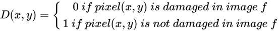


Once the damaged regions in the image are located with the mask, the lost/damaged pixels have to be reconstructed with some algorithm (for example, Total Variation Inpainting). The reconstruction is supposed to be performed fully automatically by exploiting the information presented in non-damaged regions. 

In this example, we shall demonstrate an image inpainting implementation with scikit-image restoration module's inpaint_biharmonic() function. Let's apply a mask to create a damaged image from the original Lena colored image. The following code block shows how the masked pixels in the damaged image get inpainted by the inpainting algorithm based on a biharmonic equation assumption:


```python
import numpy as np
import matplotlib.pyplot as plt

from skimage.io import imread
from skimage import img_as_float
from skimage.restoration import inpaint

image_orig = img_as_float(imread('../images/lena.jpg'))

# Create mask from a mask image
mask = rgb2gray(imread('../images/lena_scratch_mask.jpg'))
mask[mask > 0.5] = 1
mask[mask <= 0.5] = 0
print(np.unique(mask))

# Defect image over the same region in each color channel
image_defect = image_orig.copy()
for layer in range(image_defect.shape[-1]):
    image_defect[np.where(mask)] = 0

image_result = inpaint.inpaint_biharmonic(image_defect, mask, multichannel=True)

fig, axes = plt.subplots(ncols=2, nrows=2, figsize=(20,20))
ax = axes.ravel()

ax[0].set_title('Original image', size=30)
ax[0].imshow(image_orig)

ax[1].set_title('Mask', size=30)
ax[1].imshow(mask, cmap=plt.cm.gray)

ax[2].set_title('Defected image', size=30)
ax[2].imshow(image_defect)

ax[3].set_title('Inpainted image', size=30)
ax[3].imshow(image_result)

for a in ax:
    a.axis('off')

fig.tight_layout()
plt.show()
```

    [0. 1.]

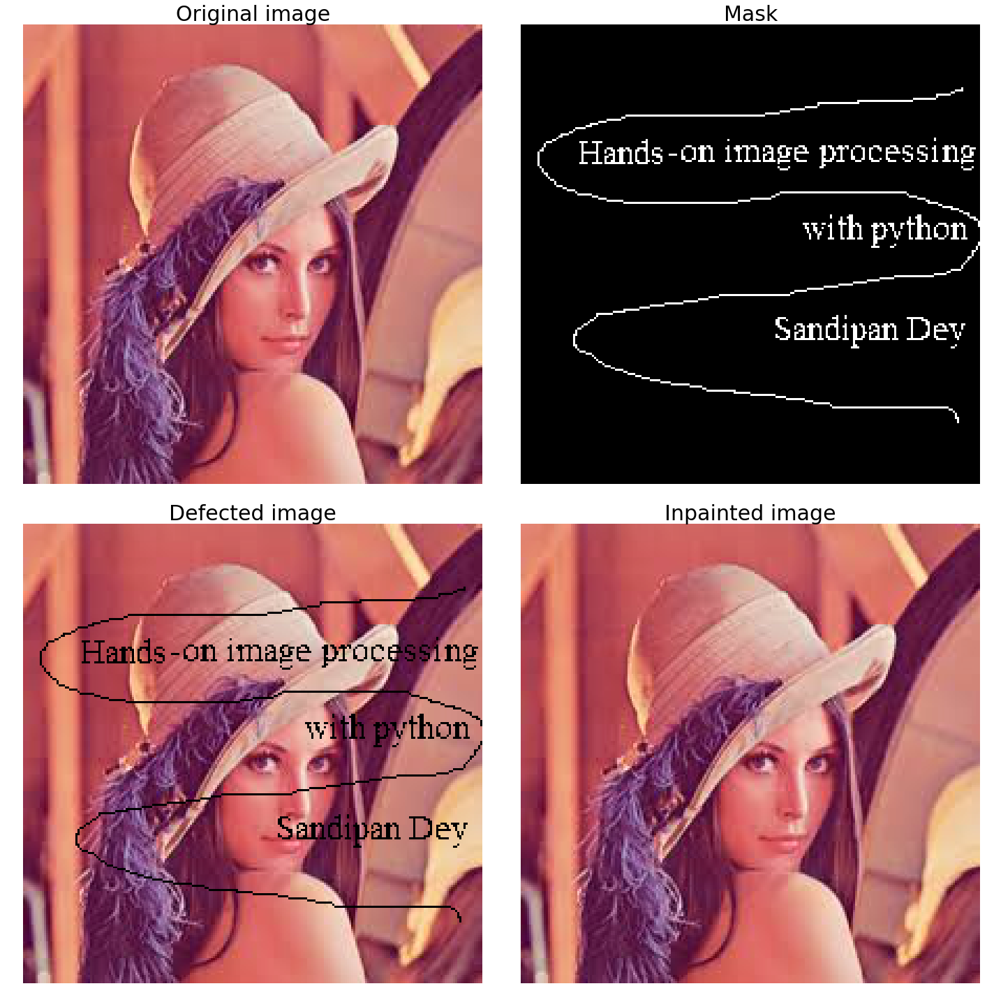


```python
from skimage.measure import compare_psnr
compare_psnr(image_orig, image_result)
```

<a name='Variational image processing'></a>

### Variational image processing                                                       

In this section, we shall very briefly discuss variational methods in image processing, with an example application in denoising. Image processing tasks can be viewed as function estimation (for example, segmentation can be thought of as finding a smooth closed curve between an object and the background). Calculus of variations can be used for minimization of the appropriately defined energy functionals (with the Euler-Langrange method) for a specific image processing task, and the gradient descent method is used to evolve towards the solution.

The following diagram describes the basic steps in an image processing task, represented as a variational optimization problem. First, we need to create an energy functional E that describes the quality of the input image u. Then, with the Euler-Lagrange equation, we need to calculate the first variation. Next, we need to set up a partial differentail equation (PDE) for the steepest descent minimization and discretize it and evolve towards the minimum:

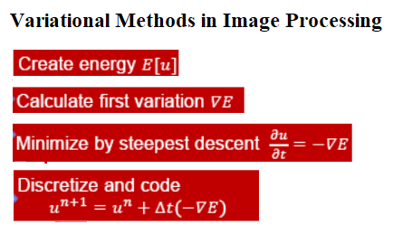

<a name='Total Variation Denoising'></a>

### Total Variation Denoising                                                        

The following shows the linear and non-linear Total Variation Denoising algorithms. As can be observed in the following, the energy functional is the only difference:

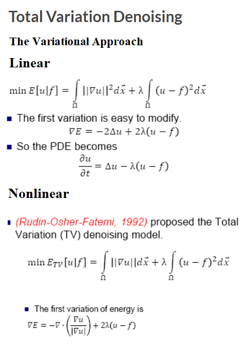

Let's demonstrate an implementation of total variation denoising using the scikit-image library's restoration module. The principle of total variation denoising is to minimize the total variation of the image, which can be roughly described as the integral of the norm of the image gradient. First, let's create a noisy input image by adding random Gaussian noise with the original input image. Next, let's use the denoise_tv_chambolle() function to do the denoising. Since we are using a grayscale input image, we do not need to set the multichannel parameter (by default it is set to False) to this function:


```python
from skimage import io, color, data, img_as_float
from skimage.restoration import denoise_tv_chambolle
import matplotlib.pylab as plt
import numpy as np
img = color.rgb2gray(io.imread('../images/me12.jpg'))
plt.figure(figsize=(12,9))
plt.gray()
noisy_img = img + 0.5 * img.std() * np.random.randn(*img.shape)
plt.subplot(221), plt.imshow(img), plt.axis('off'), plt.title('original', size=20)
plt.subplot(222), plt.imshow(noisy_img), plt.axis('off'), plt.title('noisy', size=20)
denoised_img = denoise_tv_chambolle(img, weight=0.1) #, multichannel=True)
plt.subplot(223), plt.imshow(denoised_img), plt.axis('off'), plt.title('TV-denoised (weight=0.1)', size=20)
denoised_img = denoise_tv_chambolle(img, weight=1) #, multichannel=True)
plt.subplot(224), plt.imshow(denoised_img), plt.axis('off'), plt.title('TV-denoised (weight=1)', size=20)
plt.show()
```


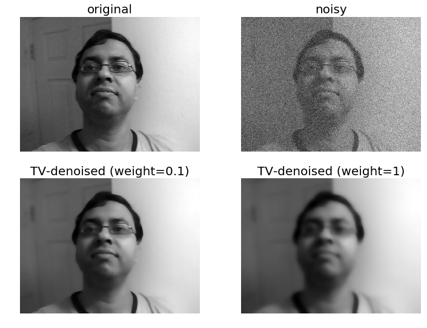

<a name='Creating flat-texture cartoonish images with total variation denoising'></a>

### Creating flat-texture cartoonish images with total variation denoising                                                        

Total variation denoising can be used to produce cartoonish images; that is, piecewise-constant images, as demonstrated. The more we increase the weight, the flatter the textures (at the expense of fidelity to the input image):


```python
img = io.imread('../images/me18.jpg')
plt.figure(figsize=(10,14))
plt.subplot(221), plt.imshow(img), plt.axis('off'), plt.title('original', size=20)
denoised_img = denoise_tv_chambolle(img, weight=0.1, multichannel=True)
plt.subplot(222), plt.imshow(denoised_img), plt.axis('off'), plt.title('TVD (wt=0.1)', size=20)
denoised_img = denoise_tv_chambolle(img, weight=0.2, multichannel=True)
plt.subplot(223), plt.imshow(denoised_img), plt.axis('off'), plt.title('TVD (wt=0.2)', size=20)
denoised_img = denoise_tv_chambolle(img, weight=0.3, multichannel=True)
plt.subplot(224), plt.imshow(denoised_img), plt.axis('off'), plt.title('TVD (wt=0.3)', size=20)
plt.show()
```


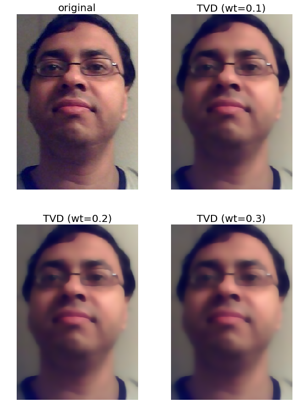

<a name='Image quilting'></a>

### Image quilting                                                        

The image quilting algorithm is an algorithm used for texture synthesis and transfer in images, described in the SIGGRAPH 2001 paper by Efros and Freeman. In this section, we shall touch upon the main idea behind the quilting algorithms for implementing texture synthesis and transfer, and show a couple of results obtained with an implementation of the algorithm. The code is left for the reader to implement ([refer to this link](https://sandipanweb.wordpress.com/2017/10/24/some-computational-photography-image-quilting-texture-synthesis-with-dynamic-programming-and-texture-transfer-in-python/) for more information).

<a name='Texture synthesis'></a>

###  Texture synthesis                                                        

Texture synthesis refers to the creation of a larger texture image from a small sample. For texture synthesis, the main idea is to sample patches and lay them down in overlapping patterns, such that the overlapping regions are similar. The overlapping regions may not match exactly, which will result in noticeable artifacts around the edges. To fix this, we need to compute a path along pixels with similar intensities through the overlapping region, and use this path to select on which overlapping patch to draw each pixel. The following shows the output generated by the algorithm for texture synthesis:

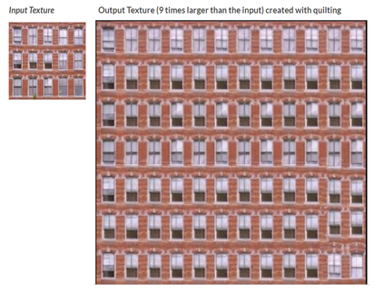

<a name='Texture transfer'></a>

## Texture transfer                                                        
Texture transfer refers to giving an object the appearance of having the same texture as a sample, while still preserving its basic shape. Texture transfer is achieved by encouraging sampled patches to have a similar appearance to a given target image, as well as matching overlapping regions of already sampled patches. The following screenshot shows the output generated by the algorithm for texture transfer:

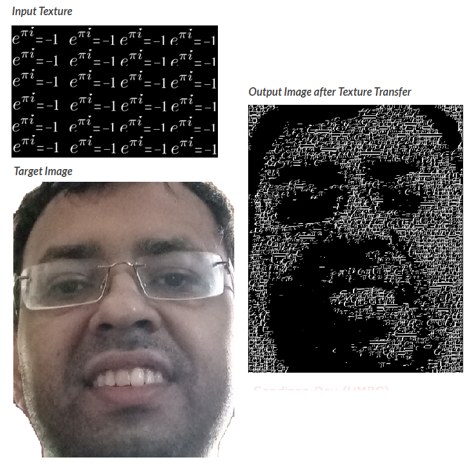


<a name='Face morphing'></a>

## Face morphing                                                        
In Chapter 1, Getting Started with Image Processing, we discussed a naive face morphing technique based on simple α-blending, which looks terrible if the faces to be morphed are not aligned.

Let's conclude the last chapter by discussing a sophisticated face morphing technique, namely Beier-Neely morphing, which visually looks way smoother and better than α-blending for non-aligned faces. Here is the algorithm:
1. Read in two image files, A and B.
2. Specify the correspondence between source image and destination image interactively (by computing facial key points with PyStasm) using a set of line segment pairs. Save the line segment pair to lines file.
3. Read the lines file. The lines file contains the line segment pairs SiA, SiB. 
4. Compute destination line segments by linearly interpolating between SiA and SiB by warp fraction. These line segments define the destination shape.
5. Warp image A to its destination shape, computing a new image A'. 
6. Warp picture B to its destination shape, computing a new image B'.
7. Cross-dissolve between A' and B' by dissolve fraction α.
8. Save the resulting image to a file.

The implementation of this algorithm is left to the reader. The following figure shows a face morphing implementation with the PyStasm library. The images in the first row are the source and the target images, and the last row shows two intermediate average face images. As can be seen, using this implementation, the morphing is very smooth and visually pleasing:

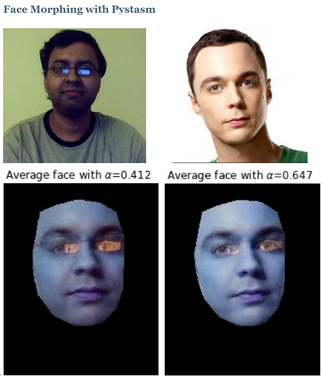


<a name='Summary'></a>

## Summary                                                        

In this chapter, we discussed a few advanced image processing problems. We started with the seam carving algorithm and demonstrated a couple of applications of the algorithm in context-aware image resizing and object or artifact removal from images with the scikit-image library

Next, we discussed seamless cloning with an application to copy one object from one image to another using Python and OpenCV. Then we discussed the biharmonic inpainting algorithm and applied it to restore damaged pixels in an image using the scikit-image library. After that, we discussed variational methods in image processing with an application in image denoising with scikit-image again. Next, we discussed the image quilting algorithm and its application in texture synthesis and transfer of images. Finally, we ended this chapter with a discussion on an advanced face morphing algorithm. By the end of this chapter, the reader should be able to write Python codes for all these tasks.

<a name='Further reading'></a>

## Further reading                                                        
- [Shai Avidan and Ariel Shamir: Seam Carving for Content-Aware Image Resizing](http://www.cs.jhu.edu/~misha/ReadingSeminar/Papers/Avidan07.pdf)
- [Patrick Perez, Michel Gangnet and Andrew Blake: Poisson Image Editing](http://www.irisa.fr/vista/Papers/2003_siggraph_perez.pdf)
- [Quilting for Texture Synthesis and Transfer](http://www.merl.com/publications/docs/TR2001-17.pdf)
- [Image inpainting by biharmonic functions](https://arxiv.org/pdf/1707.06567.pdf)
- [Feature-Based Image Metamorphosis](https://www.cs.toronto.edu/~mangas/teaching/320/assignments/a4/Beier-SIG92.pdf)
- [https://sandipanweb.wordpress.com/2017/10/14/seam-carving-using-dynamic-programming-to-implement-context-aware-image-resizing-in-python/](https://sandipanweb.wordpress.com/2017/10/14/seam-carving-using-dynamic-programming-to-implement-context-aware-image-resizing-in-python/)
- [https://sandipanweb.wordpress.com/2017/10/03/some-variational-image-processing-possion-image-editing-and-its-applications/](https://sandipanweb.wordpress.com/2017/10/03/some-variational-image-processing-possion-image-editing-and-its-applications/)
- [https://sandipanweb.wordpress.com/2017/10/08/some-more-variational-image-processing-diffusiontv-denoising-image-inpainting/](https://sandipanweb.wordpress.com/2017/10/08/some-more-variational-image-processing-diffusiontv-denoising-image-inpainting/)

