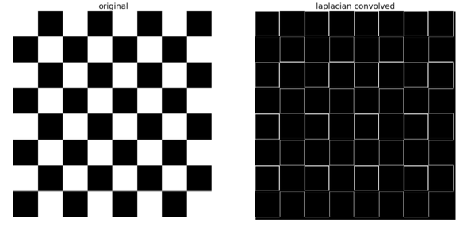
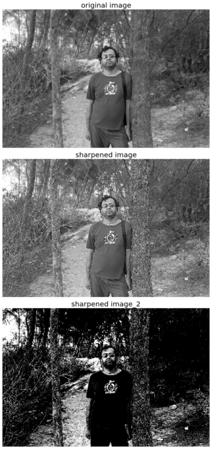

**Author: Sandipan Dey**

In this chapter, we shall continue our discussion on image enhancement, which is the problem of improving the appearance or usefulness of an image. We shall concentrate mainly on spatial filtering techniques to compute image gradients/derivatives, and how these techniques can be used for edge detection in an image. First, we shall start with the basic concepts of image gradients using the first order (partial) derivatives, how to compute the discrete derivatives, and then discuss the second order Derivative/Laplacian. We shall see how they can be used to find edges in an image. Next, we shall discuss a few ways to sharpen/unsharp mask an image using the Python image processing libraries PIL, the filter module of scikit-image, and the ndimage module of SciPy. Next, we shall see how to use different filters (sobel, canny, LoG, and so on) and convolve them with the image to detect edges in an image. Finally, we shall discuss how to compute Gaussian/Laplacian image pyramids (with scikit-image) and use the image pyramids to blend two images smoothly. The topics to be covered in this chapter are as follows:

- Image Derivatives—Gradient, Laplacian
- Sharpening and unsharp masking (with PIL, scikit-image, SciPy ndimage)
- Edge detection using derivatives and filters (Sobel, Canny, LOG, DOG, and so on with PIL, scikit-image)
- Image pyramids (Gaussian and Laplacian)—Blending images (with scikit-image)

### Image derivatives &#x2013; Gradient and Laplacian

We can compute the (partial) derivatives of a digital image using <span class="mark">finite differences</span>. In this section, let us discuss <span class="mark">how to compute the image derivatives, Gradient and Laplacian</span>, and why they are useful. As usual, let us start by importing the required libraries, as shown in the following code block

**Import libraries**


```python
%matplotlib inline
import numpy as np
from scipy import signal, misc, ndimage

#signal: Signal processing (scipy.signal.)
#misc:
#ndimage:

from skimage import filters, feature, img_as_float
from skimage.io import imread
from skimage.color import rgb2gray

#from scikit-image import filters, feature, img_as_float
#from scikit-image.io import imread
#from scikit-image.color import rgb2gray

from PIL import Image, ImageFilter

import matplotlib.pylab as pylab 
import matplotlib.image as mpimg
```

### Derivatives and gradients

The following diagram shows how to compute the <span class="mark">partial derivatives</span> of an image I (which is a function f(x, y)), using <span class="mark">finite differences</span> (with <span class="mark">forward</span> and <span class="mark">central</span> differences, the latter one being more accurate), which can be implemented using convolution with the kernels shown. The diagram also defines the gradient vector, its magnitude (which corresponds to the strength of an edge), and direction (perpendicular to an edge). Locations where the intensity (gray level value) changes sharply in an input image correspond to the locations where there are peaks/spikes (or valleys) in the intensity of the first-order derivative(s) of the image. In other words, the peaks in gradient magnitude mark the edge locations, and we need to threshold the gradient magnitude to find edges in an image:


The following code block shows how to compute the gradient (along with the magnitude and the direction) with the convolution kernels shown previously, with the gray-scale chess image as input. It also plots how the image pixel values and the x-component of the gradient vector changes with the y coordinates for the very first row in the image (x=0):


```python
def plot_image(image, title):
    pylab.imshow(image), pylab.title(title, size=20), pylab.axis('off')
    
def rgb2gray(rgb):
    r, g, b = rgb[:,:,0], rgb[:,:,1], rgb[:,:,2]
    gray = 0.2989 * r + 0.5870 * g + 0.1140 * b
    return gray
    
ker_x = [[-1, 1]]
ker_y = [[-1], [1]]
im = rgb2gray(mpimg.imread('../images/chess.png'))
im_x = signal.convolve2d(im, ker_x, mode='same')
im_y = signal.convolve2d(im, ker_y, mode='same')
im_mag = np.sqrt(im_x**2 + im_y**2)
im_dir = np.arctan(im_y/im_x)
pylab.gray()
pylab.figure(figsize=(30,20))
pylab.subplot(231), plot_image(im, 'original'), pylab.subplot(232),
plot_image(im_x, 'grad_x')

pylab.subplot(233), plot_image(im_y, 'grad_y'), pylab.subplot(234),
plot_image(im_mag, '||grad||')

pylab.subplot(235), plot_image(im_dir, r'$\theta$'), pylab.subplot(236)
pylab.plot(range(im.shape[1]), im[0,:], 'b-', label=r'$f(x,y)|_{x=0}$', linewidth=5)
pylab.plot(range(im.shape[1]), im_x[0,:], 'r-', label=r'$grad_x (f(x,y))|_{x=0}$')
pylab.title(r'$grad_x (f(x,y))|_{x=0}$', size=30)
pylab.legend(prop={'size': 20})
pylab.show()
```

    C:\Users\anto\Anaconda3\envs\gpuenv\lib\site-packages\ipykernel_launcher.py:15: RuntimeWarning: divide by zero encountered in true_divide
      from ipykernel import kernelapp as app
    C:\Users\anto\Anaconda3\envs\gpuenv\lib\site-packages\ipykernel_launcher.py:15: RuntimeWarning: invalid value encountered in true_divide
      from ipykernel import kernelapp as app
    C:\Users\anto\Anaconda3\envs\gpuenv\lib\site-packages\ipykernel_launcher.py:15: RuntimeWarning: invalid value encountered in arctan
      from ipykernel import kernelapp as app


    <Figure size 432x288 with 0 Axes>


The following diagram shows the output of the preceding code block. As can be seen from the following diagram, the partial derivatives in the x and y directions detect the vertical and horizontal edges in the image, respectively. The gradient magnitude shows the strength of the edges at different locations in the image. Also, if we pick all the pixels from the original image corresponding to a single row (row 0, for instance), we can see a square wave (corresponding to alternating white and black intensity patterns), whereas the gradient magnitude for the same set of pixels have spikes (a sudden increase/decrease) in intensity, and these correspond to the (vertical) edges.

### Displaying the magnitude and the gradient on the same image

In the earlier example, the magnitude and direction of the edges were shown in different images. We can create an RGB image and set the R, G, and B values as follows to display both magnitude and direction in the same image


```python
from skimage.io import imread
from skimage.color import rgb2gray
from skimage.util import random_noise
from skimage.filters import gaussian
import matplotlib.pylab as plt
from scipy import signal
import numpy as np
ker_x = [[-1, 1]]
ker_y = [[-1], [1]]
im = rgb2gray(imread('../images/tiger3.jpg'))
# im = random_noise(im, var=sigma**2)
#im = gaussian(im, sigma=0.25)
print(np.max(im))
```

    1.0


```python
im_x = np.clip(signal.convolve2d(im, ker_x, mode='same'),0,1)
im_y = np.clip(signal.convolve2d(im, ker_y, mode='same'),0,1)
im_mag = np.sqrt(im_x**2 + im_y**2)
#im_ang = np.arctan(im_y/im_x)
im_ang = np.arctan(0.0/im_x)

#print(im_ang.shape)   #(340, 303)
print('im.shape =', im.shape)
im_ang[100] #,100]
extract = im[100:103,100:103]  #error
a=extract.shape
print(a)
print(extract)
print([100,101])
print(im[[100,101,102],[100,101,102]])
```

    im.shape = (340, 303)
    (3, 3)
    [[0.91481176 0.94758314 0.90836745]
     [0.90050941 0.95597686 0.98342784]
     [0.88984588 0.95259098 0.9946498 ]]
    [100, 101]
    [0.91481176 0.95597686 0.9946498 ]


    /usr/local/lib/python3.5/dist-packages/ipykernel_launcher.py:5: RuntimeWarning: invalid value encountered in true_divide
      """


```python
im_x = np.clip(signal.convolve2d(im, ker_x, mode='same'),0,1)
im_y = np.clip(signal.convolve2d(im, ker_y, mode='same'),0,1)
im_mag = np.sqrt(im_x**2 + im_y**2)
im_ang = np.arctan(im_y/im_x)
#im_ang = np.arctan(0.0/im_x)

#print(im_ang.shape)   #(340, 303)
#print('im.shape =', im.shape)  #(340, 303)
extract = im[100:103,100:103]  #error
a=extract.shape
print(a)
print(extract)
print([100,101])
print(im[[100,101,102],[100,101,102]])
```

    (3, 3)
    [[0.91481176 0.94758314 0.90836745]
     [0.90050941 0.95597686 0.98342784]
     [0.88984588 0.95259098 0.9946498 ]]
    [100, 101]
    [0.91481176 0.95597686 0.9946498 ]


    /usr/local/lib/python3.5/dist-packages/ipykernel_launcher.py:4: RuntimeWarning: divide by zero encountered in true_divide
      after removing the cwd from sys.path.
    /usr/local/lib/python3.5/dist-packages/ipykernel_launcher.py:4: RuntimeWarning: invalid value encountered in true_divide
      after removing the cwd from sys.path.


```python
print(im_y[100:103,100:103])
print(im_x[100:103,100:103])
print(im_mag[100:103,100:103])
print(im_ang[100:103,100:103])
#print(im_ang[[100,101],[100,101]])
```

    [[0.         0.00644431 0.04566   ]
     [0.01430235 0.         0.        ]
     [0.01066353 0.00338588 0.        ]]
    [[0.03667804 0.         0.03921569]
     [0.07168941 0.         0.        ]
     [0.04452118 0.         0.        ]]
    [[0.03667804 0.00644431 0.06018892]
     [0.07310218 0.         0.        ]
     [0.04578041 0.00338588 0.        ]]
    [[0.         1.57079633 0.86117926]
     [0.19691897        nan        nan]
     [0.23508719 1.57079633        nan]]


```python
plt.gray()
plt.figure(figsize=(20,30))
plt.subplot(131)
plt.imshow(im)
plt.title('original', size=30)
plt.axis('off')
plt.subplot(132)
plt.imshow(im_x)
plt.title('grad_x', size=30)
plt.axis('off')
plt.subplot(133)
plt.imshow(im_y)
plt.title('grad_y', size=30)
plt.axis('off')
```


    (-0.5, 302.5, 339.5, -0.5)


    <matplotlib.figure.Figure at 0x7f77c4d490b8>


```python
plt.figure(figsize=(20,30))
plt.subplot(131)
plt.imshow(im_mag)
plt.title('||grad||', size=30)
plt.axis('off')
plt.subplot(132)
plt.imshow(im_ang)
plt.title(r'$\theta$', size=30)
plt.axis('off')
im.shape
plt.subplot(133)
im_j = np.zeros((im.shape[0],im.shape[1],3))
#im_j.shape
im_j[...,0] = im_mag*np.sin(im_ang)
im_j[...,1] = im_mag*np.cos(im_ang)
plt.imshow(im)
plt.title(r'||grad||+$\theta$', size=30)
plt.axis('off')
plt.show()
```


### Laplacian

It has been shown by Rosenfeld and Kak that the simplest isotropic derivative operator is the Laplacian, which is defined as shown in the following diagram. The Laplacian approximates the second derivative of an image and detects edges. **It is an isotropic (rotationally invariant) operator** and **the zero-crossings mark edge location;** we shall discuss more about that later in the chapter. In other words, in locations where we have spikes/peaks (or valleys) in the first-order derivative(s) of an input image, we have zero-crossings in the corresponding locations of the second-order derivative(s) of the input image:


**Some notes about the Laplacian**

Let's take a look at the following notes:


The following code snippet shows how to compute the Laplacian of an image using convolution with the kernel shown previously:


```python
ker_laplacian = [[0,-1,0],[-1, 4, -1],[0,-1,0]]
im = rgb2gray(imread('../images/chess.png'))
im1 = np.clip(signal.convolve2d(im, ker_laplacian, mode='same'),0,1)
pylab.gray()
pylab.figure(figsize=(20,10))
pylab.subplot(121), plot_image(im, 'original')
pylab.subplot(122), plot_image(im1, 'laplacian convolved')
pylab.show()
```


    <matplotlib.figure.Figure at 0x7f77c4c1cbe0>





The screenshot above shows the output of the preceding code snippet. As can be seen, the Laplacian output also finds the edges in the image

### Effects of noise on gradient computation

Derivative filters computed using finite difference are quite sensitive to noise. As we saw in the last chapter, the pixels in an image that have very different intensity values from their neighbors are generally the noise pixels. In general, the more the noise the larger the change in intensity, and the stronger is the response obtained with the filters. 
The next code block **adds some Gaussian noise to the image to see the effects on the gradient**. Let us again consider a single row (row 0, precisely) of the image, and let us plot the intensity as a function of the x location:


```python
from skimage.io import imread
from skimage.color import rgb2gray
from skimage.util import random_noise
from skimage.filters import gaussian
import matplotlib.pylab as plt
from scipy import signal
import numpy as np
ker_x = [[-1, 1]]
ker_y = [[-1], [1]]
im = rgb2gray(imread('../images/chess.png'))
sigma = 0.25
sign = np.random.random(im.shape)
sign[sign <= 0.5] = -1
sign[sign > 0.5] = 1
im = random_noise(im, var=sigma**2)
im = gaussian(im, sigma=0.25)
print(np.max(im))
im_x = signal.convolve2d(im, ker_x, mode='same')
im_y = signal.convolve2d(im, ker_y, mode='same')
im_mag = np.sqrt(im_x**2 + im_y**2)
im_ang = np.arctan(im_y/im_x)
plt.gray()
plt.figure(figsize=(30,20))
plt.subplot(231)
plt.imshow(im)
plt.title('original', size=30)
plt.axis('off')
plt.subplot(232)
plt.imshow(im_x)
plt.title('grad_x', size=30)
plt.axis('off')
plt.subplot(233)
plt.imshow(im_y)
plt.title('grad_y', size=30)
plt.axis('off')
plt.subplot(234)
plt.imshow(im_mag)
plt.title('||grad||', size=30)
plt.axis('off')
plt.subplot(235)
plt.imshow(im_ang)
plt.title(r'$\theta$', size=30)
plt.axis('off')
plt.subplot(236)
plt.plot(range(im.shape[1]), im[0,:], 'b-', label=r'$f(x,y)|_{x=0}$', linewidth=5)
plt.plot(range(im.shape[1]), im_x[0,:], 'r-', label=r'$grad_x (f(x,y))|_{x=0}$')
plt.title(r'$grad_x (f(x,y))|_{x=0}$', size=30)
plt.legend(prop={'size': 20})
plt.show()
```

    1.0000000000000004


    /home/cj/anaconda3/lib/python3.7/site-packages/ipykernel_launcher.py:21: RuntimeWarning: divide by zero encountered in true_divide
    /home/cj/anaconda3/lib/python3.7/site-packages/ipykernel_launcher.py:21: RuntimeWarning: invalid value encountered in true_divide
    /home/cj/anaconda3/lib/python3.7/site-packages/ipykernel_launcher.py:21: RuntimeWarning: invalid value encountered in arctan


    <Figure size 432x288 with 0 Axes>


The diagram tabulated shows the output of the previous code block after adding some random noise to the chess image. As we can see, adding random noise to the input image has a high impact on the (partial) derivatives and the gradient magnitude; the peaks corresponding to the edges become almost indistinguishable from the noise and the pattern gets destroyed.

### Sharpening and unsharp masking

The objective of sharpening is to **highlight detail** in an image or to enhance detail that has been blurred. In this section, we discuss a few techniques along with a few examples demonstrating a couple of different ways to sharpen an image.

### Sharpening with Laplacian

An image can be sharpened using the Laplacian filter with the following couple of steps:
1. Apply the Laplacian filter to the original input image.
2. Add the output image obtained from step 1 and the original input image (to obtain the sharpened image). The following code block demonstrates how to implement the preceding algorithm using _**scikit-image filters**_ module's **_laplace()_** function:


```python
import os
#os.getcwd()
#os.listdir("../images/")
```


```python
from skimage.filters import laplace
im = rgb2gray(imread('../images/me8.JPG'))
```


```python
Im1 = laplace(im)
im1 = np.clip(laplace(im) + im, 0, 1)
im2 = np.clip(laplace(im) + im, 0.5,0.8)
pylab.figure(figsize=(10,18))
pylab.subplot(311), plot_image(im, 'original image')
pylab.subplot(312), plot_image(im1, 'sharpened image')
pylab.subplot(313), plot_image(im2, 'sharpened image_2')
pylab.tight_layout()
pylab.show()
```





The above is the output of the preceding code block, the original image, and the sharpened image using the previous algorithm

### Unsharp masking

Unsharp masking is a technique to sharpen images, where **a blurred version** of an image is subtracted from the image itself. The typical blending formula used for unsharp masking is as follows: <span class="girk">sharpened = original + (original − blurred) × amount.</span>
Here, amount is a parameter. The next few sections demonstrate how to implement this with the **_ndimage_** module of SciPy functions in Python.


### With the SciPy ndimage module

As discussed, we can first blur an image and then compute the detail image as the difference between the original and the blurred image to implement unsharp masking. The sharpened image can be computed as a linear combination of the original image and the detail image. The following diagram illustrates the concept again:


The following code block shows how the unsharp mask operation can be implemented with the SciPy ndimage module for a gray-scale image (the same can be done with a color image, which is left as an exercise for the reader), using the preceding concept:


```python
def rgb2gray(im):
    '''
    the input image is an RGB image
    with pixel values for each channel in [0,1]
    '''
    return np.clip(0.2989 * im[...,0] + 0.5870 * im[...,1] + 0.1140 * im[...,2], 0, 1)

im = rgb2gray(img_as_float(misc.imread('../images/me4.jpg')))
im_blurred = ndimage.gaussian_filter(im, 5)
im_detail = np.clip(im - im_blurred, 0, 1)
pylab.gray()
fig, axes = pylab.subplots(nrows=2, ncols=3, sharex=True, sharey=True, figsize=(15, 15))
axes = axes.ravel()
axes[0].set_title('Original image', size=15), axes[0].imshow(im)
axes[1].set_title('Blurred image, sigma=5', size=15),
axes[1].imshow(im_blurred)
axes[2].set_title('Detail image', size=15), axes[2].imshow(im_detail)
alpha = [1, 5, 10]
for i in range(3):
    im_sharp = np.clip(im + alpha[i]*im_detail, 0, 1)
    axes[3+i].imshow(im_sharp), axes[3+i].set_title('Sharpened image, alpha=' + str(alpha[i]), size=15)
for ax in axes:
    ax.axis('off')
fig.tight_layout()
pylab.show()
```

### Edge detection using derivatives and filters (Sobel, Canny, and so on)
As discussed earlier, the pixels that construct the edges in an image are the ones where there are sudden rapid changes (discontinuities) in the image intensity function, and the goal of edge detection is to identify these changes. Hence, edge detection is a pre-processing technique where the input is a 2D (gray-scale) image and the output is a set of curves (that are called the edges). The salient features of an image are extracted in the edges detection process; an image representation using edges is more compact than one using pixels. The edge detectors output the magnitude of the gradients (as a gray-scale image), and now, to get the edge pixels (as a binary image), we need to threshold the gradient image. Here, a very simple fixed gray-level thresholding is used (assigning all negative-valued pixels to zero with the numpy's clip() function); to obtain the binary images, we can use more sophisticated methods (such as thresholding using ostu's segmentation), as we shall see later in <span class="burk">Chapter 8</span>, Image Segmentation. Let's start on the edge detectors with gradient magnitude computed using finite-difference approximations of the partial derivatives, and then proceed on to the Sobel filter

### With gradient magnitude computed using the partial derivatives
Gradient magnitude (which can be thought of as the strength of edges) computed using (forward) finite-difference approximations of the partial derivatives can be used for edge detection, as we saw earlier. The following screenshot shows the output obtained by using the same code as the previous time to compute the gradient magnitude, and then clip the pixel values in a [0, 1] interval, with the zebra's input gray-scale image

The following screenshot shows the gradient magnitude image. As can be seen, the edges appear to be thicker and multipixel wide

In order to obtain a binary image with each edge one-pixel wide, we need to apply the non-maximum suppression algorithm, which removes a pixel if it is not a local maximum along the gradient direction in the pixel's neighborhood. The implementation of the algorithm is left as an exercise for the reader. The following screenshot shows the output with non-max suppression


### The non-maximum suppression algorithm
1. The algorithm starts by inspecting the angles (directions) of the edges (output by the edge detector).

2. If a pixel value is non-maximum in a line tangential to its edge angle, it is a candidate to be removed from the edge map.

3. This is implemented by splitting the edge direction (360) into eight equal intervals with an angle of 22.50 degrees. The following table shows different cases and the actions to take

  

  

4. We may do this by looking in a π/8 range and setting the tangential comparison accordingly with a series of if conditions.

5. The effect of edge thinning is clearly observed (from the previous image) when comparing the gradient image with and without the non-maximum suppression.

### Sobel edge detector with scikit-image
<span class="mark">note: Matplotlib is the toolkit, PyPlot is an interactive way to use Matplotlib and PyLab is the same thing as PyPlot but with some extra shortcuts. Using PyLab is discouraged now.
http://queirozf.com/entries/matplotlib-pylab-pyplot-etc-what-s-the-different-between-these</span>

The (first order) derivatives can be approximated better than using the finite difference. The Sobel operators shown in the following diagram are used quite frequently


The 1/8 term is not included in the standard definition of the Sobel operator as for edge detection purposes, it does not make a difference, although the normalization term is needed to get the gradient value correctly. The next Python code snippet shows how to use the sobel_h(), sobel_y(), and sobel() functions of the filters module of scikit-image to find the horizontal/vertical edges and compute the gradient magnitude using the Sobel operators, respectively:


The following picture shows the output of the preceding code block. As can be seen, the horizontal and vertical edges of the image are detected by the horizontal and vertical Sobel filters, whereas the gradient magnitude image computed using the Sobel filter detects the edges in both directions


```python
im = rgb2gray(imread('../images/tajmahal1.jpg')) # RGB image to gray scale
pylab.gray()
pylab.figure(figsize=(20,18))
pylab.subplot(2,2,1)
plot_image(im, 'original')
pylab.subplot(2,2,2)
edges_x = filters.sobel_h(im) #filters.sobel_h
plot_image(np.clip(edges_x,0,1), 'sobel_x')
pylab.subplot(2,2,3)
edges_y = filters.sobel_v(im) #filters.sobel_v
plot_image(np.clip(edges_y,0,1), 'sobel_y')
pylab.subplot(2,2,4)
edges = filters.sobel(im) #filters.sobe
plot_image(np.clip(edges,0,1), 'sobel')
pylab.subplots_adjust(wspace=0.1, hspace=0.1)
pylab.show()
```


    <matplotlib.figure.Figure at 0x1df4162dfd0>


The screenshot shows the output of the preceding code block. As can be seen, the horizontal and vertical edges of the image are detected by the horizontal and vertical Sobel filters, whereas the gradient magnitude image computed using the Sobel filter detects the edges in both directions

### Different edge detectors with scikit-image – Prewitt, Roberts, Sobel, Scharr, and Laplace

There are quite a few different edge detection operators used in image processing algorithms; all of them are discrete (first or second order) differentiation operators and they try to approximate the gradient of the image intensity function (for instance, the Sobel operator, which we discussed previously). The kernels shown in the following diagram are a few popular ones used for edge detection. For example, popular derivative filters approximating the 1st Order image derivatives are Sobel, Prewitt, Sharr, and Roberts filters, whereas a derivative filter approximating the 2nd Order derivatives is the Laplacian:


As discussed in the scikit-image documentation, the finite-difference approximations of the gradient computed by different operators are different. For example, the Sobel filter in general performs better than the Prewitt filter, whereas the Scharr filter results in a less rotational variance than the Sobel filter. The following code block applies different edge detector filters on the golden gate gray-scale image, and shows the gradient magnitudes obtained:


```python
im = rgb2gray(imread('../images/goldengate.jpg')) # RGB image to gray scale
#im = rgb2gray(imread('../images/me.jpg'))
#im = rgb2gray(imread('../images/zebras.jpg'))
pylab.gray()
pylab.figure(figsize=(20,24))
pylab.subplot(3,2,1), plot_image(im, 'original')
edges = filters.roberts(im)
pylab.subplot(3,2,2), plot_image(edges, 'roberts')
edges = filters.scharr(im)
pylab.subplot(3,2,3), plot_image(edges, 'scharr')
edges = filters.sobel(im)
pylab.subplot(3,2,4), plot_image(edges, 'sobel')
edges = filters.prewitt(im)
pylab.subplot(3,2,5), plot_image(edges, 'prewitt')
edges = np.clip(filters.laplace(im), 0, 1)
pylab.subplot(3,2,6), plot_image(edges, 'laplace')
pylab.subplots_adjust(wspace=0.1, hspace=0.1)
pylab.show()
```


    <matplotlib.figure.Figure at 0x7fbbb2185198>


Again, a post-processing step for edge detection is non-maximum suppression that thins the (thick) edges obtained using the first order derivatives; we have not previously done this operation. In the next section, as we shall see, a more advanced state-of-the-art edge detector, Canny, does it automatically.

### The Canny edge detector with scikit-image

The Canny edge detector is a popular edge detection algorithm, developed by John F. Canny. This algorithm has the following multiple steps:
1. Smoothing/noise reduction: The edge detection operation is sensitive to noise. Hence, at the very outset, a 5 x 5 Gaussian filter is used to remove noise from the image.
2. Computing magnitude and orientation of the gradient: The Sobel horizontal and vertical filters are then applied to the image to compute the edge gradient magnitude and direction for each pixel, as discussed previously. The gradient angle (direction) computed is then rounded to one of four angles representing horizontal, vertical, and two diagonal directions for each pixel.
3. Non-maximum suppression: In this step, the edges are thinned – any unwanted pixels which may not constitute an edge are removed. To do this, every pixel is checked if it is a local maximum in its neighborhood in the direction of gradient. As a result, a binary image is obtained with thin edges.
4. Linking and hysteresis thresholding: In this step, whether all the edges detected are strong edges or not is decided. For this, a couple of (hysteresis) threshold values, min_val and max_val, are used. Sure edges are the ones that have an intensity gradient value higher than max_val. Sure non-edges are the ones that have an intensity gradient value below min_val, and they are discarded. The edges that lie between these two thresholds are classified as edges or non-edges, based on their connectivity. If they are connected to sure-edge pixels, they are considered to be part of edges. Otherwise, they are also discarded. This step also removes small pixel noise (assuming that the edges are long lines).


So finally, the algorithm outputs the strong edges of the image. The following code block shows how the Canny edge detector can be implemented with scikit-image:


The following screenshot shows the output of the previous code; the edges are detected with the Canny filter with different sigma values for the initial Gaussian LPF. As can be seen, with a lower value of sigma, the original image gets less blurred to start with and hence more edges (finer details) can be found:


```python
im = rgb2gray(imread('../images/tiger3.jpg'))
im = ndimage.gaussian_filter(im, 4)
im += 0.05 * np.random.random(im.shape)
edges1 = feature.canny(im)
edges2 = feature.canny(im, sigma=2)
fig, (axes1, axes2, axes3) = pylab.subplots(nrows=1, ncols=3, figsize=(30,
12), sharex=True, sharey=True)
axes1.imshow(im, cmap=pylab.cm.gray), axes1.axis('off'),
axes1.set_title('noisy image', fontsize=50)
axes2.imshow(edges1, cmap=pylab.cm.gray), axes2.axis('off')
axes2.set_title('Canny filter, $\sigma=1$', fontsize=50)
axes3.imshow(edges2, cmap=pylab.cm.gray), axes3.axis('off')
axes3.set_title('Canny filter, $\sigma=3$', fontsize=50)
fig.tight_layout()
pylab.show()
```

    C:\Users\Sandipan.Dey\Anaconda\envs\ana41py35\lib\site-packages\scipy\ndimage\measurements.py:431: FutureWarning: Conversion of the second argument of issubdtype from `int` to `np.signedinteger` is deprecated. In future, it will be treated as `np.int32 == np.dtype(int).type`.
      safe = ((np.issubdtype(dt, int) and dt.itemsize <= int_size) or


### The LoG and DoG filters

Laplacian of a Gaussian (LoG) is just another linear filter which is a combination of Gaussian followed by the Laplacian filter on an image. Since the 2nd derivative is very sensitive to noise, it is always a good idea to remove noise by smoothing the image before applying the Laplacian to ensure that noise is not aggravated. Because of the associative property of convolution, it can be thought of as taking the 2nd derivative (Laplacian) of the Gaussian filter and then applying the resulting (combined) filter onto the image, hence the name LoG. It can be efficiently approximated using the difference of two Gaussians (DoG) with different scales (variances), as shown in the following diagram:


The following code block shows how to compute the LOG filter and the corresponding best DoG approximation (with a given value of σ) and apply them on the same input image, using SciPy signal module's convolve2d() function:


The following images show the input image and the output images obtained with the LoG and DoG filters (with σ=3), along with the visualization of the corresponding kernels. From the kernel visualizations, it can be seen that LoG is going to act as a BPF on the input image (since it blocks both low and high frequencies). The band-pass nature of LoG can also be explained by the DoG approximation (the Gaussian filter being a LPF). Also, we can see that the output images obtained with LoG/DoG filters are quite similar:


We can see from these images that the LoG filter is quite useful for edge detection. As we shall see shortly, LoG is also useful for finding blobs in an image.


```python
from scipy.signal import convolve2d
from scipy.misc import imread
from scipy.ndimage import gaussian_filter
from numpy import pi

def plot_kernel(kernel, s, name):
    pylab.imshow(kernel, cmap='YlOrRd')

def LOG(k=12, s=3):
    n = 2*k+1 # size of the kernel
    kernel = np.zeros((n,n))
    for i in range(n):
        for j in range(n):
            kernel[i,j] = -(1-((i-k)**2+(j-k)**2)/(2.*s**2))*np.exp(-((i-k)**2+(j-k)**2)/(2.*s**2))/(pi*s**4)
    kernel = np.round(kernel / np.sqrt((kernel**2).sum()),3)
    return kernel

def DOG(k=12, s=3):
    n = 2*k+1 # size of the kernel
    s1, s2 = s * np.sqrt(2), s / np.sqrt(2)
    kernel = np.zeros((n,n))
    for i in range(n):
        for j in range(n):
            kernel[i,j] = np.exp(-((i-k)**2+(j-k)**2)/(2.*s1**2))/(2*pi*s1**2) - np.exp(-((i-k)**2+(j-k)**2)/(2.*s2**2))/(2*pi*s2**2)
    kernel = np.round(kernel / np.sqrt((kernel**2).sum()),3)
    return kernel

s = 3 # sigma value for LoG
img = rgb2gray(imread('../images/me.jpg'))
kernel = LOG()
outimg = convolve2d(img, kernel)
pylab.figure(figsize=(20,20))
pylab.subplot(221), pylab.title('LOG kernel', size=20), plot_kernel(kernel, s, 'DOG')
pylab.subplot(222), pylab.title('output image with LOG', size=20)
pylab.imshow(np.clip(outimg,0,1), cmap='gray') # clip the pixel values in between 0 and 1
kernel = DOG()
outimg = convolve2d(img, DOG())
pylab.subplot(223), pylab.title('DOG kernel', size=20), plot_kernel(kernel, s, 'DOG')
pylab.subplot(224), pylab.title('output image with DOG', size=20)
pylab.imshow(np.clip(outimg,0,1), cmap='gray')
pylab.show()    
```


### The LoG filter with the SciPy ndimage module

The SciPy ndimage module's gaussian_laplace() function can also be used to implement LoG, as shown in the following code block


The following images show the input image and the output images obtained with the LoG filter with different values of the smoothing parameter σ (standard deviation of the Gaussian filter):


```python
img = rgb2gray(imread('../images/zebras.jpg'))
fig = pylab.figure(figsize=(25,15))
pylab.gray() # show the filtered result in grayscale
for sigma in range(1,10):
    pylab.subplot(3,3,sigma)
    img_log = ndimage.gaussian_laplace(img, sigma=sigma)
    pylab.imshow(np.clip(img_log,0,1)), pylab.axis('off')
    pylab.title('LoG with sigma=' + str(sigma), size=20)
pylab.show()
```


### Edge detection with the LoG filter
The following describes the steps in edge detection with an LOG filter:
- First, the input image needs to be smoothed (by convolution with the Gaussian filter).

- Then, the smoothed image needs to be convolved with the Laplacian filter to obtain the output image as ∇2 (I (x,y) * G (x,y)).

- Finally the zero-crossings from the image obtained in the last step need to be computed, as shown in the following diagram:

  


### Edge detection with the Marr and Hildreth's algorithm using the zero-crossing computation

Computing the zero-crossings in the LoG-convolved image (to detect edges as a binary image) was proposed by Marr and Hildreth. Identification of the edge pixels can be done by viewing the sign of the LoG-smoothed image by defining it as a binary image. The algorithm to compute the zero-crossing is as follows:
1. First, convert the LoG-convolved image to a binary image by replacing the pixel values by 1 for positive values and 0 for negative values
2. In order to compute the zero-crossing pixels, we need to simply look at the boundaries of the non-zero regions in this binary image
3. Boundaries can be found by finding any non-zero pixel that has an immediate neighbor that is zero
4. Hence, for each pixel, if it is non-zero, consider its eight neighbors; if any of the neighboring pixels is zero, the pixel can be identified as an edge


The implementation of this function is left as an exercise. The following code block depicts the edges of the same zebra image detected with zero-crossings:


The following screenshot shows the output of the preceding code block, with edges identified by zero-crossing alone at different σ scales:


The previous images show zero-crossings with LoG/DoG as an edge detector. It should be noticed that the zero-crossings form closed contours.


```python
def zero_crossing(img):
    '''implement the function here'''
    return None

fig = pylab.figure(figsize=(25,15))
pylab.gray() # show the filtered result in grayscale
for sigma in range(2,10, 2):
    pylab.subplot(2,2,sigma/2)
    result = ndimage.gaussian_laplace(img, sigma=sigma)
    pylab.imshow(zero_crossing(result)) # implement the function zero_crossing() using the above algorithm
    pylab.axis('off')
    pylab.title('LoG with zero-crossing, sigma=' + str(sigma), size=20)
pylab.show()
```

### Finding and enhancing edges with PIL

PIL's ImageFilter module's filter function can also be used to find and enhance edges in an image. The following code block shows an example with the UMBC library image as input:


```python
from PIL.ImageFilter import (FIND_EDGES, EDGE_ENHANCE, EDGE_ENHANCE_MORE)
im = Image.open('../images/umbc_lib.jpg')
pylab.figure(figsize=(18,25))
pylab.subplot(2,2,1)
plot_image(im, 'original (UMBC library)')
i = 2
for f in (FIND_EDGES, EDGE_ENHANCE, EDGE_ENHANCE_MORE):
    pylab.subplot(2,2,i)
    im1 = im.filter(f)
    plot_image(im1, str(f))
    i += 1
pylab.show()
```


The following screenshot above shows the output of the preceding code with different edge finding/enhancing filters.

### Image pyramids (Gaussian and Laplacian) – blending images

We can construct the Gaussian pyramid of an image by starting with the original image and creating smaller images iteratively, first by smoothing (with a Gaussian filter to avoid <span class="mark">anti-aliasing</span>), and then by subsampling (collectively called <span class="mark">reducing</span>) from the previous level's image at each iteration until a minimum resolution is reached. The image pyramid created in this way is called a <span class="mark">Gaussian pyramid</span>. These are good for searching over scale (for instance, template-matching), precomputation, and image processing tasks by editing frequency bands separately (for instance, image blending). Similarly, a <span class="mark">Laplacian pyramid</span> for the image can be constructed by starting from the smallest sized image in the Gaussian pyramid and then by expanding (up-sampling plus smoothing) the image from that level and subtracting it from the image from the next level of the Gaussian pyramid, and repeating this process iteratively until the original image size is reached. In this section, we shall see how to write python code to compute the image pyramids, and then look at an application of the image pyramids for blending two images.

### A Gaussian pyramid with scikit-image transform pyramid module

The Gaussian pyramid from an input image can be computed using the **_scikit-image.transform.pyramid_** module's **_pyramid_gaussian()_** function. Starting with the original image, the function calls the **pyramid_reduce()** function to obtain the smoothed and down-sampled images recursively. The following code block demonstrates how to compute and display such a Gaussian pyramid with the lena RGB input image:


```python
from skimage.transform import pyramid_gaussian
image = imread('../images/lena.jpg')
nrows, ncols = image.shape[:2]
pyramid = tuple(pyramid_gaussian(image, downscale=2)) #, multichannel=True))

plt.figure(figsize=(20,5))
i, n = 1, len(pyramid)
for p in pyramid:
    plt.subplot(1,n,i), plt.imshow(p),  plt.title(str(p.shape[0]) + 'x' + str(p.shape[1])), plt.axis('off')
    i += 1
plt.suptitle('Gaussian Pyramid', size=30)
plt.show()

compos_image = np.zeros((nrows, ncols + ncols // 2, 3), dtype=np.double)
compos_image[:nrows, :ncols, :] = pyramid[0]

i_row = 0
for p in pyramid[1:]:
    n_rows, n_cols = p.shape[:2]
    compos_image[i_row:i_row + n_rows, ncols:ncols + n_cols] = p
    i_row += n_rows

fig, ax = plt.subplots(figsize=(20,20))
ax.imshow(composite_image)
plt.show()
```

    C:\Users\Sandipan.Dey\Anaconda\envs\ana41py35\lib\site-packages\skimage\transform\_warps.py:24: UserWarning: The default multichannel argument (None) is deprecated.  Please specify either True or False explicitly.  multichannel will default to False starting with release 0.16.
      warn('The default multichannel argument (None) is deprecated.  Please '


The images gotten show the output of the preceding code block: the images from the Gaussian pyramid. As we can see, there are <span class="mark">nine levels</span> in the pyramid, the top level being the original image of resolution 220 x 220, and the last image being the smallest image consisting of a single pixel; at each consecutive level down the pyramid, the image height and width get reduced by a factor of two

### A Laplacian pyramid with scikit-image transform's pyramid module

The Laplacian pyramid from an input image can be computed using the **_scikit-image.transform.pyramid_** module's **_pyramid_laplacian()_** function. Starting with the difference image of original image and its smoothed version, the function computes the down-sampled and the smoothed image, and takes the difference of these two images to compute the image corresponding to each layer recursively. <span class="mark">Motivation for creating a Laplacian pyramid is to achieve compression</span>, since the compression rates are higher for predictable values around 0.

The code to compute the Laplacian pyramid is similar to that of the previous code for computing the Gaussian pyramid; [[it is left as an exercise for the reader]]. The following screenshot shows the Laplacian pyramid for the lena gray-scale image:


```python
import numpy as np
import matplotlib.pyplot as plt

from skimage.transform import pyramid_laplacian
from skimage.color import rgb2gray

image = imread('../images/lena.jpg')
#image = imread('../new images/orange.png')[...,:3]
nrows, ncols = image.shape[:2]
pyramid = tuple(pyramid_laplacian(image, downscale=2)) #, multichannel=True))

plt.figure(figsize=(20,20))
i, n = 1, len(pyramid)
for p in pyramid:
    plt.subplot(3,3,i), plt.imshow(rgb2gray(p), cmap='gray'), plt.title(str(p.shape[0]) + 'x' + str(p.shape[1]))
    plt.axis('off')
    i += 1
plt.suptitle('Laplacian Pyramid', size=30)
plt.show()

composite_image = np.zeros((nrows, ncols + ncols // 2), dtype=np.double)

composite_image[:nrows, :ncols] = rgb2gray(pyramid[0])

i_row = 0
for p in pyramid[1:]:
    n_rows, n_cols = p.shape[:2]
    composite_image[i_row:i_row + n_rows, ncols:ncols + n_cols] = rgb2gray(p)
    i_row += n_rows

fig, ax = plt.subplots(figsize=(20,20))
ax.imshow(composite_image, cmap='gray')
plt.show()
```

    C:\Users\Sandipan.Dey\Anaconda\envs\ana41py35\lib\site-packages\skimage\transform\_warps.py:24: UserWarning: The default multichannel argument (None) is deprecated.  Please specify either True or False explicitly.  multichannel will default to False starting with release 0.16.
      warn('The default multichannel argument (None) is deprecated.  Please '


Notice that the lowest resolution image in the Laplacian pyramid and the lowest resolution image in the Gaussian pyramid are going to be different images if we use the <span class="burk">pyramid_gaussian()</span> and <span class="burk">pyramid_laplacian()</span> functions of scikit-image, which is something that we do not want. We want to build a Laplacian pyramid where the smallest resolution image is exactly the same as that of the Gaussian pyramid, as this will enable us to construct an image only from its Laplacian pyramid. In the next couple of sections, we shall discuss the algorithms to construct our own pyramids by using the <span class="burk">expand()</span> and <span class="burk">reduce()</span> functions of <span class="burk">scikit-image</span>.

### Constructing the Gaussian Pyramid with scikitimage transform module's reduce function, and the Laplacian Pyramid from the Gaussian Pyramid and the expand function
The Gaussian pyramid can be computed with the following steps:
1. Start with the original image.
2. Iteratively compute the image at each level of the pyramid, first by smoothing the image (with the Gaussian filter) and then down-sampling it.
3. Stop at a level where the image size becomes sufficiently small (for example, 1 x 1).
4. The function to implement the previous algorithm is left as an exercise for the reader; we just need to add a few lines in the following function to complete the implementation:


```python
import numpy as np
import matplotlib.pyplot as plt

from skimage.io import imread
from skimage.color import rgb2gray
from skimage.transform import pyramid_reduce, pyramid_laplacian, pyramid_expand, resize

image = imread('../images/antelops.jpeg')

def get_gaussian_pyramid(image):
    rows, cols, dim = image.shape
    gaussian_pyramid = [image]
    while rows > 1 and cols > 1:
        #print(rows, cols)
        image = pyramid_reduce(image, downscale=2)
        gaussian_pyramid.append(image)
        #print(image.shape)
        rows //= 2
        cols //= 2
    return gaussian_pyramid
```

The Laplacian pyramid can be computed with the following algorithm:
1. Start with the Gaussian pyramid and with the smallest image.
2. Iteratively compute the difference image in-between the image at the current level and the image obtained by first up-sampling and then smoothing the image (with Gaussian filter) from the previous level of the Gaussian pyramid.
3. Stop at a level where the image size becomes equal to the original image size.
4. The function to implement the previous algorithm is left as an exercise to the reader as well; we just need to add a few lines in the following function to complete the implementation:


```python
def get_laplacian_pyramid(gaussian_pyramid):
    laplacian_pyramid = [gaussian_pyramid[len(gaussian_pyramid)-1]]
    for i in range(len(gaussian_pyramid)-2, -1, -1):
        image = gaussian_pyramid[i] - resize(pyramid_expand(gaussian_pyramid[i+1]), gaussian_pyramid[i].shape)
        #print(i, image.shape)
        laplacian_pyramid.append(np.copy(image))
    laplacian_pyramid = laplacian_pyramid[::-1]
    return laplacian_pyramid


gaussian_pyramid = get_gaussian_pyramid(image)
laplacian_pyramid = get_laplacian_pyramid(gaussian_pyramid)
    
w, h = 20, 12
for i in range(3):
    plt.figure(figsize=(w,h))
    p = gaussian_pyramid[i]
    plt.imshow(p)
    plt.title(str(p.shape[0]) + 'x' + str(p.shape[1]), size=20)
    plt.axis('off')
    w, h = w / 2, h / 2
    plt.show()
    
w, h = 10, 6
for i in range(1,4):
    plt.figure(figsize=(w,h))
    p = laplacian_pyramid[i]
    plt.imshow(rgb2gray(p), cmap='gray')
    plt.title(str(p.shape[0]) + 'x' + str(p.shape[1]), size=20)
    plt.axis('off')
    w, h = w / 2, h / 2
    plt.show()
```

    C:\Users\Sandipan.Dey\Anaconda\envs\ana41py35\lib\site-packages\skimage\transform\_warps.py:24: UserWarning: The default multichannel argument (None) is deprecated.  Please specify either True or False explicitly.  multichannel will default to False starting with release 0.16.
      warn('The default multichannel argument (None) is deprecated.  Please '
    C:\Users\Sandipan.Dey\Anaconda\envs\ana41py35\lib\site-packages\skimage\transform\_warps.py:105: UserWarning: The default mode, 'constant', will be changed to 'reflect' in skimage 0.15.
      warn("The default mode, 'constant', will be changed to 'reflect' in "
    C:\Users\Sandipan.Dey\Anaconda\envs\ana41py35\lib\site-packages\skimage\transform\_warps.py:110: UserWarning: Anti-aliasing will be enabled by default in skimage 0.15 to avoid aliasing artifacts when down-sampling images.
      warn("Anti-aliasing will be enabled by default in skimage 0.15 to "


### Reconstructing an image only from its Laplacian pyramid
The following diagram shows how to reconstruct an image from only its Laplacian pyramid, if we construct one by following the algorithms described in the previous section:


The following picture shows the output of the preceding code, how the original image is finally constructed from its Laplacian pyramid only using the expand() operation on each level's image, and adding it to the next level's image iteratively


```python
def reconstruct_image_from_laplacian_pyramid(pyramid):
    i = len(pyramid) - 2
    prev = pyramid[i+1]
    #plt.figure(figsize=(20,20))
    j = 1
    while i >= 0:
        prev = resize(pyramid_expand(prev, upscale=2), pyramid[i].shape)
        im = np.clip(pyramid[i] + prev,0,1)
        #plt.subplot(3,3,j)
        plt.imshow(im)
        plt.title('Level=' + str(j) + ', ' + str(im.shape[0]) + 'x' + str(im.shape[1]), size=20)
        prev = im
        i -= 1
        j += 1
    return im

image = imread('../images/apple.png')[...,:3] / 255
pyramid = get_laplacian_pyramid(get_gaussian_pyramid(image))
im = reconstruct_image_from_laplacian_pyramid(pyramid)
```

    C:\Users\Sandipan.Dey\Anaconda\envs\ana41py35\lib\site-packages\skimage\transform\_warps.py:24: UserWarning: The default multichannel argument (None) is deprecated.  Please specify either True or False explicitly.  multichannel will default to False starting with release 0.16.
      warn('The default multichannel argument (None) is deprecated.  Please '
    C:\Users\Sandipan.Dey\Anaconda\envs\ana41py35\lib\site-packages\skimage\transform\_warps.py:105: UserWarning: The default mode, 'constant', will be changed to 'reflect' in skimage 0.15.
      warn("The default mode, 'constant', will be changed to 'reflect' in "
    C:\Users\Sandipan.Dey\Anaconda\envs\ana41py35\lib\site-packages\skimage\transform\_warps.py:110: UserWarning: Anti-aliasing will be enabled by default in skimage 0.15 to avoid aliasing artifacts when down-sampling images.
      warn("Anti-aliasing will be enabled by default in skimage 0.15 to "


### Blending images with pyramids
Let's say we have a couple of RGB color input images, A (apple) and B (orange), and a third binary mask image, M; all three images are of the same size. The objective is to blend image A with B, guided by the mask, M (if a pixel in the mask image M has a value of 1, it implies that this pixel is be taken from the image A, otherwise from image B). The following algorithm can be used to blend two images using the Laplacian pyramids of images A and B (by computing the blended pyramid using the linear combination of the images at the same levels of the Laplacian pyramids from A and B, with the weights from the same level of the Gaussian pyramid of the mask image M), followed by reconstructing the output image from the Laplacian pyramid:


```python
% matplotlib inline
import numpy as np
import matplotlib.pyplot as plt

A = imread('../images/apple.png')[...,:3] / 255
B = imread('../images/orange.png')[...,:3] / 255
M = imread('../images/mask.png')[...,:3] / 255

rows, cols, dim = A.shape
pyramidA = get_laplacian_pyramid(get_gaussian_pyramid(A))
pyramidB = get_laplacian_pyramid(get_gaussian_pyramid(B))
pyramidM = get_gaussian_pyramid(M)

pyramidC = []
for i in range(len(pyramidM)):
    im = pyramidM[i]*pyramidA[i] + (1-pyramidM[i])*pyramidB[i]
    #print(np.max(im), np.min(im), np.mean(im))
    pyramidC.append(im)

im = reconstruct_image_from_laplacian_pyramid(pyramidC)

plt.imshow(im)
plt.axis('off')
plt.show()
```

    C:\Users\Sandipan.Dey\Anaconda\envs\ana41py35\lib\site-packages\skimage\transform\_warps.py:24: UserWarning: The default multichannel argument (None) is deprecated.  Please specify either True or False explicitly.  multichannel will default to False starting with release 0.16.
      warn('The default multichannel argument (None) is deprecated.  Please '
    C:\Users\Sandipan.Dey\Anaconda\envs\ana41py35\lib\site-packages\skimage\transform\_warps.py:105: UserWarning: The default mode, 'constant', will be changed to 'reflect' in skimage 0.15.
      warn("The default mode, 'constant', will be changed to 'reflect' in "
    C:\Users\Sandipan.Dey\Anaconda\envs\ana41py35\lib\site-packages\skimage\transform\_warps.py:110: UserWarning: Anti-aliasing will be enabled by default in skimage 0.15 to avoid aliasing artifacts when down-sampling images.
      warn("Anti-aliasing will be enabled by default in skimage 0.15 to "


### Summary

In this chapter, we first discussed edge detection of images using several filters (Sobel, Prewitt, Canny, and so on) and by computing the gradient and Laplacian of an image. Then, we discussed LoG/DoG operators and how to implement them and detect edges with zero-crossing. Next, we discussed how to compute image pyramids and use Laplacian pyramids to blend two images smoothly. Finally, we discussed how to detect blobs with scikit-image. On completion of this chapter, the reader should be able to implement edge detectors (Sobel, Canny, and so forth) in an image with Python using different filters. Also, the reader should be able to implement filters to sharpen an image, and find edges at different scales using LoG/DoG. Finally, they should be able to blend images with Laplacian/Gaussian pyramids and implement blob detection in an image at different scale-spaces. In the next chapter, we shall discuss feature detection and extraction techniques from images.

### Further reading

- https://web.stanford.edu/class/cs448f/lectures/5.2/Gradient%20Domain.pdf

- https://web.stanford.edu/class/ee368/Handouts/Lectures/2014_Spring/Combined_Slides/11-Edge-Detection-Combined.pdf

- https://www.cs.cornell.edu/courses/cs6670/2011sp/lectures/lec02_filter.pdf

- http://www.cs.toronto.edu/~mangas/teaching/320/slides/CSC320L05.pdf

- http://www.cse.psu.edu/~rtc12/CSE486/lecture11.pdf

- http://graphics.cs.cmu.edu/courses/15-463/2005_fall/www/Lectures/Pyramids.pdf

- http://www.eng.tau.ac.il/~ipapps/Slides/lecture05.pdf

- https://sandipanweb.wordpress.com/2017/05/16/some-more-computational-photography-merging-and-blending-images-using-gaussian-and-laplacian-pyramids-in-python/
(***)

- http://www.me.umn.edu/courses/me5286/vision/VisionNotes/2017/ME5286-Lecture7-2017-EdgeDetection2.pdf

- https://www.cs.rutgers.edu/~elgammal/classes/cs334/EdgesandContours.pdf

- https://web.fe.up.pt/~campilho/PDI/NOTES/EdgeDetection.pdf

- http://www.cs.cornell.edu/courses/cs664/2008sp/handouts/edges.pdf

- http://www.cs.cmu.edu/~16385/s17/Slides/4.0_Image_Gradients_and_Gradient_Filtering.pdf

- http://www.hms.harvard.edu/bss/neuro/bornlab/qmbc/beta/day4/marr-hildreth-edge-prsl1980.pdf

- http://citeseerx.ist.psu.edu/viewdoc/download?doi=10.1.1.420.3300&rep=rep1&type=pdf

- http://persci.mit.edu/pub_pdfs/pyramid83.pdf

- http://persci.mit.edu/pub_pdfs/spline83.pdf

- http://ftp.nada.kth.se/CVAP/reports/cvap198.pdf

- https://www.cs.toronto.edu/~mangas/teaching/320/assignments/a3/tcomm83.pdf

- https://www.cs.toronto.edu/~mangas/teaching/320/assignments/a3/spline83.pdf

- http://6.869.csail.mit.edu/fa16/lecture/lecture6.pdf

- https://docs.opencv.org/3.1.0/dc/dff/tutorial_py_pyramids.html
