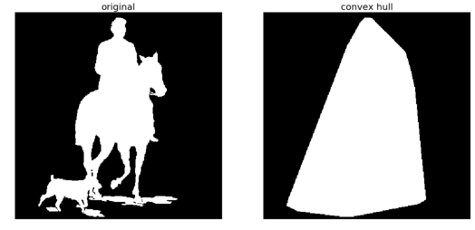
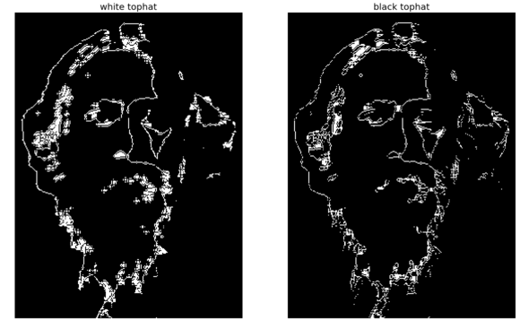
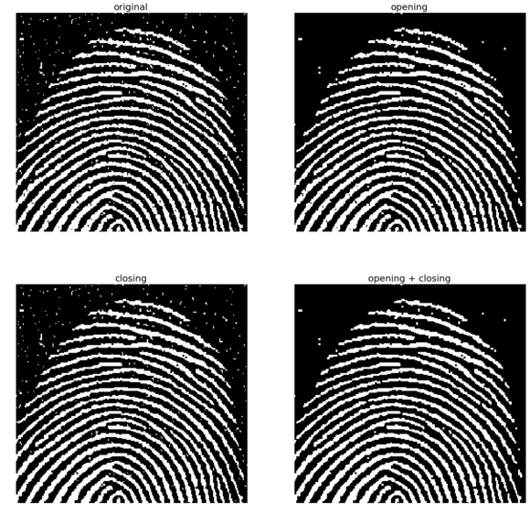
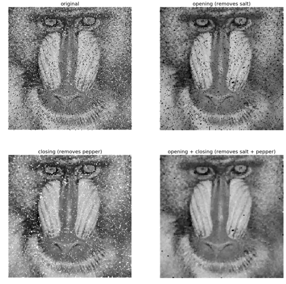

**Author: Sandipan Dey**

### Morphological Image Processing

In this chapter, we will discuss mathematical morphology and morphological image processing. Morphological image processing is a collection of non-linear operations related to the shape or morphology of features in an image. These operations are particularly suited to the processing of binary images (where pixels are represented as 0 or 1 and, by convention, the foreground of the object = 1 or white and the background = 0 or black), although it can be extended to grayscale images.


In morphological operations, a structuring element (a small template image) is used to probe the input image. The algorithms work by positioning the structuring element at all possible locations in the input image and comparing it with the corresponding neighborhood of the pixels with a set operator. Some operations test whether the element fits within the neighborhood, while others test whether it hits or intersects the neighborhood. A few popular morphological operators or filters are binary dilation and erosion, opening and closing, thinning, skeletonizing, morphological edge detectors, hit or miss filters, rank filters, median filters, and majority filters.


This chapter will demonstrate how to use morphological operators or filters on binary and grayscale images along with their applications, using functions from the scikit-image and SciPy ndimage.morphology module. 


The topics to be covered in this chapter are as follows:
- Morphological image processing with the scikit-image 
- morphology moduleMorphological image processing with the scikit-image filter.rank module
- Morphological image processing with the scipy.ndimage.morphology module

### Erosion
Erosion is a basic morphological operation that shrinks the size of the foreground objects, smooths the object boundaries, and removes peninsulas, fingers, and small objects. The following code block shows how to use the binary_erosion() function that computes fast binary morphological erosion of a binary image


```python
% matplotlib inline
from skimage.io import imread
from skimage.color import rgb2gray
import matplotlib.pylab as pylab
from skimage.morphology import binary_erosion, rectangle

def plot_image(image, title=''):
    pylab.title(title, size=20), pylab.imshow(image)
    pylab.axis('off') # comment this line if you want axis ticks
    

im = rgb2gray(imread('../images/clock2.jpg'))
im[im <= 0.5] = 0 # create binary image with fixed threshold 0.5
im[im > 0.5] = 1
pylab.gray()
pylab.figure(figsize=(20,10))
pylab.subplot(1,3,1), plot_image(im, 'original')
im1 = binary_erosion(im, rectangle(1,5))
pylab.subplot(1,3,2), plot_image(im1, 'erosion with rectangle size (1,5)')
im1 = binary_erosion(im, rectangle(1,15))
pylab.subplot(1,3,3), plot_image(im1, 'erosion with rectangle size (1,15)')
pylab.show()
```


    <matplotlib.figure.Figure at 0x1b77af33470>


The following screenshot shows the output of the previous code. As can be seen, using erosion with the structuring element as a thin, small, vertical rectangle, the small ticks from the binary clock image are removed first. Next, a taller vertical rectangle is used to erode the clock hands too

### Dilation

Dilation is another basic morphological operation that expands the size of the foreground objects, smooths object boundaries, and closes holes and gaps in a binary image. This is a dual operation of erosion. The following code snippet shows how to use the binary_dilation() function on Tagore's binary image with a disk structuring elements of different sizes


The following screenshot shows the output of the previous code block. As can be seen, with a smaller size structuring element, a few details (that are treated as background or gaps) from the face got removed and, with the larger size disk, all of the small gaps were filled:


```python
from skimage.morphology import binary_dilation, disk
from skimage import img_as_float
im = img_as_float(imread('../images/tagore.png'))
im = 1 - im[...,3]
im[im <= 0.5] = 0
im[im > 0.5] = 1
pylab.gray()
pylab.figure(figsize=(18,9))
pylab.subplot(131)
pylab.imshow(im)
pylab.title('original', size=20)
pylab.axis('off')
for d in range(1,3):
    pylab.subplot(1,3,d+1)
    im1 = binary_dilation(im, disk(2*d))
    pylab.imshow(im1)
    pylab.title('dilation with disk size ' + str(2*d), size=20)
    pylab.axis('off')
pylab.show()    
```


    <matplotlib.figure.Figure at 0x1b7000c0f60>


### Opening and closing

Opening is a morphological operation that can be expressed as a combination of first erosion and then dilation operations; it removes small objects from a binary image. Closing, to the contrary, is another morphological operation that can be expressed as a combination of first dilation and then erosion operations; it removes small holes from a binary image. These two are dual operations. The following code snippet shows how to use the scikit-image morphology module's corresponding functions to remove small objects and small holes, respectively, from a binary image


The following screenshot shows the output of the previous code block—the patterns generated with binary opening and closing operations with disk structuring element of different sizes. As expected, the opening operation only retains the larger circles


```python
from skimage.morphology import binary_opening, binary_closing, binary_erosion, binary_dilation, disk
im = rgb2gray(imread('../images/circles.jpg'))
im[im <= 0.5] = 0
im[im > 0.5] = 1
pylab.gray()
pylab.figure(figsize=(20,10))
pylab.subplot(1,3,1), plot_image(im, 'original')
im1 = binary_opening(im, disk(12))
pylab.subplot(1,3,2), plot_image(im1, 'opening with disk size ' + str(12))
im1 = binary_closing(im, disk(6))
pylab.subplot(1,3,3), plot_image(im1, 'closing with disk size ' + str(6))
pylab.show()
```


    <matplotlib.figure.Figure at 0x1b77cc8b0f0>


Now let's compare opening with erosion and closing with dilation (by replacing binary_opening() with binary_erosion() and binary_closing() with binary_dilation(), respectively, with the same structuring element as in the last code block. The following screenshot shows the output images obtained with erosion and dilation instead

### Skeletonizing

In this operation, each connected component in a binary image is reduced to a single pixel-wide skeleton using a morphological thinning operation. The following code block shows how to skeletonize a binary image of a dinosaur


```python
def plot_images_horizontally(original, filtered, filter_name, sz=(18,7)):
    pylab.gray()
    pylab.figure(figsize = sz)
    pylab.subplot(1,2,1), plot_image(original, 'original')
    pylab.subplot(1,2,2), plot_image(filtered, filter_name)
    pylab.show()

from skimage.morphology import skeletonize
im = img_as_float(imread('../images/dynasaur.png')[...,3])
threshold = 0.5
im[im <= threshold] = 0
im[im > threshold] = 1
skeleton = skeletonize(im)
plot_images_horizontally(im, skeleton, 'skeleton',sz=(18,9))
```


    <matplotlib.figure.Figure at 0x1b77c58b0f0>


### Computing the convex hull

The convex hull is defined by the smallest convex polygon that surrounds all foreground (white pixels) in the input image. The following code block demonstrates how to compute the convex hull for a binary image


```python
from skimage.morphology import convex_hull_image
im = rgb2gray(imread('../images/horse-dog.jpg'))
threshold = 0.5
im[im < threshold] = 0 # convert to binary image
im[im >= threshold] = 1
chull = convex_hull_image(im)
plot_images_horizontally(im, chull, 'convex hull', sz=(18,9))
```


    <matplotlib.figure.Figure at 0x1b77c58b390>




```python
im = im.astype(np.bool)
chull_diff = img_as_float(chull.copy())
chull_diff[im] = 2
pylab.figure(figsize=(20,10))
pylab.imshow(chull_diff, cmap=pylab.cm.gray, interpolation='nearest')
pylab.title('Difference Image', size=20)
pylab.show()
```


### Removing small objects

The following code block shows how the remove_small_objects() function can be used <span class="mark">to remove objects smaller than a specified minimum size threshold</span>—the higher the specified threshold, the more objects get removed


The following screenshot shows the output of the previous code block. As expected, the higher the minimum size threshold specified, the more objects are removed


```python
from skimage.morphology import remove_small_objects
im = rgb2gray(imread('../images/circles.jpg'))
im[im > 0.5] = 1 # create binary image by thresholding with fixed threshold
0.5
im[im <= 0.5] = 0
im = im.astype(np.bool)
pylab.figure(figsize=(20,20))
pylab.subplot(2,2,1), plot_image(im, 'original')
i = 2
for osz in [50, 200, 500]:
    im1 = remove_small_objects(im, osz, connectivity=1)
    pylab.subplot(2,2,i), plot_image(im1, 'removing small objects below size ' + str(osz))
    i += 1
pylab.show()
```


### White and black top-hats

The white top-hat of an image computes the bright spots smaller than the structuring element. It is defined as the difference image of the original image and its morphological opening. Similarly, the black top-hat of an image computes the dark spots smaller than the structuring element. It is defined as the difference image of the morphological closing image of original image. The dark spots in the original image become bright spots after the black top-hat operation. The following code block demonstrates how to use these two morphological operations using the scikit-image morphology module functions on the input binary image of Tagore


```python
from skimage.morphology import white_tophat, black_tophat, square
im = imread('../images/tagore.png')[...,3]
im[im <= 0.5] = 0
im[im > 0.5] = 1
im1 = white_tophat(im, square(5))
im2 = black_tophat(im, square(5))
pylab.figure(figsize=(20,15))
pylab.subplot(1,2,1), plot_image(im1, 'white tophat')
pylab.subplot(1,2,2), plot_image(im2, 'black tophat')
pylab.show()
```





### Extracting the boundary

The erosion operation can be used to extract the boundary of a binary image—we just need to subtract the eroded image from the input binary image to extract the boundary. The following code block implements this


```python
from skimage.morphology import binary_erosion
im = rgb2gray(imread('../images/horse-dog.jpg'))
threshold = 0.5
im[im < threshold] = 0
im[im >= threshold] = 1
boundary = im - binary_erosion(im)
plot_images_horizontally(im, boundary, 'boundary',sz=(18,9))
```


    <matplotlib.figure.Figure at 0x1b70003f2e8>


### Fingerprint cleaning with opening and closing

Opening and closing can be sequentially used to remove noise (small foreground objects) from a binary image. This can be used in cleaning a fingerprint image as a preprocessing step. The following code block demonstrates how to implement it


```python
im = rgb2gray(imread('../images/fingerprint.jpg'))
im[im <= 0.5] = 0 # binarize
im[im > 0.5] = 1
im_o = binary_opening(im, square(2))
im_c = binary_closing(im, square(2))
im_oc = binary_closing(binary_opening(im, square(2)), square(2))
pylab.figure(figsize=(20,20))
pylab.subplot(221), plot_image(im, 'original')
pylab.subplot(222), plot_image(im_o, 'opening')
pylab.subplot(223), plot_image(im_c, 'closing')
pylab.subplot(224), plot_image(im_oc, 'opening + closing')
pylab.show()
```





### Grayscale operations

The following few code blocks show how to apply the morphological operations on grayscale images. First, let's start with gray-level erosion


```python
from skimage.morphology import dilation, erosion, closing, opening, square
im = imread('../images/zebras.jpg')
im = rgb2gray(im)
struct_elem = square(5)
eroded = erosion(im, struct_elem)
plot_images_horizontally(im, eroded, 'erosion')
```


    <matplotlib.figure.Figure at 0x1b77cec36d8>


The following code block shows how to apply dilation on the same input grayscale image


```python
dilated = dilation(im, struct_elem)
plot_images_horizontally(im, dilated, 'dilation')
```


    <matplotlib.figure.Figure at 0x1b70045c358>


The following code block shows how to apply the morphological gray-level opening operation on the same input grayscale image


```python
opened = opening(im, struct_elem)
plot_images_horizontally(im, opened, 'opening')
```


    <matplotlib.figure.Figure at 0x1b7006c44a8>


The following code block shows how to apply the morphological gray-level closing operation on the same input grayscale image


```python
closed = closing(im, struct_elem)
plot_images_horizontally(im, closed, 'closing')
```


    <matplotlib.figure.Figure at 0x1b77b0032e8>


### Morphological contrast enhancement

The morphological contrast enhancement filter operates on each pixel by considering only the pixels in a neighborhood defined by a structuring element. It replaces the central pixel either by the local minimum or the local maximum pixel in the neighborhood, depending on which one the original pixel is closest to. The following code block shows a comparison of the output obtained using the morphological contrast enhancement filter and the exposure module's adaptive histogram equalization, with both the filters being local


The following screenshot shows the output, comparing the input image with the output images obtained using morphological contrast enhancement and adaptive histogram equalization


```python
from skimage.filters.rank import enhance_contrast
from skimage import exposure
def plot_gray_image(ax, image, title):
    ax.imshow(image, cmap=pylab.cm.gray),
    ax.set_title(title), ax.axis('off')
    ax.set_adjustable('box-forced')
    
image = rgb2gray(imread('../images/squirrel.jpg'))
sigma = 0.05
noisy_image = np.clip(image + sigma * np.random.standard_normal(image.shape), 0, 1)
enhanced_image = enhance_contrast(noisy_image, disk(5))
equalized_image = exposure.equalize_adapthist(noisy_image)

fig, axes = pylab.subplots(1, 3, figsize=[18, 7], sharex='row',sharey='row')
axes1, axes2, axes3 = axes.ravel()
plot_gray_image(axes1, noisy_image, 'Original')
plot_gray_image(axes2, enhanced_image, 'Local morphological contrast enhancement')
plot_gray_image(axes3, equalized_image, 'Adaptive Histogram equalization')
```

    C:\Users\Sandipan.Dey\Anaconda\envs\ana41py35\lib\site-packages\skimage\util\dtype.py:130: UserWarning: Possible precision loss when converting from float64 to uint8
      .format(dtypeobj_in, dtypeobj_out))
    C:\Users\Sandipan.Dey\Anaconda\envs\ana41py35\lib\site-packages\skimage\util\dtype.py:130: UserWarning: Possible precision loss when converting from float64 to uint16
      .format(dtypeobj_in, dtypeobj_out))


### Noise removal with the median filter

The following code block shows how to use scikit-image filters.rank module's morphological median filter. Some impulse noise is added to the input grayscale Lena image by randomly setting 10% of the pixels to 255 (salt) and another 10% to 0 (pepper). The structuring elements used are disks with different sizes in order to remove the noise with the median filter


The output of the previous code block is shown in the following screenshot. As can be seen, the output gets more patchy or blurred as the disk radius is increased, although more noise gets removed at the same time


```python
from skimage.filters.rank import median
from skimage.morphology import disk
noisy_image = (rgb2gray(imread('../images/lena.jpg'))*255).astype(np.uint8)
noise = np.random.random(noisy_image.shape)
noisy_image[noise > 0.9] = 255
noisy_image[noise < 0.1] = 0
fig, axes = pylab.subplots(2, 2, figsize=(10, 10), sharex=True, sharey=True)
axes1, axes2, axes3, axes4 = axes.ravel()
plot_gray_image(axes1, noisy_image, 'Noisy image')
plot_gray_image(axes2, median(noisy_image, disk(1)), 'Median $r=1$')
plot_gray_image(axes3, median(noisy_image, disk(5)), 'Median $r=5$')
plot_gray_image(axes4, median(noisy_image, disk(20)), 'Median $r=20$')
```


### Computing the local entropy
Entropy is a measure of uncertainty or randomness in an image. It is mathematically defined as follows

In the previous formula, pi is the probability (obtained from the normalized histogram of the image) associated with the gray-level, i. This formula computes the global entropy of an image. In a similar manner, we can define local entropy too, to define local image complexity, and it can be computed from the local histograms.


The skimage.rank.entropy() function computes the local entropy (the minimum number of bits required to encode local gray-level distribution) of an image on a given structuring element. The following example shows how to apply this filter on a grayscale image. The function returns 10x entropy for 8-bit images


The following screenshot shows the output. The regions with higher entropy (in other words, with higher information content such as the bird's nest) are represented with brighter colors


```python
from skimage.morphology import disk
from skimage.filters.rank import entropy
image = rgb2gray(imread('../images/birds.png'))
fig, (axes1, axes2) = pylab.subplots(1, 2, figsize=(18, 10), sharex=True, sharey=True)
fig.colorbar(axes1.imshow(image, cmap=pylab.cm.gray), ax=axes1)
axes1.axis('off'), axes1.set_title('Image', size=20), axes1.set_adjustable('box-forced')
fig.colorbar(axes2.imshow(entropy(image, disk(5)), cmap=pylab.cm.inferno), ax=axes2)
axes2.axis('off'), axes2.set_title('Entropy', size=20), axes2.set_adjustable('box-forced')
pylab.show()
```

    C:\Users\Sandipan.Dey\Anaconda\envs\ana41py35\lib\site-packages\skimage\util\dtype.py:130: UserWarning: Possible precision loss when converting from float64 to uint8
      .format(dtypeobj_in, dtypeobj_out))


### Filling holes in binary objects

This function fills the holes in binary objects. The following code block demonstrates the application of the function with different structuring element sizes on an input binary image


The following screenshot shows the output of the previous code block. As can be seen, the larger the structuring element (square) side, the fewer number of holes are filled}


```python
from scipy.ndimage.morphology import binary_fill_holes
im = rgb2gray(imread('../images/text1.png'))
im[im <= 0.5] = 0
im[im > 0.5] = 1
pylab.figure(figsize=(20,15))
pylab.subplot(221), pylab.imshow(im), pylab.title('original', size=20),pylab.axis('off')
i = 2
for n in [3,5,7]:
    pylab.subplot(2, 2, i)
    im1 = binary_fill_holes(im, structure=np.ones((n,n)))
    pylab.imshow(im1), pylab.title('binary_fill_holes with structure square side ' + str(n), size=20)
    pylab.axis('off')
    i += 1
pylab.show()
```


### Using opening and closing to remove noise

The following code block shows how gray-level opening and closing can remove salt-and-pepper noise from a grayscale image, and how the successive application of opening and closing removes salt-and-pepper (impulse) noise from the input, a noisy mandrill grayscale image


The following shows the output of the previous code—how opening and closing removes the salt and the pepper noise from the grayscale noisy image of a mandrill


```python
from scipy import ndimage
im = rgb2gray(imread('../images/mandrill_spnoise_0.1.jpg'))
im_o = ndimage.grey_opening(im, size=(2,2))
im_c = ndimage.grey_closing(im, size=(2,2))
im_oc = ndimage.grey_closing(ndimage.grey_opening(im, size=(2,2)), size=(2,2))
pylab.figure(figsize=(20,20))
pylab.subplot(221), pylab.imshow(im), pylab.title('original', size=20), pylab.axis('off')
pylab.subplot(222), pylab.imshow(im_o), pylab.title('opening (removes salt)', size=20), pylab.axis('off')
pylab.subplot(223), pylab.imshow(im_c), pylab.title('closing (removes pepper)', size=20),pylab.axis('off')
pylab.subplot(224), pylab.imshow(im_oc), pylab.title('opening + closing (removes salt + pepper)', size=20)
pylab.axis('off')
pylab.show()
```





### Computing the morphological Beucher gradient

The morphological Beucher gradient can be computed as a difference image of the dilated version and the eroded version of an input grayscale image. SciPy ndimage provides a function for computing the morphological gradient of a grayscale image. The following code block shows how these two produce the same output for an Einstein image


The following screenshot shows the output—the SciPy morphological gradient function has the exact same output image as the Beucher gradient


```python
from scipy import ndimage
im = rgb2gray(imread('../images/einstein.jpg'))
im_d = ndimage.grey_dilation(im, size=(3,3))
im_e = ndimage.grey_erosion(im, size=(3,3))
im_bg = im_d - im_e
im_g = ndimage.morphological_gradient(im, size=(3,3))
pylab.gray()
pylab.figure(figsize=(20,18))
pylab.subplot(231), pylab.imshow(im), pylab.title('original', size=20),
pylab.axis('off')
pylab.subplot(232), pylab.imshow(im_d), pylab.title('dilation', size=20),
pylab.axis('off')
pylab.subplot(233), pylab.imshow(im_e), pylab.title('erosion', size=20),
pylab.axis('off')
pylab.subplot(234), pylab.imshow(im_bg), pylab.title('Beucher gradient (bg)', size=20), pylab.axis('off')
pylab.subplot(235), pylab.imshow(im_g), pylab.title('ndimage gradient (g)', size=20), pylab.axis('off')
pylab.subplot(236), pylab.title('diff gradients (bg - g)', size=20), pylab.imshow(im_bg - im_g) 
pylab.axis('off')
pylab.show()
```


    <matplotlib.figure.Figure at 0x1b77b030668>


### Computing the morphological Laplace

The following code block demonstrates how to compute the morphological Laplace using the corresponding ndimage function with a binary image of Tagore, and compares it with the morphological gradient with structuring elements of different sizes, though as can be seen, for this image a smaller structuring element with gradient and a larger structuring element with Laplace yields better output images in terms of extracted edges


The following screenshot shows the output of the previous code


```python
im = imread('../images/tagore.png')[...,3]
im_g = ndimage.morphological_gradient(im, size=(3,3))
im_l = ndimage.morphological_laplace(im, size=(5,5))
pylab.figure(figsize=(15,10))
pylab.subplot(121), pylab.title('ndimage morphological laplace', size=20), pylab.imshow(im_l)
pylab.axis('off')
pylab.subplot(122), pylab.title('ndimage morphological gradient', size=20),
pylab.imshow(im_g)
pylab.axis('off')
pylab.show()
```


### Summary                                                        
In this chapter, we discussed different image processing techniques based on mathematical morphology. We discussed morphological binary operations such as erosion, dilation, opening, closing, skeletonizing, and white and black top-hats. Then we discussed some applications such as computing the convex hull, removing small objects, extracting the boundary, fingerprint cleaning with opening and closing, filling holes in binary objects, and using opening and closing to remove noise. After that, we discussed extension of the morphological operations to grayscale operations and applications of morphological contrast enhancement, noise removal with the median filter, and computing local entropy. Also, we discussed how to compute the morphological (Beucher) gradient and the morphological Laplace. By the end of this chapter, the reader should be able to write Python code for morphological image processing (for example, opening, closing, skeletonizing, and computing the convex hull).

### Questions
1. how with a binary image that morphological opening and closing are dual operations. (Hint: apply opening on an image foreground and closing on the image background with the same structuring element)
2. Automatically crop an image using the convex hull of the object in it (the problem is taken from https://stackoverflow.com/questions/14211340/automatically-cropping-an-image-with-python-pil/51703287#51703287). Use the following image and crop the white background:

The desired output image is shown as follows—the bounding rectangle to crop the image is to be found automatically

3. Use the maximum() and minimum() functions from skimage.filters.rank to implement morphological opening and closing with a grayscale image.

### Further reading
- https://www.idi.ntnu.no/emner/tdt4265/lectures/lecture3b.pdf
- https://www.uio.no/studier/emner/matnat/ifi/INF4300/h11/undervisningsmateriale/morfologi2011.pdf
- https://www.cis.rit.edu/class/simg782/lectures/lecture_03/lec782_05_03.pdf
- http://www.math.tau.ac.il/~turkel/notes/segmentation_morphology.pdf
- https://courses.cs.washington.edu/courses/cse576/book/ch3.pdf
- http://www.cse.iitd.ernet.in/~pkalra/csl783/Morphological.pdf
