**Author: Sandipan Dey**

## Extracting Image Features and Descriptors

In this chapter, we will discuss feature detectors and descriptors, along with various applications of different types of feature detectors/extractors in image processing. We will start by defining feature detectors and descriptors. We will then continue our discussion on a few popular feature detectors such as Harris Corner/SIFT and HOG, and then their applications in important image processing problems such as image matching and object detection, respectively, with <span class="burk">scikit-image</span> and <span class="burk">python-opencv (cv2)</span> library functions.

The topics to be covered in this chapter are as follows:

1. Feature detectors versus descriptors, to extract features/descriptors from images
2. Harris Corner Detector and the application of Harris Corner features in image matching (with scikit-image)
3. Blob detectors with LoG, DoG, and DoH (with scikit-image)
4. Extraction of Histogram of Oriented Gradients features
5. SIFT, ORB, and BRIEF features and their application in image matching
6. Haar-like features and their application in face detection

### Feature detectors versus descriptors

In image processing, (local) features refer to a group of <span class="mark">key/salient points</span> or <span class="mark">information relevant</span> to an image processing task, and they create an abstract, more general (and often robust) representation of an image.A family of <span class="mark">algorithms</span> that choose a set of interest points from an image based on some criterion (for example, cornerness, local maximum/minimum, and so on, that detect/extract the features from an image) are called feature detectors/extractors.

On the contrary, a descriptor consists of a collection of values to represent the image with the features/interest points (for example, HOG features). Feature extraction can also be thought of as an operation that transforms an image into a set of feature descriptors, and, hence, <span class="mark">a special form of dimensionality reduction</span>. <span class="mark">A local feature is usually formed by an interest point and its descriptor together.</span>

Global features from the whole image (for example, image histogram) are often not desirable. A more practical approach is to describe an image as a collection of local features which correspond to interesting regions in the image such as corners, edges, and blobs. Each of these regions is characterized by a descriptor which captures the local distribution of certain photometric properties, such as intensities and gradients. Some properties of the local features are as follows:

1. They should be repetitive (detect the same points independently in each image)
2. They should be invariant to translation, rotation, scale (affine transformation)
3. They should be robust to the presence of noise/blur/occlusion, clutter, and illumination change (locality)
4. The region should contain interesting structures (distinctiveness), and suchlike

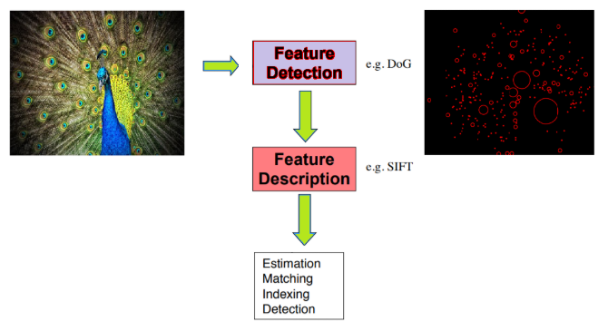

In this chapter, we are going to use python-opencv (the cv2 library) for the first time. In order to install it properly, it is recommended you go through this link: https://opencv-python-tutroals.readthedocs.io/en/latest/py_tutorials/py_setup/py_setup_in_windows/py_setup_in_windows.html.

As usual, let's start by importing all the required libraries:


```python
# Import libraries

%matplotlib inline
from matplotlib import pylab as pylab
from skimage.io import imread
from skimage.color import rgb2gray
from skimage.feature import corner_harris, corner_subpix, corner_peaks
from skimage.transform import warp, SimilarityTransform, AffineTransform, resize
import cv2
import numpy as np
from skimage import data
from skimage.util import img_as_float
from skimage.exposure import rescale_intensity
from skimage.measure import ransac
```

### Harris Corner Detector With scikit-image
This algorithm explores the intensity changes within a window as the window changes location inside an image. Unlike an edge, for which intensity values change abruptly in only one direction, there is a significant change in intensity values at a corner in all directions. Hence, a large change in intensity value should result when the window is shifted in any direction at the corner (with good localization); this fact is exploited in the Harris Corner Detector algorithm. It is invariant to rotation, but not to scale (that is, the corner points found from an image remain unchanged when the image undergoes a rotation transformation, but change when the image is resized). In this section, we shall discuss how to implement a Harris Corner Detector with scikit-image

#### With scikit-image
The next code snippet shows how to detect corner points in an image using the Harris Corner Detector with the corner_harris() function from the scikit-image feature module


```python
image = imread('../images/chess_football.png') # RGB image
image_gray = rgb2gray(image)
coordinates = corner_harris(image_gray, k =0.001)
image[coordinates>0.01*coordinates.max()]=[255,0,0,255]
pylab.figure(figsize=(20,10))
pylab.imshow(image), pylab.axis('off'), pylab.show()
```


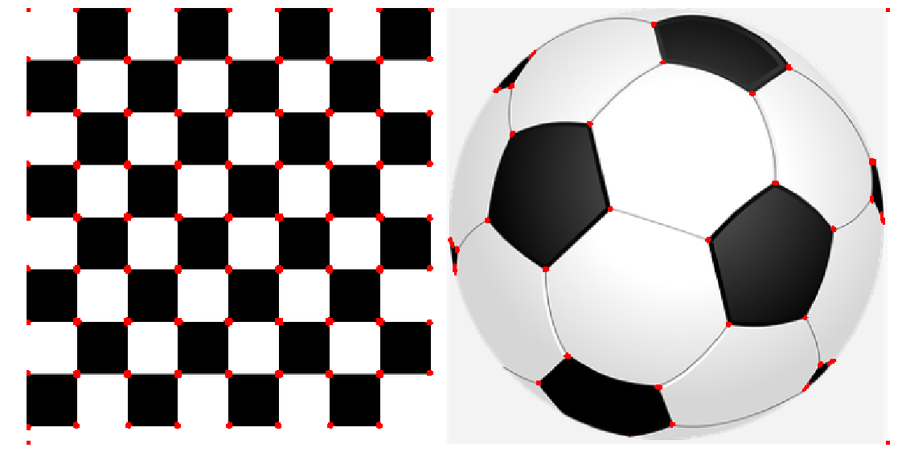


    (<matplotlib.image.AxesImage at 0x202e06905f8>,
     (-0.5, 700.5, 354.5, -0.5),
     None)


#### With sub-pixel accuracy
Sometimes, the corners may be needed to be found with maximum accuracy. With the corner_subpix() function from the scikit-image's feature module, the corners detected are refined with sub-pixel accuracy. The following code demonstrates how to use this function. The Louvre Pyramid in Paris is used as the input image. As usual, first the Harris Corners are computed with corner_peaks(), then the sub-pixel positions of corners are computed with the corner_subpix() function, which uses a statistical test to decide whether to accept/reject a corner point computed earlier with the corner_peaks() function. We need to define the size of neighborhood (window) the function will use to search for corners


The next couple of screenshots show the output of the code. In the first screenshot, the Harris Corners are marked in yellow pixels and the refined sub-pixel corners are marked with red pixels. In the second screenshot, the corners detected are plotted on top of the original input image with blue pixels and the sub-pixel, again with red pixels


```python
image = imread('../images/pyramids2.jpg')
image_gray = rgb2gray(image)
coordinates = corner_harris(image_gray, k =0.001)
coordinates[coordinates > 0.03*coordinates.max()] = 255 # threshold for an optimal value, depends on the image
corner_coordinates = corner_peaks(coordinates)
coordinates_subpix = corner_subpix(image_gray, corner_coordinates, window_size=11)
pylab.figure(figsize=(20,20))
pylab.subplot(211), pylab.imshow(coordinates, cmap='inferno')
pylab.plot(coordinates_subpix[:, 1], coordinates_subpix[:, 0], 'r.', markersize=5, label='subpixel')
pylab.legend(prop={'size': 20}), pylab.axis('off')
pylab.subplot(212), pylab.imshow(image, interpolation='nearest')
pylab.plot(corner_coordinates[:, 1], corner_coordinates[:, 0], 'bo', markersize=5)
pylab.plot(coordinates_subpix[:, 1], coordinates_subpix[:, 0], 'r+', markersize=10), pylab.axis('off')
pylab.tight_layout(), pylab.show()
```


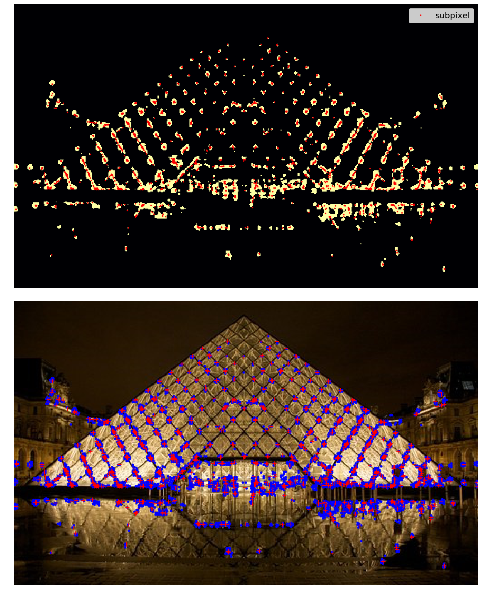


    (None, None)


**An application – image matching**                                                      
Once we have detected the interest points in an image, it would be good to know how to match the points across different images of the same object. For example, the following list shows the general approach to matching two such images:Compute the points of interest (for example, corner points with the Harris Corner Detector)Consider a region (window) around each of the key-pointsFrom the region, compute a local feature descriptor, for each key point for each image and normalizeMatch the local descriptors computed in two images (using Euclidean distance, for example)Harris Corner points can be used to match two images; the next section gives an example. 

### Robust image matching using the RANSAC algorithm and Harris Corner features 
In this example, we will match an image with its affine transformed version; they can be considered as if they were taken from different view points. The following steps describe the image matching algorithm:


1. First, we will compute the interest points or the Harris Corners in both the images.
2. A small space around the points will be considered, and the correspondences in-between the points will then be computed using a weighted sum of squared differences. This measure is not very robust, and it's only usable with slight viewpoint changes.
3. A set of source and corresponding destination coordinates will be obtained once the correspondences are found; they are used to estimate the geometric transformations between both the images.
4. A simple estimation of the parameters with the coordinates is not enough—many of the correspondences are likely to be faulty.
5. The RANdom SAmple Consensus (RANSAC) algorithm is used to robustly estimate the parameters, first by classifying the points into inliers and outliers, and then by fitting the model to inliers while ignoring the outliers, in order to find matches consistent with an affine transformation.


The next code block shows how to implement the image matching using the Harris Corner features


```python
temple = rgb2gray(img_as_float(imread('../images/temple.jpg')))
image_original = np.zeros(list(temple.shape) + [3])
image_original[..., 0] = temple
gradient_row, gradient_col = (np.mgrid[0:image_original.shape[0], 0:image_original.shape[1]] / float(image_original.shape[0]))
image_original[..., 1] = gradient_row
image_original[..., 2] = gradient_col
image_original = rescale_intensity(image_original)
image_original_gray = rgb2gray(image_original)
affine_trans = AffineTransform(scale=(0.8, 0.9), rotation=0.1, translation=(120, -20))
image_warped = warp(image_original, affine_trans .inverse, output_shape=image_original.shape)
image_warped_gray = rgb2gray(image_warped)
```

Extract corners using the Harris Corner measure:


```python
coordinates = corner_harris(image_original_gray)
coordinates[coordinates > 0.01*coordinates.max()] = 1
coordinates_original = corner_peaks(coordinates, threshold_rel=0.0001, min_distance=5)
coordinates = corner_harris(image_warped_gray)
coordinates[coordinates > 0.01*coordinates.max()] = 1
coordinates_warped = corner_peaks(coordinates, threshold_rel=0.0001, min_distance=5)
```

Determine the sub-pixel corner positions:


```python
coordinates_original_subpix = corner_subpix(image_original_gray, coordinates_original, window_size=9)
coordinates_warped_subpix = corner_subpix(image_warped_gray, coordinates_warped, window_size=9)

def gaussian_weights(window_ext, sigma=1):
    y, x = np.mgrid[-window_ext:window_ext+1, -window_ext:window_ext+1]
    g_w = np.zeros(y.shape, dtype = np.double)
    g_w[:] = np.exp(-0.5 * (x**2 / sigma**2 + y**2 / sigma**2))
    g_w /= 2 * np.pi * sigma * sigma
    return g_w
```

Weight pixels depending on the distance to the center pixel,  compute the sum of squared differences to all corners in the warped image and use the corner with the minimum SSD as correspondence:


```python
def match_corner(coordinates, window_ext=3):
    row, col = np.round(coordinates).astype(np.intp)
    window_original = image_original[row-window_ext:row+window_ext+1, col-window_ext:col+window_ext+1, :]
    weights = gaussian_weights(window_ext, 3)
    weights = np.dstack((weights, weights, weights))
    SSDs = []
    for coord_row, coord_col in coordinates_warped:
        window_warped = image_warped[coord_row-window_ext:coord_row+window_ext+1,
        coord_col-window_ext:coord_col+window_ext+1, :]
        if window_original.shape == window_warped.shape:
            SSD = np.sum(weights * (window_original - window_warped)**2)
            SSDs.append(SSD)
    min_idx = np.argmin(SSDs) if len(SSDs) > 0 else -1
    return coordinates_warped_subpix[min_idx] if min_idx >= 0 else [None]
```

Find the correspondences using the simple weighted sum of the squared differences:


```python
from skimage.feature import (match_descriptors, corner_peaks, corner_harris, plot_matches, BRIEF)
source, destination = [], []
for coordinates in coordinates_original_subpix:
    coordinates1 = match_corner(coordinates)
    if any(coordinates1) and len(coordinates1) > 0 and not all(np.isnan(coordinates1)):
        source.append(coordinates)
        destination.append(coordinates1)
source = np.array(source)
destination = np.array(destination)
```

Estimate the affine transform model using all the coordinates:


```python
model = AffineTransform()
model.estimate(source, destination)
```

Robustly estimate the affine transform model with RANSAC:


```python
model_robust, inliers = ransac((source, destination), AffineTransform, min_samples=3, residual_threshold=2, max_trials=100)
outliers = inliers == False
```

Compare the True and estimated transform parameters:


```python
print(affine_trans.scale, affine_trans.translation, affine_trans.rotation)
print(model.scale, model.translation, model.rotation)
print(model_robust.scale, model_robust.translation, model_robust.rotation)
```

    C:\Users\Sandipan.Dey\Anaconda\envs\ana41py35\lib\site-packages\ipykernel_launcher.py:3: RuntimeWarning: overflow encountered in longlong_scalars
      This is separate from the ipykernel package so we can avoid doing imports until


    (0.8, 0.9) [120. -20.] 0.09999999999999999
    (0.8982412101241938, 0.8072777593937368) [-20.45123966 114.92297156] -0.10225420334222493
    (0.9001524425730122, 0.8000362790749186) [-19.87491292 119.83016533] -0.09990858564132554


Visualize the correspondence:


```python
fig, axes = pylab.subplots(nrows=2, ncols=1, figsize=(20,15))
pylab.gray()
inlier_idxs = np.nonzero(inliers)[0]
plot_matches(axes[0], image_original_gray, image_warped_gray, source, destination, np.column_stack((inlier_idxs, inlier_idxs)),matches_color='b')
axes[0].axis('off'), axes[0].set_title('Correct correspondences', size=20)
outlier_idxs = np.nonzero(outliers)[0]
plot_matches(axes[1], image_original_gray, image_warped_gray, source, destination, np.column_stack((outlier_idxs, outlier_idxs)), matches_color='r')
axes[1].axis('off'), axes[1].set_title('Faulty correspondences', size=20)
fig.tight_layout(), pylab.show()
```


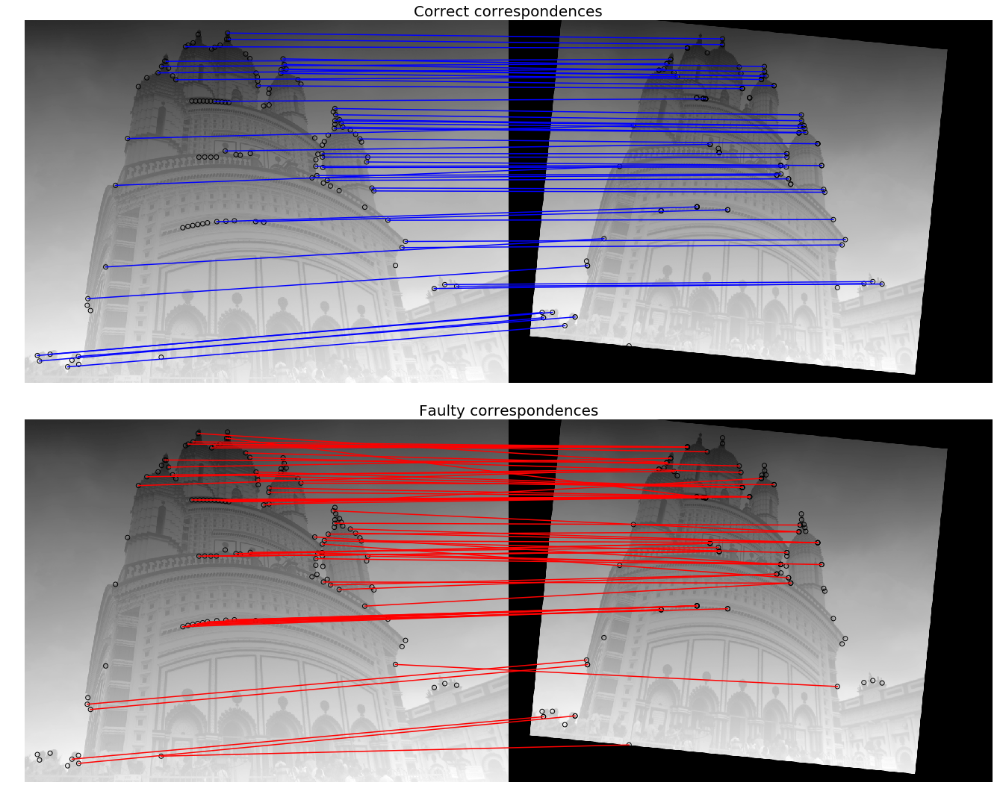

    (None, None)


### Blob detectors with LoG, DoG and DoH
In an image, a blob is defined as either a bright on a dark region, or a dark on a bright region. In this section, we will discuss how to implement blob features detection in an image using the following three algorithms. The input image is a colored (RGB) butterfly image.

**Laplacian of Gaussian (LoG)**                                                     
In the Chapter 3, Convolution and Frequency Domain Filtering, we saw that the cross correlation of an image with a filter can be viewed as pattern matching; that is, comparing a (small) template image (of what we want to find) against all local regions in the image. The key idea in blob detection comes from this fact. We have already seen how an LoG filter with zero crossing can be used for edge detection in the last chapter. LoG can also be used to find scale invariant regions by searching 3D (location + scale) extrema of the LoG with the concept of Scale Space. If the scale of the Laplacian (σ of the LoG filter) gets matched with the scale of the blob, the magnitude of the Laplacian response attains a maximum at the center of the blob. With this approach, the LoG-convolved images are computed with gradually increasing σ and they are stacked up in a cube. The blobs correspond to the local maximums in this cube. This approach only detects the bright blobs on the dark backgrounds. It is accurate, but slow (particularly for detecting larger blobs).


**Difference of Gaussian (DoG)**
The LoG approach is approximated by the DoG approach, and hence it is faster. The image is smoothed (using Gaussians) with increasing σ values, and the difference between two consecutive smoothed images is stacked up in a cube. This approach again detects the bright blobs on the dark backgrounds. It is faster than LoG but less accurate, although the larger blobs detection is still expensive.


**Determinant of Hessian (DoH)**                                                       
The DoH approach is the fastest of all these approaches. It detects the blobs by computing maximums in the matrix of the Determinant of Hessian of the image. The size of blobs does not have any impact on the speed of detection. Both the bright blobs on the dark background and the dark blobs on the bright backgrounds are detected by this approach, but the small blobs are not detected accurately.The next code block demonstrates how to implement these aforementioned three algorithms using scikit-image:


```python
from numpy import sqrt
from skimage.feature import blob_dog, blob_log, blob_doh
im = imread('../images/butterfly.png')
im_gray = rgb2gray(im)
log_blobs = blob_log(im_gray, max_sigma=30, num_sigma=10, threshold=.1)
log_blobs[:, 2] = sqrt(2) * log_blobs[:, 2] # Compute radius in the 3rd column
dog_blobs = blob_dog(im_gray, max_sigma=30, threshold=0.1)
dog_blobs[:, 2] = sqrt(2) * dog_blobs[:, 2]
doh_blobs = blob_doh(im_gray, max_sigma=30, threshold=0.005)
list_blobs = [log_blobs, dog_blobs, doh_blobs]
colors, titles = ['yellow', 'lime', 'red'], ['Laplacian of Gaussian', 'Difference of Gaussian', 'Determinant of Hessian']
sequence = zip(list_blobs, colors, titles)
fig, axes = pylab.subplots(2, 2, figsize=(20, 20), sharex=True, sharey=True)
axes = axes.ravel()
axes[0].imshow(im, interpolation='nearest')
axes[0].set_title('original image', size=30), axes[0].set_axis_off()
for idx, (blobs, color, title) in enumerate(sequence):
    axes[idx+1].imshow(im, interpolation='nearest')
    axes[idx+1].set_title('Blobs with ' + title, size=30)
    for blob in blobs:
        y, x, row = blob
        col = pylab.Circle((x, y), row, color=color, linewidth=2, fill=False)
        axes[idx+1].add_patch(col), axes[idx+1].set_axis_off()
pylab.tight_layout(), pylab.show()
```


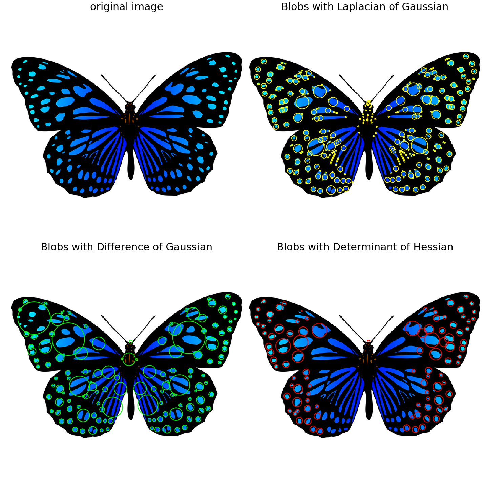

    (None, None)


### Histogram of Oriented Gradients                                                        
A popular feature descriptor for object detection is the Histogram of Oriented Gradients (HOG). In this section, we will discuss how HOG descriptors can be computed from an image.


**Algorithm to compute HOG descriptors**

The following steps describe the algorithm:If you wish to, you can globally normalize the imageCompute the horizontal and vertical gradient imagesCompute the gradient histogramsNormalize across blocksFlatten into a feature descriptor vectorHOG descriptors are the normalized block descriptors finally obtained by using the algorithm. 


**Compute HOG descriptors with scikit-image**

Let's now compute the HOG descriptors using the scikit-image feature module's hog() function and visualize them


```python
from skimage.feature import hog
from skimage import exposure
image = rgb2gray(imread('../images/cameraman.jpg'))
fd, hog_image = hog(image, orientations=8, pixels_per_cell=(16, 16),
cells_per_block=(1, 1), visualize=True)
print(image.shape, len(fd))
# ((256L, 256L), 2048)
fig, (axes1, axes2) = pylab.subplots(1, 2, figsize=(15, 10), sharex=True, sharey=True)
axes1.axis('off'), axes1.imshow(image, cmap=pylab.cm.gray), axes1.set_title('Input image')
hog_image_rescaled = exposure.rescale_intensity(hog_image, in_range=(0, 10))
axes2.axis('off'), axes2.imshow(hog_image_rescaled, cmap=pylab.cm.gray),
axes2.set_title('Histogram of Oriented Gradients')
pylab.show()
```

    C:\Users\Sandipan.Dey\Anaconda\envs\ana41py35\lib\site-packages\skimage\feature\_hog.py:150: skimage_deprecation: Default value of `block_norm`==`L1` is deprecated and will be changed to `L2-Hys` in v0.15. To supress this message specify explicitly the normalization method.
      skimage_deprecation)


    (256, 256) 2048


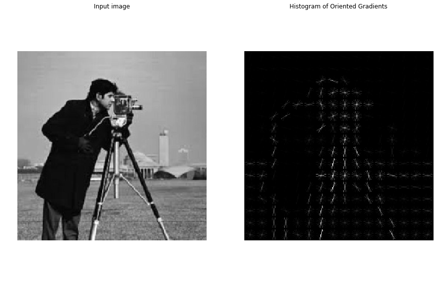


### Scale-invariant feature transform (SIFT)
Scale-invariant feature transform (SIFT) descriptors provide an alternative representation for image regions. They are very useful for matching images. As demonstrated earlier, simple corner detectors work well when the images to be matched are similar in nature (with respect to scale, orientation, and so on). But if they have different scales and rotations, the SIFT descriptors are needed to be used to match them. SIFT is not only just scale invariant, but it still obtains good results when rotation, illumination, and viewpoints of the images change as well. 


Let's discuss the primary steps involved in the SIFT algorithm that transforms image content into local feature coordinates that are invariant to translation, rotation, scale, and other imaging parameters.

**Algorithm to compute SIFT descriptors**                                                       

- Scale-space extrema detection: Search over multiple scales and image locations, the location and characteristic scales are given by DoG detector
- Keypoint localization: Select keypoints based on a measure of stability, keep only the strong interest points by eliminating the low-contrast and edge keypoints 
- Orientation assignment: Compute the best orientation(s) for each keypoint region, which contributes to the stability of matching
- Keypoint descriptor computation: Use local image gradients at selected scale and rotation to describe each keypoint region


As discussed, SIFT is robust with regard to small variations in illumination (due to gradient and normalization), pose (small affine variation due to orientation histogram), scale (by DoG), and intra-class variability (small variations due to histograms).


**With opencv and opencv-contrib**

In order to be able to use the SIFT functions with python-opencv, we first need to install opencv-contrib by following the instructions from this link: https://pypi.org/project/opencv-contrib-python/. The next code block demonstrates how to detect the SIFT keypoints and draws them using the input Mona Lisa image. 


We will first construct a SIFT object and then use the detect() method to compute the keypoints in an image. Every keypoint is a special feature, and has several attributes. For example, its (x, y) coordinates, angle (orientation), response (strength of keypoints), size of the meaningful neighborhood, and so on.


We will then use the drawKeyPoints() function from cv2 to draw the small circles around the detected keypoints. If the cv2.DRAW_MATCHES_FLAGS_DRAW_RICH_KEYPOINTS flag is applied to the function, it will draw a circle with the size of a keypoint, along with its orientation. In order to compute the keypoints and the descriptor together, we will use the function detectAndCompute():


```python
# make sure the opencv version is 3.3.0 with pip install opencv-python==3.3.0.10 opencv-contrib-python==3.3.0.10
import cv2
print(cv2.__version__)
# 3.3.0
img = cv2.imread('../images/monalisa.jpg')
gray= cv2.cvtColor(img,cv2.COLOR_BGR2GRAY)
sift = cv2.xfeatures2d.SIFT_create()
kp = sift.detect(gray,None) # detect SIFT keypoints
img = cv2.drawKeypoints(img,kp, None, flags=cv2.DRAW_MATCHES_FLAGS_DRAW_RICH_KEYPOINTS)
cv2.imwrite('../images/me5_keypoints.jpg',img)
kp, des = sift.detectAndCompute(gray,None) # compute the SIFT descriptor
```

### Application – matching images with BRIEF, SIFT, and ORB

In the last section, we discussed how to detect SIFT keypoints. In this section, we will introduce a couple more feature descriptors for an image, namely BRIEF (a short binary descriptor) and ORB (an efficient alternative to SIFT). All of these descriptors can also be used for image matching and object detection, as we will see shortly. 

**Matching images with BRIEF binary descriptors with scikit-image**

The BRIEF descriptor has comparatively few bits, and can be computed using a set of intensity difference tests. Being a short binary descriptor, it has a low memory footprint, and the matching using this descriptor turns out to be very efficient with the Hamming distance metric. With BRIEF, the desired scale-invariance can be obtained by detecting features at different scales, although it does not provide rotation-invariance. The next code block demonstrates how to compute the BRIEF binary descriptors with scikit-image functions. The input images for matching used are the gray-scale Lena image and its affine transformed versions


```python
from skimage import transform as transform
from skimage.feature import (match_descriptors, corner_peaks, corner_harris, plot_matches, BRIEF)
img1 = rgb2gray(imread('../images/lena.jpg')) #data.astronaut())
affine_trans = transform.AffineTransform(scale=(1.2, 1.2), translation=(0,-100))
img2 = transform.warp(img1, affine_trans)
img3 = transform.rotate(img1, 25)
coords1, coords2, coords3 = corner_harris(img1), corner_harris(img2), corner_harris(img3)
coords1[coords1 > 0.01*coords1.max()] = 1
coords2[coords2 > 0.01*coords2.max()] = 1
coords3[coords3 > 0.01*coords3.max()] = 1
keypoints1 = corner_peaks(coords1, min_distance=5)
keypoints2 = corner_peaks(coords2, min_distance=5)
keypoints3 = corner_peaks(coords3, min_distance=5)
extractor = BRIEF()
extractor.extract(img1, keypoints1)
keypoints1, descriptors1 = keypoints1[extractor.mask], extractor.descriptors
extractor.extract(img2, keypoints2)
keypoints2, descriptors2 = keypoints2[extractor.mask], extractor.descriptors
extractor.extract(img3, keypoints3)
keypoints3, descriptors3 = keypoints3[extractor.mask], extractor.descriptors
matches12 = match_descriptors(descriptors1, descriptors2, cross_check=True)
matches13 = match_descriptors(descriptors1, descriptors3, cross_check=True)
fig, axes = pylab.subplots(nrows=2, ncols=1, figsize=(20,20))
pylab.gray(), plot_matches(axes[0], img1, img2, keypoints1, keypoints2, matches12)
axes[0].axis('off'), axes[0].set_title("Original Image vs. Transformed Image")
plot_matches(axes[1], img1, img3, keypoints1, keypoints3, matches13)
axes[1].axis('off'), axes[1].set_title("Original Image vs. Transformed Image"), pylab.show()
```


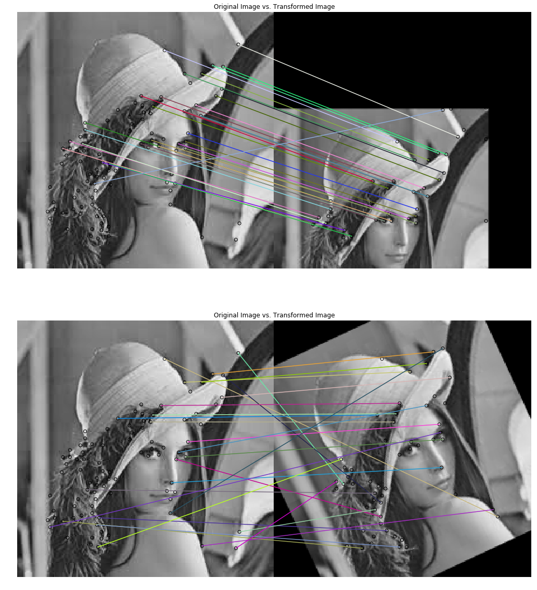

    ((0.0, 440.0, 220.0, 0.0), <matplotlib.text.Text at 0x202e85484a8>, None)


### Matching with ORB feature detector and binary descriptor using scikit-image

Let's write a code that demonstrates the ORB feature detection and binary descriptor algorithm. An oriented FAST detection method and the rotated BRIEF descriptors are used by this algorithm. As compared to BRIEF, ORB is more scale and rotation invariant, but even this applies the Hamming distance metric for matching, which is more efficient. Hence, this method is preferred over BRIEF when considering real-time applications:


The next screenshots show the output images of the code block and the ORB keypoints for the images to be matched, along with the matches shown with lines. First the algorithm tries to match an image with its affine transformed version, and then two different images with a same object.


```python
from skimage import transform as transform
from skimage.feature import (match_descriptors, ORB, plot_matches)
img1 = rgb2gray(imread('../images/me5.jpg'))
img2 = transform.rotate(img1, 180)
affine_trans = transform.AffineTransform(scale=(1.3, 1.1), rotation=0.5, translation=(0, -200))
img3 = transform.warp(img1, affine_trans)
img4 = transform.resize(rgb2gray(imread('../images/me6.jpg')), img1.shape, anti_aliasing=True)
descriptor_extractor = ORB(n_keypoints=200)
descriptor_extractor.detect_and_extract(img1)
keypoints1, descriptors1 = descriptor_extractor.keypoints, descriptor_extractor.descriptors
descriptor_extractor.detect_and_extract(img2)
keypoints2, descriptors2 = descriptor_extractor.keypoints, descriptor_extractor.descriptors
descriptor_extractor.detect_and_extract(img3)
keypoints3, descriptors3 = descriptor_extractor.keypoints, descriptor_extractor.descriptors
descriptor_extractor.detect_and_extract(img4)
keypoints4, descriptors4 = descriptor_extractor.keypoints, descriptor_extractor.descriptors
matches12 = match_descriptors(descriptors1, descriptors2, cross_check=True)
matches13 = match_descriptors(descriptors1, descriptors3, cross_check=True)
matches14 = match_descriptors(descriptors1, descriptors4, cross_check=True)
fig, axes = pylab.subplots(nrows=3, ncols=1, figsize=(20,25))
pylab.gray()
plot_matches(axes[0], img1, img2, keypoints1, keypoints2, matches12)
axes[0].axis('off'), axes[0].set_title("Original Image vs. Transformed Image", size=20)
plot_matches(axes[1], img1, img3, keypoints1, keypoints3, matches13)
axes[1].axis('off'), axes[1].set_title("Original Image vs. Transformed Image", size=20)
plot_matches(axes[2], img1, img4, keypoints1, keypoints4, matches14)
axes[2].axis('off'), axes[2].set_title("Image1 vs. Image2", size=20)
pylab.show()
```

    C:\Users\Sandipan.Dey\Anaconda\envs\ana41py35\lib\site-packages\skimage\transform\_warps.py:105: UserWarning: The default mode, 'constant', will be changed to 'reflect' in skimage 0.15.
      warn("The default mode, 'constant', will be changed to 'reflect' in "


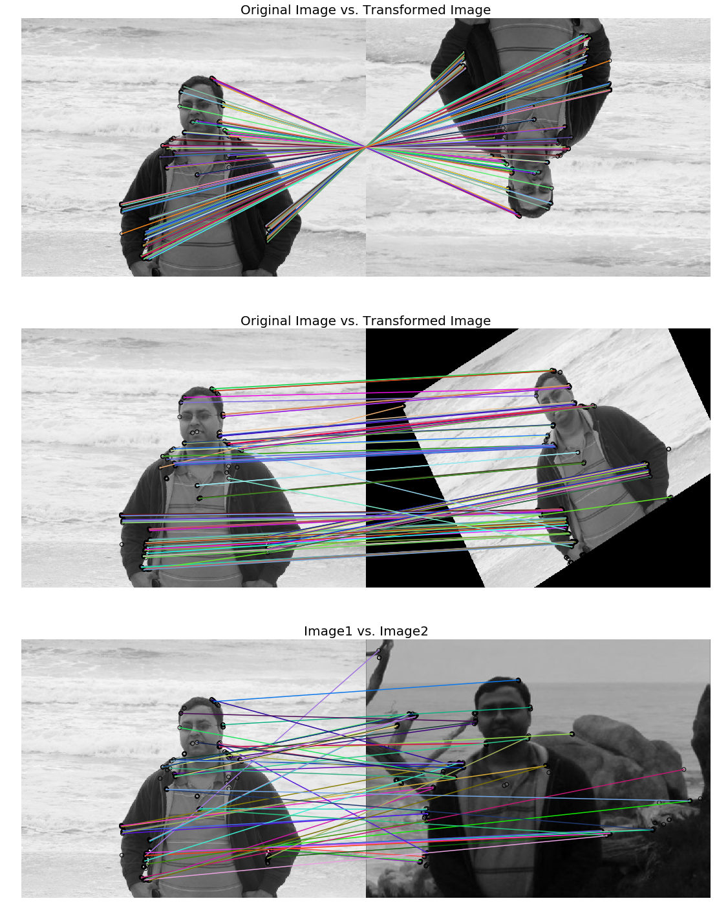


### Matching with ORB features using Brute-Force matching with python-opencv


In this section, we will demonstrate how two image descriptors can be matched using the brute-force matcher of opencv. In this, a descriptor of a feature from one image is matched with all the features in another image (using some distance metric), and the closest one is returned. We will use the BFMatcher() function with ORB descriptors to match two images of books:


```python
img1 = cv2.imread('../images/books.png',0) # queryImage
img2 = cv2.imread('../images/book.png',0) # trainImage
# Create a ORB detector object
orb = cv2.ORB_create()
# find the keypoints and descriptors
kp1, des1 = orb.detectAndCompute(img1,None)
kp2, des2 = orb.detectAndCompute(img2,None)
# create a BFMatcher object
bf = cv2.BFMatcher(cv2.NORM_HAMMING, crossCheck=True)
# Match descriptors.
matches = bf.match(des1, des2)
# Sort them in the order of their distance.
matches = sorted(matches, key = lambda x:x.distance)
# Draw first 20 matches.
img3 = cv2.drawMatches(img1,kp1,img2,kp2,matches[:20], None, flags=2)
pylab.figure(figsize=(20,10)), pylab.imshow(img3), pylab.show()
```


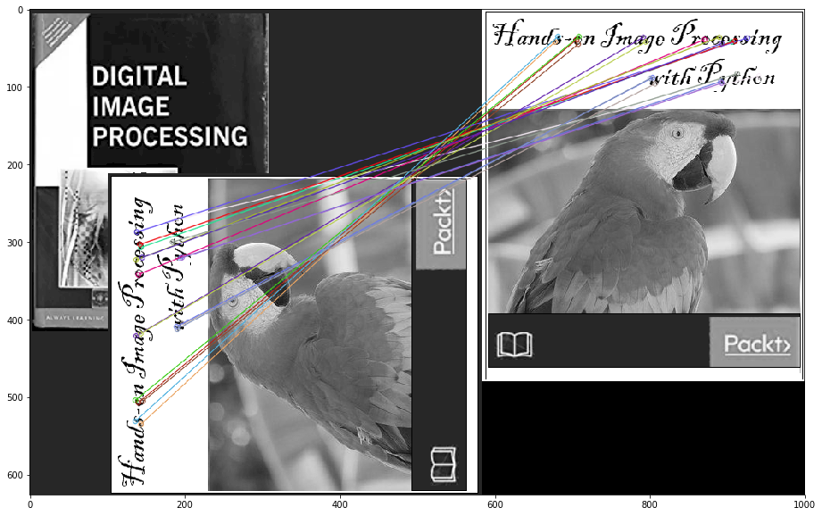


    (<matplotlib.figure.Figure at 0x202ea26ff28>,
     <matplotlib.image.AxesImage at 0x202e95c4128>,
     None)


### Brute-force matching with SIFT descriptors and ratio test with OpenCV

The SIFT keypoints between two images are matched by identifying their nearest neighbors. But in some cases, because of factors such as noise, the second closest match may seem to be closer to the first. In this case, we compute the ratio of closest distance to the second closest distance and check if it is above 0.8. If the ratio is more than 0.8, it means they are rejected.


This efficiently eliminates approximately 90% of false matches, and only around 5% correct matches (as per the SIFT paper). Let's use the knnMatch() function to get k=2 best matches for a keypoint; we will also apply the ratio test:


```python
# make sure the opencv version is 3.3.0 with pip install opencv-python==3.3.0.10 opencv-contrib-python==3.3.0.10
import cv2
print(cv2.__version__)
# 3.3.0
img1 = cv2.imread('../images/books.png',0) # queryImage
img2 = cv2.imread('../images/book.png',0) # trainImage
# Create a SIFT detector object
sift = cv2.xfeatures2d.SIFT_create()
# find the keypoints and descriptors with SIFT
kp1, des1 = sift.detectAndCompute(img1,None)
kp2, des2 = sift.detectAndCompute(img2,None)
bf = cv2.BFMatcher()
matches = bf.knnMatch(des1, des2, k=2)
# Apply ratio test
good_matches = []
for m1, m2 in matches:
    if m1.distance < 0.75*m2.distance:
        good_matches.append([m1])
img3 = cv2.drawMatchesKnn(img1, kp1, img2, kp2,good_matches, None, flags=2)
pylab.figure(figsize=(20,10)), pylab.imshow(img3), pylab.axis('off'), pylab.show()
```

    3.3.0


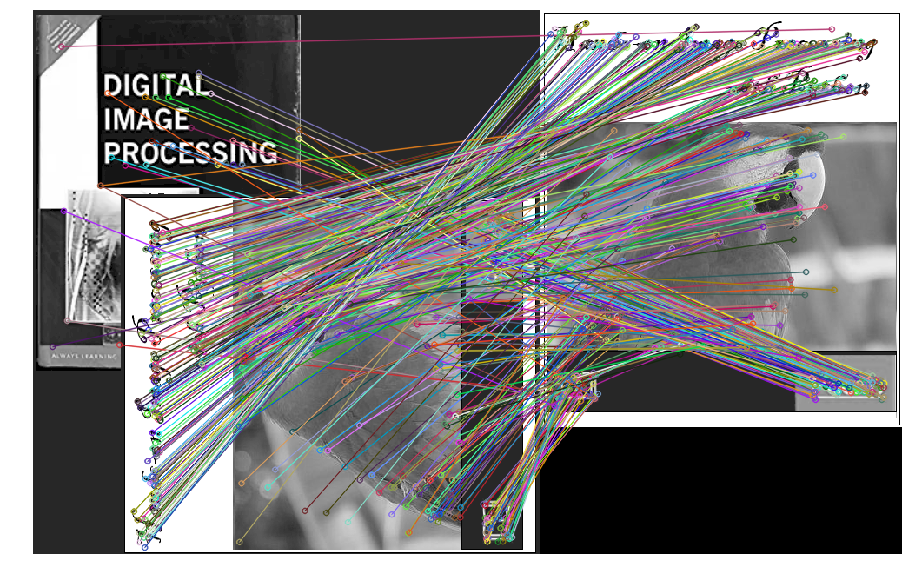

    (<matplotlib.figure.Figure at 0x2542c33a7f0>,
     <matplotlib.image.AxesImage at 0x2542c3b7fd0>,
     (-0.5, 999.5, 625.5, -0.5),
     None)


### Haar-like feature descriptor with scikit-image
Haar-like features are very useful image features used in object detection. They were introduced in the first real-time face detector by Viola and Jones. Using integral images, Haar-like features of any size (scale) can be efficiently computed in constant time. The computation speed is the key advantage of a Haar-like feature over most other features. These features are just like the convolution kernels (rectangle filters) introduced in Chapter 3, Convolution and Frequency Domain Filtering. Each feature corresponds to a single value computed by subtracting a sum of pixels under a white rectangle from a sum of pixels under a black rectangle. The next diagram shows different types of Haar-like features, along with the important Haar-like features for face detection
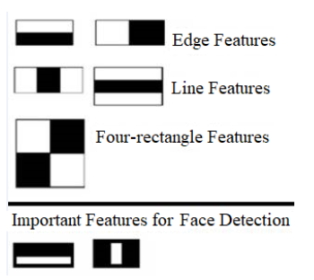
The first and the second important feature for face detection shown here seems to focus on the fact that the region of the eyes is often darker than the region of the nose and cheeks, and that the eyes are darker than the bridge of the nose, respectively. The next section visualizes the Haar-like features using scikit-image.


In this section, we are going to visualize different types of Haar-like feature descriptors, of which there are five different types. The value of the descriptor is equal to the difference between the sum of intensity values in the blue and the red one.


The next code block shows how to use the scikit-image feature module's haar_like_feature_coord() and draw_haar_like_feature() functions to visualize different types of Haar feature descriptors:


```python
from skimage.feature import haar_like_feature_coord
from skimage.feature import draw_haar_like_feature
images = [np.zeros((2, 2)), np.zeros((2, 2)), np.zeros((3, 3)),
np.zeros((3, 3)), np.zeros((2, 2))]
feature_types = ['type-2-x', 'type-2-y', 'type-3-x', 'type-3-y', 'type-4']
fig, axes = pylab.subplots(3, 2, figsize=(5,7))
for axes, img, feat_t in zip(np.ravel(axes), images, feature_types):
    coordinates, _ = haar_like_feature_coord(img.shape[0], img.shape[1], feat_t)
    haar_feature = draw_haar_like_feature(img, 0, 0, img.shape[0],img.shape[1], coordinates, max_n_features=1, random_state=0, color_positive_block=(1.0, 0.0, 0.0), color_negative_block=(0.0, 0.0, 1.0), alpha=0.8)
    axes.imshow(haar_feature), axes.set_title(feat_t), axes.set_axis_off()
#fig.suptitle('Different Haar-like feature descriptors')
pylab.axis('off'), pylab.tight_layout(), pylab.show()
```


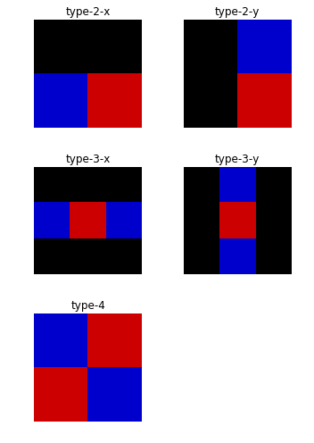

    ((0.0, 1.0, 0.0, 1.0), None, None)


### Application – face detection with Haar-like features
Using the Viola—Jones face detection algorithm, faces can be detected in an image using these Haar-like features. Each Haar-like feature is only a weak classifier, and hence a large number of Haar-like features are required to detect a face with good accuracy. A huge number of Haar-like features are computed for all possible sizes and locations of each Haar-like kernel using the integral images. Then an AdaBoost ensemble classifier is used to select important features from the huge number of features and combine them into a strong classifier model during the training phase. The model learned is then used to classify a face region with the selected features. 


Most of the regions in an image is a non-face region in general. So, first it is checked whether a window is not a face region. If it is not, it is discarded in a single shot and a different region is inspected where a face is likely to be found. This ensures that more time is dedicated to checking a possible face region. In order to implement this idea, the concept of cascade of classifiers is introduced. Instead of applying all the huge number of features on a window, the features are grouped into different stages of classifiers and applied one-by-one. (The first few stages contain very few features). If a window fails at the first stage it is discarded, and the remaining features on it are not considered. If it passes, the second stage of features are applied, and so on and so forth. A face region corresponds to the window that passes all the stages. These concepts will be discussed more in Chapter 9, Classical Machine Learning Methods in Image Processing.

**Face/eye detection with OpenCV using pre-trained classifiers with Haar-cascade features**

OpenCV comes with a trainer as well as a detector. In this section, we will demonstrate the detection (skip training a model) with the pre-trained classifiers for face, eyes, smile, and so on. OpenCV already contains many such models already trained; we are going to use them instead of training a classifier from scratch. These pre-trained classifiers are serialized as XML files and come with an OpenCV installation (this can be found in the opencv/data/haarcascades/ folder). 


In order to detect a face from an input image, first we need to load the required XML classifiers, and then load the input image (in grayscale mode). The faces in the image can be found using the detectMultiScale() function, with the pre-trained cascade classifier. This function accepts the following parameters:
- scaleFactor: A parameter that specifies how much the image size is reduced at each image scale and used to create a scale pyramid (for example, scale factor 1.2 means reduce the size by 20%). The smaller the scaleFactor, the more chance a matching size with the model for detection is found.
- minNeighbors: A parameter that specifies how many neighbors each candidate rectangle needs to retain. This parameter affects the quality of the detected faces; a higher value results in less detection, but with higher quality.
- minSize and maxSize: These are the minimum and maximum possible object size, respectively. Objects of sizes beyond these values will be ignored.


If faces are found, the function returns the positions of detected faces as Rect(x, y, w, h). Once these locations are obtained, a ROI (region of interest) for the face can be created, and then the eye detection on this ROI is applied (since eyes are always on the face). The following code block demonstrates how to create a face and eye detector with python-opencv using different pre-trained classifiers (suitable for face detection with classifiers pre-trained using frontal faces, upper bodies, or pre-trained classifiers for eye detection, trained using eyes with/without glasses):


```python
opencv_haar_path = './' #'C:/opencv/data/haarcascades/' # provide proper opencv installation path
face_cascade = cv2.CascadeClassifier(opencv_haar_path + 'haarcascade_frontalface_default.xml')
eye_cascade = cv2.CascadeClassifier(opencv_haar_path + 'haarcascade_eye.xml')
#eye_cascade = cv2.CascadeClassifier(opencv_haar_path + 'haarcascade_eye_tree_eyeglasses.xml') # eye with glasses
```

The following two screenshots show the output of the preceding code block, with different pre-trained Haar cascade classifiers (eye and eye_tree_glass classifiers, respectively) and a couple of different input face images, the first one without and the second one with glasses:


```python
img = cv2.imread('../images/lena.jpg')
gray = cv2.cvtColor(img, cv2.COLOR_BGR2GRAY)
faces = face_cascade.detectMultiScale(gray, 1.2, 5) # scaleFactor=1.2, minNbr=5
print(len(faces)) # number of faces detected
for (x,y,w,h) in faces:
    img = cv2.rectangle(img,(x,y),(x+w,y+h),(255,0,0),2)
    roi_gray = gray[y:y+h, x:x+w]
    roi_color = img[y:y+h, x:x+w]
    eyes = eye_cascade.detectMultiScale(roi_gray)
    print(eyes) # location of eyes detected
    for (ex,ey,ew,eh) in eyes:
        cv2.rectangle(roi_color,(ex,ey),(ex+ew,ey+eh),(0,255,0),2)
        cv2.imwrite('../images/lena_face_detected.jpg', img)
```

    1
    [[11 14 23 23]
     [38 16 21 21]]


### Summary                                                        
In this chapter, we discussed a few important feature detection and extraction techniques to compute different types of feature descriptors from an image using Python's scikit-image and cv2 (python-opencv) libraries. We started with the basic concepts of local feature detectors and descriptors for an image, along with their desirable properties. Then we discussed the Harris Corner Detectors to detect corner interest points of an image and use them to match two images (with the same object captured from different viewpoints). Next, we discussed blob detection using LoG/DoG/DoH filters. Next, we discussed HOG, SIFT, ORB, BRIEF binary detectors/descriptors and how to match images with these features. Finally, we discussed Haar-like features and face detection with the Viola—Jones algorithm. By the end of this chapter, you should be able to compute different features/descriptors of an image with Python libraries. Also, you should be able to match images with different types of feature descriptors (for example, SIFT, ORB, and so on) and detect faces from images containing faces with Python.

### Further reading                                                        
- http://scikit-image.org/docs/dev/api/skimage.feature.html
- https://docs.opencv.org/3.1.0/da/df5/tutorial_py_sift_intro.html
- https://sandipanweb.wordpress.com/2017/10/22/feature-detection-with-harris-corner-detector-and-matching-images-with-feature-descriptors-in-python/
- https://sandipanweb.wordpress.com/2018/06/30/detection-of-a-human-object-with-hog-descriptor-features-using-svm-primal-quadprog-implementation-using-cvxopt-in-python/
- http://vision.stanford.edu/teaching/cs231b_spring1213/slides/HOG_2011_Stanford.pdf
- http://cvgl.stanford.edu/teaching/cs231a_winter1415/lecture/lecture10_detector_descriptors_2015.pdf
- https://www.cis.rit.edu/~cnspci/references/dip/feature_extraction/harris1988.pdf
- https://www.cs.ubc.ca/~lowe/papers/ijcv04.pdf
- https://www.cs.cmu.edu/~efros/courses/LBMV07/Papers/viola-cvpr-01.pdf
- https://lear.inrialpes.fr/people/triggs/pubs/Dalal-cvpr05.pdf
