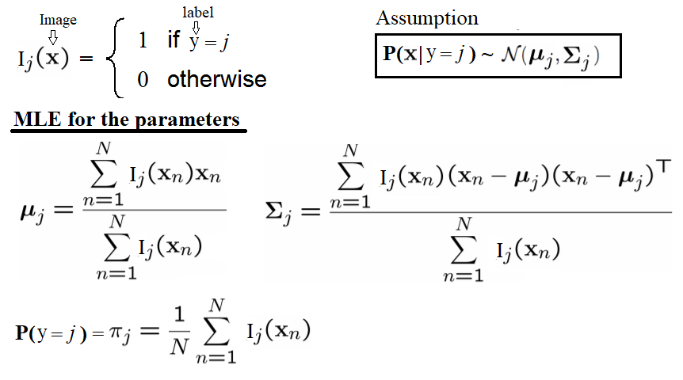

**<span class="mark">Author: Sandipan Dey</span>**

In this chapter, we will discuss the application of machine learning techniques in image processing. We will define machine learning and learn about two of its algorithms, supervised and unsupervised. Then, we will continue our discussion on the application of a few popular unsupervised machine learning techniques, such as clustering, and problems such as image segmentation.We will also be looking at applications of supervised machine learning techniques for problems such as image classification and object detection. 


We will be using <span class="mark">a very popular library,</span> <span class="girk">scikit-learn</span>, along with <span class="burk">scikit-image</span> and <span class="burk">Python-OpenCV (cv2)</span> to implement machine learning algorithms for image processing. This chapter is going to give you insight into machine learning algorithms and the problems they solve. 


<span class="burk">The topics to be covered in this chapter are as follows:</span>
- <span class="mark">Supervised versus unsupervised learning 
- <span class="mark">Unsupervised machine learning—clustering, PCA, and eigenfaces</span>
- <span class="mark">Supervised machine learning—image classification with the handwritten digits datase</span>t
- <span class="mark">Supervised machine learning—object detection</span></span>

**1. Supervised versus unsupervised learning**


Machine learning algorithms can primarily be of two types:

- Supervised learning: In this type of learning, we <span class="mark">are given</span> <span class="girk">an input dataset along with the correct labels</span>, and we need to <span class="burk">learn the the relationship (as a function) between the input and the output.</span> The handwritten-digit classification problem is an example of a supervised (classification) problem.
- Unsupervised learning: In this type of learning, we have <span class="girk">little or no idea what our output should look like</span>. We can d<span class="burk">erive structure from data</span> where we don't necessarily know the effect of the variables. An example is clustering, which can also be thought of as segmentation, in image processing technique where we do not have any prior knowledge of which pixel belongs to which segment.


A computer program is said to learn from experience, __E__, with respect to some task, __T__, and some performance measure, __P__, if its performance on __T__, as measured by __P__, improves with experience, __E__.


<span class="mark">For example,</span> let's say that we are given a set of handwritten digit images along with their labels (digits from zero to nine) and we need to write a Python program that __learns the association between the images and labels__ (as experience E) and then automatically labels a set of new handwritten digit images.


In this case, the task, T, is the assignment of labels to the image (that is, classifying or identifying the digit image). The proportion of the set of new images correctly identified will be the performance, P, (accuracy). of the program. In this case, the program can be said to be a learning program.


<span class="mark">In this chapter,</span> we will describe a few image processing problems that can be solved using machine learning algorithms (unsupervised or supervised). We will start with learning the applications of a couple of unsupervised machine learning techniques in solving image processing problems.

**2. Unsupervised machine learning – clustering, PCA, and eigenfaces**

In this section, we will discuss a few popular machine learning algorithms along with their applications in image processing. Let's start with a couple of clustering algorithms and their applications in color quantization and the segmentation of images. We will use the scikit-learn library's implementation for these clustering algorithms.

### PCA and eigenfaces 
Principal Component Analysis (PCA) is a statistical/unsupervised machine learning technique that uses an orthogonal transformation to convert a set of observations of possibly correlated variables into a set of values of linearly uncorrelated variables called principal components, thereby finding the maximum directions of variances in the dataset (along the principal components).This can be used for (linear) dimensionality reduction (only a few dominant principal components captures almost all of the variance in a dataset most of the time) and visualization (in 2D) of datasets having many dimensions. One application of PCA is eigenfaces, to find a set of faces that can (theoretically) represent any face (as a linear combination of those eigenfaces).

#### Dimension reduction and visualization with PCA


In this section, we will use the scikit-learn's digits dataset that contains 1,797 images (each of 8 x 8 pixels) of handwritten digits. Each row represents an image in the data matrix. Let's first load and display the first 25 digits from the dataset with the following code block


```python
%matplotlib inline
import numpy as np
import matplotlib.pylab as plt 
from sklearn.datasets import load_digits 
from sklearn.preprocessing import StandardScaler
from sklearn.decomposition import PCA
from sklearn.pipeline import Pipeline

digits = load_digits() 
#print(digits.keys())
print(digits.data.shape)
j = 1
np.random.seed(1)
fig = plt.figure(figsize=(3,3)) 
fig.subplots_adjust(left=0, right=1, bottom=0, top=1, hspace=0.05, wspace=0.05) 
for i in np.random.choice(digits.data.shape[0], 25):
    plt.subplot(5,5,j), plt.imshow(np.reshape(digits.data[i,:], (8,8)), cmap='binary'), plt.axis('off')
    j += 1
plt.show()
```

    (1797, 64)


#### 2D projection and visualization

As we can see from the loaded dataset, it's a 64-dimensional dataset. Now let's use scikit-learn's PCA() function to find <span class="mark">the two dominant principal components of this dataset</span> and project the dataset along these two dimensions, followed by scatter-plotting the projected data with Matplotlib and with each data point representing an image (a digit), with the digits label represented by a unique color, using the following code block


```python
pca_digits=PCA(2)
digits.data_proj = pca_digits.fit_transform(digits.data) 
print(np.sum(pca_digits.explained_variance_ratio_))
plt.figure(figsize=(15,10))
plt.scatter(digits.data_proj[:, 0], digits.data_proj[:, 1], lw=0.25, c=digits.target, edgecolor='k',  s=100, cmap=plt.cm.get_cmap('cubehelix', 10))
plt.xlabel('PC1', size=20), plt.ylabel('PC2', size=20), plt.title('2D Projection of handwritten digits with PCA', size=25)
plt.colorbar(ticks=range(10), label='digit value')
plt.clim(-0.5, 9.5)
```

    0.28509364823697


#### Eigenfaces with PCA

Principal Component Analysis (PCA) is a statistical/unsupervised machine learning technique that uses an orthogonal transformation to convert a set of observations of possibly correlated variables into a set of values of linearly uncorrelated variables called principal components, thereby finding the maximum directions of variances in the dataset (along the principal components).


This can be used for (linear) dimensionality reduction (only a few dominant principal components captures almost all of the variance in a dataset most of the time) and visualization (in 2D) of datasets having many dimensions. One application of PCA is eigenfaces, to find a set of faces that can (theoretically) represent any face (as a linear combination of those eigenfaces)

Let's start by loading the olivetti face dataset from scikit-learn; it contains 400 face images, each with a dimension of 64 x 64 pixels.


The following code block shows a few random faces from the dataset


```python
from sklearn.datasets import fetch_olivetti_faces 
faces = fetch_olivetti_faces().data
print(faces.shape) # there are 400 faces each of them is of 64x64=4096 pixels
fig = plt.figure(figsize=(5,5)) 
fig.subplots_adjust(left=0, right=1, bottom=0, top=1, hspace=0.05, wspace=0.05) 
# plot 25 random faces
j = 1
np.random.seed(0)
for i in np.random.choice(range(faces.shape[0]), 25): 
    ax = fig.add_subplot(5, 5, j, xticks=[], yticks=[]) 
    ax.imshow(np.reshape(faces[i,:],(64,64)), cmap=plt.cm.bone, interpolation='nearest') 
    j += 1
plt.show()
```

    downloading Olivetti faces from https://ndownloader.figshare.com/files/5976027 to C:\Users\anto\scikit_learn_data
    (400, 4096)


Next, let's pre-process the dataset to perform <span class="mark">a z-score normalization</span> (subtracting the mean face from all the faces and dividing by the standard deviation); this is a necessary step before we apply PCA on the images. Next, the principal components are computed with PCA() and only the 64 (instead of 4,096) dominant principal components are chosen; the dataset is <span class="girk">projected</span> onto these PCs. The following code block shows how to do it and visualizes how <span class="burk">much variance of the image dataset</span> is captured by choosing more and more principal components


```python
from matplotlib import pylab as pylab
from sklearn.preprocessing import StandardScaler
from sklearn.decomposition import PCA
from sklearn.pipeline import Pipeline
n_comp =64
pipeline = Pipeline([('scaling', StandardScaler()), ('pca', PCA(n_components=n_comp))])
faces_proj = pipeline.fit_transform(faces)
print(faces_proj.shape)
# (400, 64)
mean_face = np.reshape(pipeline.named_steps['scaling'].mean_, (64,64))
sd_face = np.reshape(np.sqrt(pipeline.named_steps['scaling'].var_), (64,64))
pylab.figure(figsize=(8, 6))
pylab.plot(np.cumsum(pipeline.named_steps['pca'].explained_variance_ratio_), linewidth=2)
pylab.grid(), pylab.axis('tight'), pylab.xlabel('n_components'), pylab.ylabel('cumulative explained_variance_ratio_')
pylab.show()
pylab.figure(figsize=(10,5))
pylab.subplot(121), pylab.imshow(mean_face, cmap=pylab.cm.bone), pylab.axis('off'), pylab.title('Mean face')
pylab.subplot(122), pylab.imshow(sd_face, cmap=pylab.cm.bone), pylab.axis('off'), pylab.title('SD face')
pylab.show()
```

    (400, 64)


#### Eigenfaces                                                        

Given the property of PCA, the PCs computed are orthogonal to each other and each of them contains 4,096 pixels—and can be reshaped to a 64 x 64 image. These principal components are known as eigenfaces (since they are also the eigenvectors).As can be seen, they represent certain properties of the faces. The following code block displays some of the computed eigenfaces:


```python
fig = plt.figure(figsize=(5,2)) 
fig.subplots_adjust(left=0, right=1, bottom=0, top=1, hspace=0.05, wspace=0.05) 
# plot the first 10 eigenfaces
for i in range(10): 
    ax = fig.add_subplot(2, 5, i+1, xticks=[], yticks=[]) 
    ax.imshow(np.reshape(pipeline.named_steps['pca'].components_[i,:], (64,64)), cmap=plt.cm.bone, interpolation='nearest')
```


#### Reconstruction                                                      

The following code block demonstrates how each of the faces can be approximately represented as a linear combination of only those 64 dominant eigenfaces. The inverse_transform() function from scikit-learn is used to go back to the original space but only with these 64 dominant eigenfaces, discarding all other eigenfaces


```python
# face reconstruction
faces_inv_proj = pipeline.named_steps['pca'].inverse_transform(faces_proj) 
#reshaping as 400 images of 64x64 dimension 
fig = plt.figure(figsize=(5,5)) 
fig.subplots_adjust(left=0, right=1, bottom=0, top=1, hspace=0.05, wspace=0.05) 
# plot the faces, each image is 64 by 64 dimension but 8x8 pixels 
j = 1
np.random.seed(0)
for i in np.random.choice(range(faces.shape[0]), 25): 
    ax = fig.add_subplot(5, 5, j, xticks=[], yticks=[]) 
    ax.imshow(mean_face + sd_face*np.reshape(faces_inv_proj,(400,64,64)) [i,:], cmap=plt.cm.bone, interpolation='nearest')
    j += 1
```


```python
#print(faces_proj[0,:].shape)
#print(pipeline.named_steps['pca'].components_.shape)
orig_face = np.reshape(faces[0,:], (64,64))
reconst_face = np.reshape(faces_proj[0,:]@pipeline.named_steps['pca'].components_, (64,64))
reconst_face = mean_face + sd_face*reconst_face
plt.figure(figsize=(10,5))
plt.subplot(121), plt.imshow(orig_face, cmap=plt.cm.bone, interpolation='nearest'), plt.axis('off'), plt.title('original', size=20)
plt.subplot(122), plt.imshow(reconst_face, cmap=plt.cm.bone, interpolation='nearest'), plt.axis('off'), plt.title('reconstructed', size=20)
plt.show()
```


#### Eigen decomposition

Each face can be represented as a linear combination of the 64 eigenfaces. Each eigenface will have different weights (loadings) for different face image. The following screenshot shows how a face can be represented with the eigenfaces and shows the first few corresponding weights.The code is left as an exercise to the reader:


### Supervised machine learning – image classification

In this section, we will discuss the image classification problem. The input dataset that we will use is <span class="mark">MNIST</span> (http://yann.lecun.com/exdb/mnist/), which is a classic dataset in machine learning, consisting of 28 x 28 grayscale images of handwritten digits.


The original training dataset contains 60,000 examples (the handwritten digit images along with the labels to train machine learning models), and the test dataset contains 10,000 examples (the handwritten digit images along with the labels as ground-truths, to test the accuracy of the models learned). Given a set of handwritten digits and images along with their labels (0-9), the goal will be to learn a machine learning model that can automatically identify the digit from an unseen image and assign a label (0-9) to the image:

1. A few supervised machine learning (multi-class classification) models (classifiers) will be trained using the training dataset
2. Then, they will be used to predict the labels of the images from the test dataset
3. The predicted labels will be subsequently compared with the ground-truth labels to evaluate the performance of the classifiers


The following screenshot describes the steps in the training, prediction, and evaluation of a basic classification model. When we train many more different models (possibly with different algorithms or the same algorithm with different values of hyper-parameters) on the training dataset, in order to select the best one, we need a third dataset, which is called a validation dataset (the training dataset is split into two parts, one to train and another to hold out for validation) and is used for model selection and hyper-parameter tuning


Applying KNN and Bayes to classify MNIST dataset

###### Downloading the MNIST (handwritten digits) dataset

Let's start by downloading the MNIST dataset. The following Python code shows you how to download the training and test datasets


```python
%matplotlib inline
import matplotlib.pyplot as plt 
import gzip, os, sys
import numpy as np
from scipy.stats import multivariate_normal

if sys.version_info[0] == 2:
    from urllib import urlretrieve
else:
    from urllib.request import urlretrieve
    
# Function that downloads a specified MNIST data file from Yann Le Cun's website
def download(filename, source='http://yann.lecun.com/exdb/mnist/'):
    print("Downloading %s" % filename)
    urlretrieve(source + filename, filename)

# Invokes download() if necessary, then reads in images
def load_mnist_images(filename):
    if not os.path.exists(filename):
        download(filename)
    with gzip.open(filename, 'rb') as f:
        data = np.frombuffer(f.read(), np.uint8, offset=16)
    data = data.reshape(-1,784)
    return data

def load_mnist_labels(filename):
    if not os.path.exists(filename):
        download(filename)
    with gzip.open(filename, 'rb') as f:
        data = np.frombuffer(f.read(), np.uint8, offset=8)
    return data

## Load the training set
#path = 'C:\Courses\Edx\Current\USCD ML\Week3\\'
train_data = load_mnist_images('train-images-idx3-ubyte.gz')
train_labels = load_mnist_labels('train-labels-idx1-ubyte.gz')

## Load the testing set
test_data = load_mnist_images('t10k-images-idx3-ubyte.gz')
test_labels = load_mnist_labels('t10k-labels-idx1-ubyte.gz')
```

###### Visualizing the dataset

Each data point is stored as 784-dimensional vector. To visualize a data point, we first need to reshape it to a 28 x 28 image. The following code snippet shows how to display a few handwritten digits from the test dataset

The following screenshot shows the first 25 handwritten digits from the test dataset along with their ground-truth (true) labels. The kNN classifier trained on the training dataset will be used to predict the labels of this unseen test dataset and the predicted labels will be compared with the true labels to evaluate the accuracy of the classifier


```python
## Define a function that displays a digit given its vector representation
def show_digit(x, label):
    plt.axis('off')
    plt.imshow(x.reshape((28,28)), cmap=plt.cm.gray)
    plt.title('Label ' + str(label))
    #plt.show()
    #return

## Define a function that takes an index into a particular data set ("train" or "test") and displays that image.
def vis_image(index, dataset="train"):
    if(dataset=="train"): 
        label = train_labels[index]
        show_digit(train_data[index,], label)
    else:
        label = test_labels[index]
        show_digit(test_data[index,], label)
    #print("Label " + str(label))
    plt.show()
    return

plt.figure(figsize=(10,10))
for i in range(25):
    plt.subplot(5, 5, i+1)
    #show_digit(train_data[i,], train_labels[i])
    show_digit(test_data[i,], test_labels[i])
plt.tight_layout()
plt.show()
```


#### k-nearest neighbors (KNN) classifier
In this section, we will build a classifier that takes an image of a handwritten digit and outputs a label (0-9) using a particularly simple strategy for this problem known as the nearest neighbor classifier. The idea to predict an unseen test digit image is pretty simple. First, we need to find the k instances from the training dataset that are nearest to this test image. Next, we need to simply use majority-voting to compute the label of the test image, that is, the label that most of the data points from the k nearest training data points have will be be assigned to the test image (breaking ties arbitrarily).

###### Squared Euclidean distance                                                        
To compute the nearest neighbors in our dataset, we need to first be able to compute distances between data points. A natural distance function is Euclidean distance; for two vectors x, y ∈ Rd, their Euclidean distance is defined as follows


Often, we omit the square root and simply compute the squared Euclidean distance. For the purposes of nearest neighbor computations, the two are equivalent: for three vectors x, y, z ∈ Rd, we have ∥x−y∥  ≤  ∥x−z∥ if and only if ∥x−y∥2 ≤ ∥x−z∥2. Now we just need to be able to compute the squared Euclidean distance. 

###### Computing the nearest neighbors
A naive implementation of k-nearest neighbor will scan through each of the training images for each test image. Performing nearest neighbor classification in this way will require a full pass through the training set in order to classify a single point. If there are N training points in Rd, this takes O (Nd) time, which will be quite slow. Fortunately, there are faster methods to perform nearest neighbor lookup if we are willing to spend some time pre-processing the training set. The scikit-learn library has fast implementations of two useful nearest neighbor data structures: the ball tree and the k-d tree. The following code shows how to create a ball tree data structure at training time and then use it for fast nearest neighbor computation during testing for 1-NN (k=1):


```python
import time
from sklearn.neighbors import BallTree
## Build nearest neighbor structure on training data
t_before = time.time()
ball_tree = BallTree(train_data)
t_after = time.time()
## Compute training time
t_training = t_after - t_before
print("Time to build data structure (seconds): ", t_training)
## Get nearest neighbor predictions on testing data
t_before = time.time()
test_neighbors = np.squeeze(ball_tree.query(test_data, k=1, return_distance=False))
test_predictions = train_labels[test_neighbors]
t_after = time.time()
## Compute testing time
t_testing = t_after - t_before
print("Time to classify test set (seconds): ", t_testing)
```

    Time to build data structure (seconds):  21.05887007713318
    Time to classify test set (seconds):  531.3652856349945


###### Evaluating the performance of the classifier 
Next, we need to evaluate the performance of the classifier on the test dataset. The following code snippet shows how to do that:


```python
# evaluate the classifier
t_accuracy = sum(test_predictions == test_labels) / float(len(test_labels))
t_accuracy
# 0.96909999999999996
import pandas as pd
import seaborn as sn
from sklearn import metrics
cm = metrics.confusion_matrix(test_labels,test_predictions)
df_cm = pd.DataFrame(cm, range(10), range(10))
sn.set(font_scale=1.2)# for label size
sn.heatmap(df_cm, annot=True,annot_kws={"size": 16}, fmt="g")
```

    Time to build data structure (seconds):  21.463416576385498

The following screenshot shows the confusion matrix for the classification; we can see there are a few misclassified test images and the overall accuracy of the training dataset is 96.9%


The following screenshot shows:

A success case: 1-NN prediction label = True label = 0 <br>
A failure case: 1-NN prediction label = 2, True label = 3


The code to find a success and a failure case for prediction is left as an exercise for the reader.

#### Classifying MNIST with Bayes classifier (Gaussian generative model)
As we have seen in the last section, the 1-NN classifier yielded a 3.09% test error rate on the MNIST data set of handwritten digits. In this section, we will build a Gaussian generative model that does almost as well, while being significantly faster and more compact. Again, we need to load the MNIST training and test dataset first, as we did last time. Next, let's fit a Gaussian generative model to the training dataset

###### Training the generative model – computing the MLE of the Gaussian parameters
The following code block defines a function, fit_generative_model(), that takes as input a training set (x data and y labels) and fits a Gaussian generative model to it. It returns the following parameters of this generative model—for each label, j = 0,1,...,9, we have the following:πj: The frequency of the label (that is, the prior)μj: The 784-dimensional mean vector∑j: The 784 x 784 covariance matrixThis means that π is a 10 x 1, μ is a 10 x 784, and ∑ is a 10 x 784 x 784 matrix. The Maximum Likelihood Estimates (MLE) for the parameters are the empirical estimates, as shown in the following diagram:

- πj: The frequency of the label (that is, the prior)
- μj: The 784-dimensional mean vector
- ∑j: The 784 x 784 covariance matrix 


This means that π is a 10 x 1, μ is a 10 x 784, and ∑ is a 10 x 784 x 784 matrix. The Maximum Likelihood Estimates (MLE) for the parameters are the empirical estimates, as shown in the following diagram



The empirical covariances are very likely to be singular (or close to singular), which means that we won't be able to do calculations with them. Hence, it is important to regularize these matrices. The standard way of doing this is to add c*I to them, where c is some constant and I is the 784-dimensional identity matrix (to put it another way, we compute the empirical covariances and then increase their diagonal entries by some constant c). This modification is guaranteed to yield covariance matrices that are non-singular, for any c > 0, no matter how small. Now, c becomes a (regularization) parameter and, by setting it appropriately, we can improve the performance of the model. We should choose a good value of c. Crucially, this needs to be done using the training set alone, by setting aside part of the training set as a validation set or using some kind of cross-validation—we leave this as an exercise for the reader to complete. In particular, the display_char() function will be used to visualize the means of the Gaussians for the first three digits:


```python
def display_char(image):
    plt.imshow(np.reshape(image, (28,28)), cmap=plt.cm.gray)
    plt.axis('off')
    plt.show()

def fit_generative_model(x,y):
    k = 10  # labels 0,1,...,k-1
    d = (x.shape)[1]  # number of features
    mu = np.zeros((k,d))
    sigma = np.zeros((k,d,d))
    pi = np.zeros(k)
    c = 3500 #10000 #1000 #100 #10 #0.1 #1e9
    for label in range(k):
        indices = (y == label)
        pi[label] = sum(indices) / float(len(y))
        mu[label] = np.mean(x[indices,:], axis=0)
        sigma[label] = np.cov(x[indices,:], rowvar=0, bias=1) + c*np.eye(d)
    return mu, sigma, pi
```


```python
mu, sigma, pi = fit_generative_model(train_data, train_labels)
display_char(mu[0])
display_char(mu[1])
display_char(mu[2])
```


###### Computing the posterior probabilities to make predictions on test data and model evaluation
In order to predict the label of a new image, x, we need to find the label, j, for which the posterior probability, Pr(y=j|x), is maximum. It can be computed using the Bayes rule, as follows

The following code block shows how to predict the labels of the test dataset using the generative model and how to compute the number of errors the model makes on the test dataset. As can be seen, the accuracy of the test dataset is 95.6%, which is a little less than the 1-NN classifier


```python
# Compute log Pr(label|image) for each [test image,label] pair.
k = 10
score = np.zeros((len(test_labels),k))
for label in range(0,k):
    rv = multivariate_normal(mean=mu[label], cov=sigma[label])
    for i in range(0,len(test_labels)):
       score[i,label] = np.log(pi[label]) + rv.logpdf(test_data[i,:])
test_predictions = np.argmax(score, axis=1)
# Finally, tally up score
errors = np.sum(test_predictions != test_labels)
print("The generative model makes " + str(errors) + " errors out of 10000")
t_accuracy = sum(test_predictions == test_labels) / float(len(test_labels))
t_accuracy
```

    The generative model makes 438 errors out of 10000
    
    0.95620000000000005


```python
print(train_data.shape)
print(test_data.shape)
```

    (60000, 784)
    (10000, 784)


#### Claasfying MNIST with SVM classifier

In this section, we will train the (multi-class) SVM classifier with the MNIST training dataset and then use it to predict the labels of the images from the MNIST test dataset.

SVM is a pretty complex binary classifier that uses quadratic programming to maximize the margin between the separating hyper-planes. The binary SVM classifier is extended to handle multi-class classification problems using the 1-vs-all or 1-vs-1 technique. We are going to use scikit-learn's implementation, SVC(), with polynomial kernel (of degree 2) to fit (train) the soft-margin (kernelized) SVM classifier with the training dataset and then predict the labels of the test images using the score() function.

The following code shows how to train, predict, and evaluate the SVM classifier using the MNIST dataset. As can be seen, the accuracy obtained on the test dataset has increased to 98% using this classifier

### Supervised machine learning – object detection
So far, we have demonstrated how to use the classification model to classify an image, for example, to use binary classification to find if an image contains the handwritten digit 1 or not. In the next section, we will see how to use supervised machine learning models, not only to check whether an object is in an image or not, but also to find the location of the object in the image (for example, in terms of a bounding box—a rectangle the object is contained in).


```python
from sklearn.svm import SVC
C = 1
#for C in [.01,.1,1.,10.,100.]:
clf = SVC(C=C, kernel='poly', degree=2)
clf.fit(train_data,train_labels)
print(C, clf.score(test_data,test_labels))
```

    1 0.9806


```python
import pandas as pd
import seaborn as sn
from sklearn import metrics
test_predictions = clf.predict(test_data)
cm=metrics.confusion_matrix(test_labels,test_predictions)
df_cm = pd.DataFrame(cm, range(10), range(10))
#plt.figure(figsize = (10,7))
sn.set(font_scale=1.2)#for label size
sn.heatmap(df_cm, annot=True,annot_kws={"size": 16}, fmt="g") #, cmap='viridis')# font size
```


    <matplotlib.axes._subplots.AxesSubplot at 0x25bf6f26eb8>


```python
wrong_indices = test_predictions != test_labels
wrong_digits, wrong_preds, correct_labs = test_data[wrong_indices], test_predictions[wrong_indices], test_labels[wrong_indices] 
print(len(wrong_pred))
plt.title('predicted: ' + str(wrong_preds[1]) + ', actual: ' + str(correct_labs[1]))
display_char(wrong_digits[1])
```

    194


### Finding the most important Haar-like features for face classification with the random forest ensemble classifier

###### Face detection with Haar-like features and cascade classifiers with AdaBoost – Viola-Jones
As we have discussed briefly in Chapter 7, Extracting Image Features and Descriptors, (in the context of Haar-like feature extraction), the Viola-Jones' object detection technique can be used for face detection in images. It is a classical machine learning approach, where a cascade function is trained using a training set of positive and negative images, by using the hand-crafted Haar-like features extracted from the images.

The Viola-Jones algorithm typically uses a base patch size (for example, 24 x 24 pixels) that it slides across and down an image and computes a huge number of Haar-like features (160,000 possible features for a 24 x 24 patch, although they have achieved 95% accuracy with an appropriately chosen 6,000 feature subset); these can be extracted, but to run even 6,000 features on every patch is a lot of effort. So, once the features have been decided on and assembled, a number of fast rejectors are built. This is based on the idea that, in a complete image, most of the possible positions we check will not contain a face—therefore, it is faster overall to reject quickly than to invest too much in it. If the location doesn't contain a face, we discard it and move on before investing more computational checks. This is another of the tricks used by Viola-Jones to achieve its performance, as shown in the following diagram:


Instead of applying all 6,000 features on a window, the features are grouped into different stages of weak classifiers through the use of the AdaBoost ensemble classifier (to perform adaptive boosting of the performance of the cascade of feature), and these weak classifiers are run one by one in a cascade. If the patch window under consideration fails at any stage, the window is rejected. A patch that passes all stages is considered a valid detection. 

A nice benefit of Haar-like features being so quick to calculate (due to the integral image technique) leads to the final aspect of the Viola-Jones performance. The base patch itself can be scaled and the features in the final cascade evaluated very quickly to search for objects of different sizes without the requirement for an image pyramid. Putting it all together, the Viola-Jones workflow for training looks like the one shown in the following diagram


This algorithm is blazingly fast, but has obvious accuracy limitations. 

###### Face classification using the Haar-like feature descriptor 
The first real-time face detector was implemented using Haar-like feature descriptors by Viola-Jones. The following example is taken from the scikit-image's example that illustrates the extraction, selection, and classification of Haar-like features to detect faces versus non-faces. Clearly, this is a binary classification problem.

The scikit-learn library for feature selection and classification. Although the original implementation for face detection used the AdaBoost ensemble classifier, in this example, a different ensemble classifier, random forest, will be used, primarily to find important Haar-like features useful for the classification. 

In order to extract the Haar-like features for an image, first a Region Of Interest (ROI) is defined for which all possible features are extracted. The integral image of this ROI is then computed to compute all possible features very fast.

A subset of the LFW image dataset, which is composed of 100 face images (positive examples) and 100 non-face images (negative examples), is used as input. Each image is resized to an ROI of 19 x 19 pixels. A traditional machine learning validation process is used to divide the images into 75% (that is, 75 images from each group) training and 25% (that is, the remaining 25 from each class) and validation datasets in order to train a classifier, check which extracted features are the most salient, and check the performance of the classifier, respectively.

The following code block demonstrates the extraction of the Haar-like features from the image and displays a few positive examples (face images) from the dataset


```python
from time import time

import numpy as np
import matplotlib.pyplot as plt

from dask import delayed

from sklearn.ensemble import RandomForestClassifier
from sklearn.model_selection import train_test_split
from sklearn.metrics import roc_auc_score

from skimage.data import lfw_subset
from skimage.transform import integral_image
from skimage.feature import haar_like_feature
from skimage.feature import haar_like_feature_coord
from skimage.feature import draw_haar_like_feature

@delayed
def extract_feature_image(img, feature_type, feature_coord=None):
    """Extract the haar feature for the current image"""
    ii = integral_image(img)
    return haar_like_feature(ii, 0, 0, ii.shape[0], ii.shape[1],
                             feature_type=feature_type,
                             feature_coord=feature_coord)

images = lfw_subset()
print(images.shape)
```

    (200, 25, 25)


```python
fig = plt.figure(figsize=(5,5))
fig.subplots_adjust(left=0, right=0.9, bottom=0, top=0.9, hspace=0.05, wspace=0.05) 
for i in range(25):
    plt.subplot(5,5,i+1), plt.imshow(images[i,:,:], cmap='bone'), plt.axis('off')
plt.suptitle('Faces')
plt.show()
```


```python
fig = plt.figure(figsize=(5,5))
fig.subplots_adjust(left=0, right=0.9, bottom=0, top=0.9, hspace=0.05, wspace=0.05) 
for i in range(100,125):
    plt.subplot(5,5,i-99), plt.imshow(images[i,:,:], cmap='bone'), plt.axis('off')
plt.suptitle('Non-Faces')
plt.show()
```


###### Finding the most important Haar-like features for face classification with the random forest ensemble classifier
A random forest classifier is trained in order to select the most salient features for face classification. The idea is to check which features are the most often used by the ensemble of trees. By using only the most salient features in subsequent steps, computation speed can be increased, while retaining accuracy. The following code snippet shows how to compute the feature importance for the classifier and displays the top 25 most important Haar-like features:


```python
# For speed, only extract the two first types of features
feature_types = ['type-2-x', 'type-2-y']

# Build a computation graph using dask. This allows using multiple CPUs for
# the computation step
X = delayed(extract_feature_image(img, feature_types)
            for img in images)
# Compute the result using the "processes" dask backend
t_start = time()
X = np.array(X.compute(scheduler='processes'))
time_full_feature_comp = time() - t_start
y = np.array([1] * 100 + [0] * 100)
X_train, X_test, y_train, y_test = train_test_split(X, y, train_size=150,
                                                    random_state=0,
                                                    stratify=y)
print(time_full_feature_comp)
print(X.shape, X_train.shape, y_train.shape)
```

    104.87986302375793
    (200, 101088) (150, 101088) (150,)


    C:\Users\Sandipan.Dey\Anaconda\envs\ana41py35\lib\site-packages\sklearn\model_selection\_split.py:2010: FutureWarning: From version 0.21, test_size will always complement train_size unless both are specified.
      FutureWarning)


```python
from sklearn.metrics import roc_curve, auc, roc_auc_score
# Extract all possible features to be able to select the most salient.
feature_coord, feature_type = \
        haar_like_feature_coord(width=images.shape[2], height=images.shape[1],
                                feature_type=feature_types)
    
# Train a random forest classifier and check performance
clf = RandomForestClassifier(n_estimators=1000, max_depth=None,
                             max_features=100, n_jobs=-1, random_state=0)
t_start = time()
clf.fit(X_train, y_train)
time_full_train = time() - t_start
auc_full_features = roc_auc_score(y_test, clf.predict_proba(X_test)[:, 1])
print(auc_full_features)
```

    1.0

```python
# Sort features in order of importance, plot six most significant
idx_sorted = np.argsort(clf.feature_importances_)[::-1]

fig, axes = plt.subplots(5, 5, figsize=(10,10))
for idx, ax in enumerate(axes.ravel()):
    image = images[1]
    image = draw_haar_like_feature(image, 0, 0,
                                   images.shape[2],
                                   images.shape[1],
                                   [feature_coord[idx_sorted[idx]]])
    ax.imshow(image)
    ax.set_xticks([])
    ax.set_yticks([])

fig.suptitle('The most important features', size=30)
```


    <matplotlib.text.Text at 0x25b8d1f48d0>


### Detecting objects with SVM using HOG features 
As discussed in Chapter 7, Extracting Image Features and Descriptors, a Histogram of Oriented Gradients (HOG) is a feature descriptor used in a variety of computer vision and image processing applications for the purposes of object detection. HOG descriptors were first used along with the SVM classifier for pedestrian detection by Navneet Dalal and Bill Triggs. The use of HOG descriptors has been a particularly successful technique in detecting, among other things, humans, animals, faces, and text. For example, an object detection system can be considered for generating HOG descriptors that describe features of objects in an input image. 

We already described how to compute a HOG descriptor from an image.At first, an SVM model is trained with a number of positive and negative training example images. Positive images are examples that contain the object we want to detect. The negative training set can be any images that do not contain the object we want to detect. Positive and negative source images are converted into HOG block descriptors. 

###### HOG training
The SVM trainer selects the best hyperplane to separate positive and negative examples from the training set. These block descriptors are concatenated, converted into the input format for the SVM trainer, and labelled appropriately as positive or negative. The trainer typically outputs a set of support vectors—that is, examples from the training set that best describe the hyperplane. The hyperplane is the learned decision boundary separating positive examples from negative examples. These support vectors are used later by the SVM model to classify a HOG-descriptor block from a test image to detect the presence/absence of an object

###### Classification with the SVM model
This HOG computation is traditionally performed by repeatedly stepping a window of, say, 64 pixels wide by 128 pixels high across a test image frame and computing the HOG descriptors. As the HOG calculation contains no intrinsic sense of scale and objects can occur at multiple scales within an image, the HOG calculation is stepped and repeated across each level of a scale pyramid. The scaling factor between each level in the scale pyramid is commonly between 1.05 and 1.2 and the image is repeatedly scaled down until the scaled source frame can no longer accommodate a complete HOG window. If the SVM classifier predicts the detection of an object at any scale, the corresponding bounding box is returned. The following diagram shows a typical HOG object (pedestrian) detection workflow

This technique is more accurate but more computationally complex than Viola-Jones object detection.

###### Computing BoundingBoxes with HOG-SVM
In this section, we will demonstrate how the python-opencv library functions can be used to detect people in an image using HOG-SVM. The following code shows how to compute the HOG descriptors from an image and use the descriptors to feed into a pre-trained SVM classifier (with cv2's HOGDescriptor_getDefaultPeopleDetector()), which will predict the presence or absence of a person in from an image block at multiple scales with the detectMultiScale() function from python-opencv

The preceding screenshot illustrates some interesting properties and problems with HOG—we can see in the preceding screenshot that there are many extraneous detections (a total of 357 of them), which need to be fused together using non-maximal suppression. Additionally, we may see some false positives too


```python
import numpy as np
import cv2
import matplotlib.pylab as plt 

# read in test image (from Microsoft COCO database)
img = cv2.imread("../images/me17.jpg")

# create HOG descriptor using default people (pedestrian) detector
hog = cv2.HOGDescriptor()
hog.setSVMDetector(cv2.HOGDescriptor_getDefaultPeopleDetector())

# run detection, using a spatial stride of 4 pixels (horizontal and verticle), a scale stride of 1.02, and zero grouping of
# rectangles (to demonstrate that HOG will detect at potentially multiple places in the scale pyramid)
#img = cv2.resize(img, (0,0), fx=0.5, fy=0.5) 
#(foundBoundingBoxes, weights) = hog.detectMultiScale(img, winStride=(4, 4), padding=(8, 8), scale=2, finalThreshold=0, useMeanshiftGrouping=True)
(foundBoundingBoxes, weights) = hog.detectMultiScale(img, winStride=(4, 4), padding=(8, 8), scale=1.02, finalThreshold=0, useMeanshiftGrouping=False)

print(len(foundBoundingBoxes))
# we're going to copy the original test image to draw bounding boxes on it for now, as we'll use it again later
imgWithRawBboxes = img.copy()
for (hx, hy, hw, hh) in foundBoundingBoxes:
        cv2.rectangle(imgWithRawBboxes, (hx, hy), (hx + hw, hy + hh), (0, 0, 255), 1)
        
#plt.figure(figsize=(14, 10), dpi=80)
plt.figure(figsize=(10, 8))#, dpi=80)
imgWithRawBboxes = cv2.cvtColor(imgWithRawBboxes, cv2.COLOR_BGR2RGB)

plt.imshow(imgWithRawBboxes, aspect='auto'), plt.axis('off'), plt.show()
```

    306


    (<matplotlib.image.AxesImage at 0x25b822769e8>,
     (-0.5, 495.5, 525.5, -0.5),
     None)


###### Non-max suppression
Next, a non-max suppression function needs to be invoked to avoid detection of the same object at multiple times and scales. The following code block shows how to implement it with the cv2 library functions:


```python
from imutils.object_detection import non_max_suppression

# convert our bounding boxes from format (x1, y1, w, h) to (x1, y1, x2, y2)
rects = np.array([[x, y, x + w, y + h] for (x, y, w, h) in foundBoundingBoxes])

# run non-max suppression on these based on an overlay op 65%
nmsBoundingBoxes = non_max_suppression(rects, probs=None, overlapThresh=0.65)

print ("Before suppression, we had {} bounding boxes, after suppression we have {}".format(len(rects), len(nmsBoundingBoxes)))

# draw the final bounding boxes
for (xA, yA, xB, yB) in nmsBoundingBoxes:
    cv2.rectangle(img, (xA, yA), (xB, yB), (0, 255, 0), 2)

# and show our work
plt.figure(figsize=(10, 8)) #, dpi=80)
img = cv2.cvtColor(img, cv2.COLOR_BGR2RGB)
plt.imshow(img, aspect='auto') 
plt.axis('off')
plt.show()
```

    Before suppression, we had 306 bounding boxes, after suppression we have 1


### K-means clustering for image segmentation with color quantization

In this section, we will demonstrate how to perform a pixel-wise Vector Quantization (VQ) of the pepper image, reducing the number of colors required to show the image from 250 unique colors down to four colors, while preserving the overall appearance quality. In this example, pixels are represented in a 3D space and k-means is used to find four color clusters.In image processing literature, the codebook is obtained from k-means (the cluster centers) and is called the color palette. In a color palette, using a single byte, up to 256 colors can be addressed, whereas an RGB encoding requires 3 bytes per pixel. The GIF file format uses such a palette. For comparison, we will also see a quantized image using a random codebook (colors picked up randomly).Let's use k-means clustering to segment an image, first let's load the required libraries and the input image:


```python
import numpy as np
import matplotlib.pyplot as plt
from sklearn.cluster import KMeans
from sklearn.metrics import pairwise_distances_argmin
from skimage.io import imread
from sklearn.utils import shuffle
from skimage import img_as_float
from time import time

pepper = imread("../images/pepper.jpg")

# Display the original image
plt.figure(1), plt.clf()
ax = plt.axes([0, 0, 1, 1])
plt.axis('off'), plt.title('Original image (%d colors)' %(len(np.unique(pepper)))), plt.imshow(pepper)
```


    ((0.0, 1.0, 0.0, 1.0),
     Text(0.5, 1.0, 'Original image (250 colors)'),
     <matplotlib.image.AxesImage at 0x1f07342bb70>)


```python
n_colors = 64

# Convert to floats instead of the default 8 bits integer coding. Dividing by
# 255 is important so that plt.imshow behaves works well on float data (need to
# be in the range [0-1])
pepper = np.array(pepper, dtype=np.float64) / 255

# Load Image and transform to a 2D numpy array.
w, h, d = original_shape = tuple(pepper.shape)
assert d == 3
image_array = np.reshape(pepper, (w * h, d))

def recreate_image(codebook, labels, w, h):
    """Recreate the (compressed) image from the code book & labels"""
    d = codebook.shape[1]
    image = np.zeros((w, h, d))
    label_idx = 0
    for i in range(w):
        for j in range(h):
            image[i][j] = codebook[labels[label_idx]]
            label_idx += 1
    return image

# Display all results, alongside original image
plt.figure(1)
plt.clf()
ax = plt.axes([0, 0, 1, 1])
plt.axis('off')
plt.title('Original image (96,615 colors)')
plt.imshow(pepper)

plt.figure(2, figsize=(10,10))
plt.clf()
i = 1
for k in [64, 32, 16, 4]:
    t0 = time()
    plt.subplot(2,2,i)
    plt.axis('off')
    image_array_sample = shuffle(image_array, random_state=0)[:1000]
    kmeans = KMeans(n_clusters=k, random_state=0).fit(image_array_sample)
    print("done in %0.3fs." % (time() - t0))
    # Get labels for all points
    print("Predicting color indices on the full image (k-means)")
    t0 = time()
    labels = kmeans.predict(image_array)
    print("done in %0.3fs." % (time() - t0))
    plt.title('Quantized image (' + str(k) + ' colors, K-Means)')
    plt.imshow(recreate_image(kmeans.cluster_centers_, labels, w, h))
    i += 1
plt.show()
        
plt.figure(3, figsize=(10,10))
plt.clf()
i = 1
for k in [64, 32, 16, 4]:
    t0 = time()
    plt.subplot(2,2,i)
    plt.axis('off')
    codebook_random = shuffle(image_array, random_state=0)[:k + 1]
    print("Predicting color indices on the full image (random)")
    t0 = time()
    labels_random = pairwise_distances_argmin(codebook_random,
                                              image_array,
                                              axis=0)
    print("done in %0.3fs." % (time() - t0)) 
    plt.title('Quantized image (' + str(k) + ' colors, Random)')
    plt.imshow(recreate_image(codebook_random, labels_random, w, h))
    i += 1
plt.show()
```

    done in 0.260s.
    Predicting color indices on the full image (k-means)
    done in 0.047s.
    done in 0.169s.
    Predicting color indices on the full image (k-means)
    done in 0.025s.
    done in 0.114s.
    Predicting color indices on the full image (k-means)
    done in 0.013s.
    done in 0.052s.
    Predicting color indices on the full image (k-means)
    done in 0.005s.


    Predicting color indices on the full image (random)
    done in 0.051s.
    Predicting color indices on the full image (random)
    done in 0.027s.
    Predicting color indices on the full image (random)
    done in 0.015s.
    Predicting color indices on the full image (random)
    done in 0.005s.


### Spectral clustering for image segmentation

In this section, we will demonstrate how the spectral clustering technique can be used for image segmentation. In these settings, the spectral clustering approach solves the problem known as normalized graph cuts—the image is seen as a graph of connected pixels and the spectral clustering algorithm amounts to choosing graph cuts defining regions while minimizing the ratio of the gradient along the cut and the volume of the region. SpectralClustering() from the scikit-learn cluster module will be used to segment the image into foreground and background.The result is compared with binary segmentation obtained using k-means clustering, as demonstrated in the following code:


```python
from sklearn import cluster
from skimage.io import imread
from skimage.color import rgb2gray
from scipy.misc import imresize
import matplotlib.pylab as pylab
im = imresize(imread('../images/me14.jpg'), (100,100,3))
img = rgb2gray(im)
k = 2 # binary segmentation, with 2 output clusters / segments
X = np.reshape(im, (-1, im.shape[-1]))
two_means = cluster.MiniBatchKMeans(n_clusters=k, random_state=10)
two_means.fit(X)
y_pred = two_means.predict(X)
labels = np.reshape(y_pred, im.shape[:2])
pylab.figure(figsize=(20,20))
pylab.subplot(221), pylab.imshow(np.reshape(y_pred, im.shape[:2])), pylab.title('k-means segmentation (k=2)', size=30)
pylab.subplot(222), pylab.imshow(im), pylab.contour(labels == 0, contours=1, colors='red'), pylab.axis('off')
pylab.title('k-means contour (k=2)', size=30)
spectral = cluster.SpectralClustering(n_clusters=k, eigen_solver='arpack', affinity="nearest_neighbors", n_neighbors=100, random_state=10)
spectral.fit(X) 
y_pred = spectral.labels_.astype(np.int)
labels = np.reshape(y_pred, im.shape[:2])
pylab.subplot(223), pylab.imshow(np.reshape(y_pred, im.shape[:2])), pylab.title('spctral segmentation (k=2)', size=30)
pylab.subplot(224), pylab.imshow(im), pylab.contour(labels == 0, contours=1, colors='red'), pylab.axis('off'), pylab.title('spectral contour (k=2)', size=30), pylab.tight_layout()
pylab.show()
```

    c:\users\anto\anaconda3\envs\25112019\lib\site-packages\ipykernel_launcher.py:6: DeprecationWarning: `imresize` is deprecated!
    `imresize` is deprecated in SciPy 1.0.0, and will be removed in 1.2.0.
    Use ``skimage.transform.resize`` instead.
      
    c:\users\anto\anaconda3\envs\25112019\lib\site-packages\ipykernel_launcher.py:16: UserWarning: The following kwargs were not used by contour: 'contours'
      app.launch_new_instance()
    c:\users\anto\anaconda3\envs\25112019\lib\site-packages\ipykernel_launcher.py:23: UserWarning: The following kwargs were not used by contour: 'contours'


### Summary 
In this chapter, we discussed a few classical machine learning techniques and their applications in solving image processing problems. We started with unsupervised machine learning algorithms such as clustering and principal component analysis. We demonstrated k-means and spectral clustering algorithms with scikit-learn and showed you how they can be used in vector quantization and segmentation. Next, we saw how PCA can be used in dimension reduction and the visualization of high-dimensional datasets such as the scikit-learn handwritten digits images dataset. Also, how the PCA can be used to implement eigenfaces using a scikit-learn face dataset was illustrated.

Then, we discussed a few supervised machine learning classification models, such as kNN, the Gaussian Bayes generative model, and SVM to solve problems such as the classification of the handwritten digits dataset. Finally, we discussed a couple of classical machine learning techniques for object detection in images, namely Viola-Jones' AdaBoost cascade classifier with Haar-like features for face detection (and finding the most important features with random forest classifier) and HOG-SVM for pedestrian detection.

In the next chapter, we are going to start discussing recent advances in image processing with deep learning techniques.

### Further reading
- Viola, Paul, and Michael J. Jones, Robust real-time face detection. International journal of computer vision: http://www.merl.com/publications/docs/TR2004-043.pdf
- Navneet Dalal and Bill Triggs, Histograms of Oriented Gradients for Human Detection: https://lear.inrialpes.fr/people/triggs/pubs/Dalal-cvpr05.pdf

